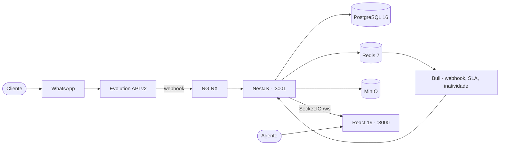

<div align="center">

# AtendeHub

**Plataforma SaaS multi-tenant de atendimento via WhatsApp**
Conversas em tempo real · fila de atendimento · auto-atendimento · SLA · relatórios

[](https://github.com/Cmdev2019/atendehub/actions/workflows/api-ci.yml)
[](https://github.com/Cmdev2019/atendehub/actions/workflows/web-ci.yml)
[](#testes)

[Documentação](docs/) · [Roadmap](ROADMAP_ESTABILIZACAO.md) · [Contribuir](CONTRIBUTING.md) · [Segurança](SECURITY.md)

</div>

---

## Visão geral

O AtendeHub é uma central de atendimento multiatendente que conecta o WhatsApp de uma empresa a uma
equipe de agentes, com fila, roteamento por departamento, auto-atendimento configurável, SLA e
relatórios — em arquitetura **multi-tenant**, onde cada empresa cliente é um tenant isolado.

**Estado atual:** produto **mono-canal** (WhatsApp via Evolution API) funcional e testado, em fase de
endurecimento para produção. A evolução para plataforma omnichannel está planejada em
[`docs/03-Roadmap/`](docs/03-Roadmap/PLANO-DE-EVOLUCAO-ENTERPRISE.md).

> 📌 **Fonte de verdade do progresso:** [`ROADMAP_ESTABILIZACAO.md`](ROADMAP_ESTABILIZACAO.md).
> Consulte antes de qualquer trabalho.

### O que já funciona

| Área | Status |
|---|---|
| Autenticação JWT com refresh rotativo, blacklist e auto-cadastro de empresa | ✅ |
| Conversas em tempo real via Socket.IO | ✅ |
| Envio e recepção de mensagens WhatsApp, validado ponta a ponta | ✅ |
| Mídia: imagem, áudio, figurinha, documento, envio por Ctrl+V | ✅ |
| Fila de atendimento, atribuição, encerramento com motivo e justificativa | ✅ |
| Auto-atendimento: saudação, menu, horário comercial, inatividade | ✅ |
| Dashboard, 3 relatórios com exportação CSV/PDF, base de contatos | ✅ |
| SLA com detecção de violação e notificação | ✅ |
| Configurações: conexões WhatsApp por QR, usuários, departamentos, filas, tags | ✅ |
| Anonimização de contato (LGPD) e auditoria | ✅ |
| Deploy de produção | ⬜ falta domínio e certificado |

### O que ainda não existe

Segundo canal · construtor visual de fluxo · IA · CRM com funil · API pública documentada ·
observabilidade além de logs. Todos mapeados com prioridade em
[`docs/03-Roadmap/`](docs/03-Roadmap/PLANO-DE-EVOLUCAO-ENTERPRISE.md).

---

## Arquitetura



**Modelo:** Modular Monolith. Um único deployable com fronteiras internas por domínio, preparado para
extrair serviços quando houver necessidade real — não antes.

**Multi-tenancy:** toda query filtra por `companyId`. O reforço com Row-Level Security no PostgreSQL
está registrado como item B-41.

Detalhamento completo, diagramas C4 e UML em [`docs/04-Arquitetura/`](docs/04-Arquitetura/).

---

## Tecnologias

| Camada | Tecnologia | Versão |
|---|---|---|
| **Frontend** | Vite · React (JavaScript) | 6 · 19 |
| | Socket.IO Client · Recharts · Sentry | — |
| **Backend** | NestJS · TypeScript | 11 · 5.7 |
| | Prisma ORM · Passport JWT · class-validator | 5.22 |
| | Bull (filas) · Socket.IO · Winston · Helmet | — |
| **Dados** | PostgreSQL · Redis | 16 · 7 |
| **Storage** | MinIO (compatível com S3) | — |
| **WhatsApp** | Evolution API v2 (Baileys) | 2.3.4 |
| **Infra** | Docker · Docker Compose · NGINX | — |
| **CI** | GitHub Actions | — |
| **Testes** | Jest · Testing Library | 30 · 16 |

> **Decisão F5-3 (2026-07-16):** o frontend permanece em Vite + React. Migração para Next.js só será
> reavaliada com necessidade concreta de SSR ou SEO.

---

## Estrutura

```
atendehub/
├── apps/
│   └── api/                # Backend NestJS — 18 módulos, 85 rotas
│       ├── prisma/         #   schema, 6 migrations, seed
│       └── src/
│           ├── modules/    #   domínios: auth, conversation, message, webhook...
│           └── shared/     #   logging, prisma, storage, queues, monitoring
├── src/                    # Frontend React  ⚠️ move para apps/web na Fase 1
├── infra/
│   ├── nginx/              # Dockerfile + nginx.conf de produção
│   └── postgres/           # init.sql
├── scripts/                # dev-api.ps1 · dev-front.ps1
├── docs/                   # 41 áreas numeradas — ver docs/README.md
├── .github/                # workflows, templates, CODEOWNERS
├── docker-compose.yml      # infra local
└── docker-compose.prod.yml # override de produção
```

> A estrutura está em reestruturação planejada. Árvore-alvo, justificativa técnica e plano de migração
> em [`docs/00-Governanca/PLANO-DE-REESTRUTURACAO.md`](docs/00-Governanca/PLANO-DE-REESTRUTURACAO.md).

---

## Como executar

### Pré-requisitos

- [Docker Desktop](https://www.docker.com/products/docker-desktop/)
- Node.js ≥ 20 e npm ≥ 10

### 1. Variáveis de ambiente

```bash
cp apps/api/.env.example apps/api/.env
```

Crie também um `.env` na **raiz** contendo `EVOLUTION_API_KEY=<a mesma chave de apps/api/.env>`.

> ⚠️ **Pitfall conhecido:** o `docker-compose` lê a chave da raiz e a API precisa usar exatamente a
> mesma. Sem isso, toda chamada API → Evolution responde 401.

### 2. Infraestrutura

```bash
docker compose up -d
```

Sobe PostgreSQL (`:5432`), Redis (`:6379`), MinIO (`:9000` API / `:9001` console) e Evolution API
(`:8080`). O bucket `atendehub-media` é criado pela própria API no boot.

### 3. Backend

```bash
cd apps/api
npm install
npm run db:generate && npm run db:migrate
npm run db:seed          # senha do admin é ALEATÓRIA → .seed-credentials-*.txt
npm run start:dev        # porta 3001
```

Verificação: `curl http://localhost:3001/api/v1/health` → `{"status":"ok"}`

### 4. Frontend

```bash
npm install
npm run dev              # http://localhost:3000
```

Sem o backend no ar, o front entra em **modo demonstração** com banner visível — nunca silencioso.

### 5. Conectar o WhatsApp

Login → **Configurações → Conexões WhatsApp** → criar conexão → escanear o QR Code (WhatsApp →
Dispositivos conectados). O status muda para "Conectado" e as conversas passam a chegar em tempo real.

### Desenvolvimento no Windows

```powershell
Start-Process powershell -ArgumentList '-NoExit','-File','scripts\dev-api.ps1'   -WindowStyle Minimized
Start-Process powershell -ArgumentList '-NoExit','-File','scripts\dev-front.ps1' -WindowStyle Minimized
```

> ⚠️ **Sempre use os scripts.** Eles matam qualquer instância anterior antes de subir. Sem isso, duas
> janelas da mesma API concorrem pela porta 3001, uma fica viva mas sem responder, e a API "cai" sem
> erro visível (incidente B-37).

### URLs e credenciais de desenvolvimento

| Serviço | URL | Credenciais |
|---|---|---|
| Frontend | http://localhost:3000 | `admin@demo.com` / `Admin@123` |
| API | http://localhost:3001/api/v1 | JWT via `/auth/login` |
| PostgreSQL | `localhost:5432` | `atendehub` / `atendehub_secret` |
| Redis | `localhost:6379` | senha `redis_secret` |
| MinIO Console | http://localhost:9001 | `atendehub_minio` / `minio_secret_123` |
| Evolution API | http://localhost:8080 | `apikey` do `.env` |

> 🔒 Defaults de desenvolvimento. **Em produção, todos os segredos devem ser trocados.**

---

## Testes

```bash
npm test                        # front — 302 testes / 31 suítes
npm run test:coverage           # front com cobertura
cd apps/api && npm test         # backend — 265 testes / 30 suítes
cd apps/api && npm run test:e2e # backend e2e
```

Ambas as suítes rodam no CI a cada push e a cada PR.

| Natureza | Estado |
|---|---|
| Unitário | ✅ 567 testes verdes |
| Integração | ⬜ planejado (Testcontainers) |
| E2E | ⚠️ 1 arquivo — lacuna conhecida |
| Carga, estresse, segurança | ⬜ planejado |

Estratégia completa em [`docs/22-QA/`](docs/22-QA/) · artefatos em [`docs/23-Testes/`](docs/23-Testes/).

---

## Como contribuir

Leia [`CONTRIBUTING.md`](CONTRIBUTING.md) na íntegra antes do primeiro PR. Em resumo:

1. Todo problema novo **vira item com ID no roadmap antes de ser corrigido**
2. Todo item concluído **exige evidência no changelog**
3. Documentação muda **no mesmo PR** que o comportamento
4. Um PR, um propósito — nunca misture movimentação de arquivo com mudança de comportamento

### Como documentar

Toda documentação vive em [`docs/`](docs/), organizada em 41 áreas numeradas. Documento novo nasce de um
template em [`docs/37-Templates/`](docs/37-Templates/).

| Você alterou… | Atualize |
|---|---|
| Um endpoint | [`docs/09-APIs/API_CONTRACT.md`](docs/09-APIs/API_CONTRACT.md) — **mesmo PR** |
| O schema | [`docs/08-Banco-de-Dados/`](docs/08-Banco-de-Dados/) |
| Um evento de socket | [`docs/11-WebSocket/`](docs/11-WebSocket/) |
| Um procedimento operacional | [`docs/26-DevOps/RUNBOOK.md`](docs/26-DevOps/RUNBOOK.md) |
| Uma decisão arquitetural | Nova ADR em [`docs/05-ADR/`](docs/05-ADR/) |

### Como abrir issues

Use os templates: [🐛 Defeito](.github/ISSUE_TEMPLATE/bug.yml) ou
[✨ Funcionalidade](.github/ISSUE_TEMPLATE/feature.yml).

> 🔒 **Vulnerabilidade de segurança nunca vira issue pública.** Veja [`SECURITY.md`](SECURITY.md).

### Como criar branches

```
<tipo>/<escopo-opcional>-<descricao-em-kebab>
```

`feat/canal-telegram` · `fix/webhook-retry-propaga-erro` · `docs/adr-abstracao-de-canal`

**Branch com mais de 5 dias é sinal de escopo grande demais.** Quebre.

### Padrão de commits

Conventional Commits **em português**, com ID do roadmap quando aplicável:

```
fix(webhook): propaga erro do handleEvent para reativar o retry do Bull [B-39]
feat(api): escopo de conversa por departamento [B-40]
docs: publica a estrutura de documentação em 41 áreas
```

Tipos: `feat` `fix` `docs` `chore` `refactor` `test` `perf` `build` `ci`
Escopos: `api` `web` `db` `infra` `docs` `ci` `deps` `auth` `webhook` `conversation` `whatsapp` `bot` `sla`

Convenção completa em
[`docs/00-Governanca/CONVENCAO-DE-NOMENCLATURA.md`](docs/00-Governanca/CONVENCAO-DE-NOMENCLATURA.md).

---

## Fluxo Git

**GitHub Flow com branch única de integração.** Não usamos GitFlow: ele pressupõe releases longas e
múltiplas versões em manutenção paralela, o que não corresponde a um SaaS de implantação contínua.

```mermaid
gitGraph
    commit id: "master"
    branch feat/exemplo
    commit id: "feat: implementa"
    commit id: "test: cobre"
    checkout master
    merge feat/exemplo tag: "v1.3.0"
```

`master` é **sempre implantável**.

## Fluxo CI/CD

| Etapa | Gatilho | O que roda | Bloqueia merge? |
|---|---|---|---|
| **CI API** | push/PR em `apps/api/**` | lint · `tsc --noEmit` · 265 testes | ✅ |
| **CI Web** | push/PR em `src/**` e configs | 302 testes · `vite build` | ✅ |
| Segurança | *planejado* | CodeQL · Trivy · gitleaks · audit | ✅ |
| E2E | *planejado* | Playwright contra staging | ✅ |
| Build & push | *planejado* | imagem + SBOM + assinatura | — |
| Deploy staging | *planejado* | automático a cada merge | — |
| Deploy produção | *planejado* | manual, a partir de tag, canário 10% | — |

Detalhamento em [`docs/27-CI-CD/`](docs/27-CI-CD/).

## Fluxo de releases

1. Congelamento de código ao final da sprint
2. Regressão automatizada completa em staging
3. QA manual dos critérios de aceite
4. Tag `vX.Y.Z` + `CHANGELOG.md` + notas de release (automático)
5. Deploy canário **terça de manhã** — nunca sexta
6. Observação de 30 min em 10% do tráfego → promoção ou rollback
7. Monitoramento reforçado por 24 h

Versionamento semântico: **MAJOR** quebra contrato de API · **MINOR** funcionalidade retrocompatível ·
**PATCH** correção. Política completa em [`docs/31-Versionamento/`](docs/31-Versionamento/).

---

## Roadmap

| Versão | Tema | Prazo | Estado |
|---|---|---|---|
| **v1.0** | Endurecimento e produção real | 3 meses | 🔄 em andamento |
| **v1.1** | Produtividade do agente | 2 meses | ⬜ |
| **v1.2** | API pública e billing | 2 meses | ⬜ |
| **v2.0** | Omnichannel | 4 meses | ⬜ |
| **v2.5** | Automação e flow builder | 3 meses | ⬜ |
| **v3.0** | IA aplicada | 4 meses | ⬜ |
| **v4.0** | Marketplace, SDK e mobile | 6 meses | ⬜ |

**Prioridade imediata:** os itens críticos B-38 (bucket de mídia público) e B-39 (retry de webhook
inoperante), antes de qualquer funcionalidade nova.

Roadmap completo com complexidade, dependências e criticidade em
[`docs/03-Roadmap/PLANO-DE-EVOLUCAO-ENTERPRISE.md`](docs/03-Roadmap/PLANO-DE-EVOLUCAO-ENTERPRISE.md).

---

## Links úteis

### Documentação interna

| Documento | O que é |
|---|---|
| [`docs/README.md`](docs/README.md) | Índice completo da documentação |
| [`CLAUDE.md`](CLAUDE.md) | Guia do projeto e **pitfalls que custaram sessões de depuração** |
| [`ROADMAP_ESTABILIZACAO.md`](ROADMAP_ESTABILIZACAO.md) | Documento vivo canônico de progresso |
| [`ROADMAP_BACKEND.md`](ROADMAP_BACKEND.md) | Documento vivo do backend, Prisma e filas |
| [`docs/09-APIs/API_CONTRACT.md`](docs/09-APIs/API_CONTRACT.md) | Contrato real da API |
| [`docs/26-DevOps/RUNBOOK.md`](docs/26-DevOps/RUNBOOK.md) | Deploy, rollback, troubleshooting, backup |
| [`docs/05-ADR/INDICE.md`](docs/05-ADR/INDICE.md) | Decisões arquiteturais |
| [`docs/00-Governanca/`](docs/00-Governanca/) | Convenções e boas práticas |

### Referência externa

[NestJS](https://docs.nestjs.com) · [Prisma](https://www.prisma.io/docs) ·
[Evolution API](https://doc.evolution-api.com) · [Socket.IO](https://socket.io/docs/v4/) ·
[Vite](https://vitejs.dev) · [React](https://react.dev) · [Bull](https://docs.bullmq.io)

---

<div align="center">

**Idioma do projeto: PT-BR** — respostas, commits e documentação em português.

</div>
