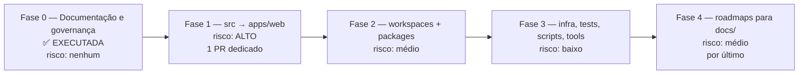

# Plano de Reestruturação do Repositório — AtendeHub

> **Architecture Review Board** · Versão 1.0 · 2026-07-28
> Base analisada: `master @ de1da24` · Escopo: **estrutura**, não funcionalidade
> Status: **Fase 0 executada** · Fases 1 a 4 aprovadas para execução, pendentes de autorização

---

## Sumário

1. [Princípios e critérios de decisão](#1-princípios-e-critérios-de-decisão)
2. [Auditoria da estrutura atual](#2-auditoria-da-estrutura-atual)
3. [Árvore-alvo do repositório](#3-árvore-alvo-do-repositório)
4. [Árvore-alvo da documentação](#4-árvore-alvo-da-documentação)
5. [Justificativa técnica de cada alteração](#5-justificativa-técnica-de-cada-alteração)
6. [O que recomendamos NÃO fazer](#6-o-que-recomendamos-não-fazer)
7. [Plano de migração por fases](#7-plano-de-migração-por-fases)
8. [Checklist de migração](#8-checklist-de-migração)
9. [Checklist de validação](#9-checklist-de-validação)
10. [Checklist pós-migração](#10-checklist-pós-migração)
11. [Plano de rollback](#11-plano-de-rollback)
12. [Plano de versionamento](#12-plano-de-versionamento)

---

## 1. Princípios e critérios de decisão

O ARB adotou seis princípios. Toda decisão deste documento pode ser rastreada até um deles.

| # | Princípio | Aplicação prática |
|---|---|---|
| **P1** | **Estrutura reflete arquitetura** | A árvore de pastas deve tornar as fronteiras arquiteturais visíveis. Se `apps/api` é um bounded context e `apps/web` é outro, isso precisa estar na estrutura, não só na cabeça de quem escreveu. |
| **P2** | **Uma responsabilidade por diretório** | Um diretório com dois propósitos é um diretório que ninguém sabe onde alterar. Vale o mesmo SRP que aplicamos a classes. |
| **P3** | **Repositório versiona fonte, não artefato** | Build, log, upload, cobertura, PDF gerado e dependência não entram no Git. Diretório de runtime não é diretório de repositório. |
| **P4** | **Convenção explícita vence gosto pessoal** | Toda regra de nomenclatura está escrita e é verificável. Onde possível, automatizada. |
| **P5** | **Migração incremental e reversível** | Nenhuma fase move código e altera configuração sem que as suítes de teste possam validar o resultado. Toda fase tem rollback de um comando. |
| **P6** | **Custo de mudança precisa ser justificado** | Reorganizar tem custo real: conflito de merge, quebra de link, retrabalho de quem tem branch aberta. Movimento sem benefício claro é recusado — e há recusas neste documento. |

---

## 2. Auditoria da estrutura atual

### 2.1 O que existe hoje (verificado com `git ls-files`)

```
atendehub/                          178 arquivos em apps · 70 em src · 25 em docs
├── .babelrc                        config do Babel (front)
├── .dockerignore
├── .env.example                    variáveis do FRONT (apesar do nome genérico)
├── .github/workflows/              api-ci.yml · web-ci.yml
├── .gitignore
├── CLAUDE.md                       guia do projeto para agentes e devs
├── README.md
├── ROADMAP_BACKEND.md              72 KB — documento vivo
├── ROADMAP_ESTABILIZACAO.md        236 KB — documento vivo canônico
├── docker-compose.yml              infra local
├── docker-compose.prod.yml         override de produção + build da api e do nginx
├── index.html                      entrypoint do Vite
├── jest.config.js                  config de teste do FRONT
├── jest.setup.js
├── package.json                    @atendehub/web — o front mora na RAIZ
├── package-lock.json
├── vite.config.js
├── public/logo.svg
├── src/                            FRONTEND inteiro na raiz do monorepo
│   ├── components/  (22 arquivos + 18 testes lado a lado)
│   ├── components/settings/
│   ├── context/ · data/ · hooks/ · pages/ · services/ · styles/ · utils/
├── apps/api/                       BACKEND NestJS
│   ├── prisma/                     schema · migrations · seed
│   ├── src/modules/                18 módulos
│   ├── src/shared/                 logging · prisma · storage · queues · monitoring · websocket · validators
│   ├── test/                       1 arquivo e2e + jest-e2e.json
│   ├── Dockerfile · eslint.config.js · jest.config.js · nest-cli.json · tsconfig*.json
├── infra/nginx/ · infra/postgres/
├── scripts/                        dev-api.ps1 · dev-front.ps1
└── docs/                           7 arquivos + archive/ (23 arquivos) + 4 PDFs não versionados
```

### 2.2 Diagnóstico por dimensão

| Dimensão | Diagnóstico | Gravidade |
|---|---|---|
| **Estrutura geral** | Assimetria estrutural: o backend está em `apps/api`, mas o frontend está na **raiz**. A raiz acumula 16 arquivos, dos quais 6 são configuração exclusiva do front (`vite.config.js`, `jest.config.js`, `jest.setup.js`, `.babelrc`, `index.html`, `package.json`). Lê-se como "projeto front com um backend anexo", quando são duas aplicações de mesmo peso. | 🔴 Alta |
| **Pastas** | `src/` na raiz é ambíguo num monorepo — `src` de quê? Já há sinal de que a estrutura foi *planejada* de outro jeito: o `.gitignore` ignora `apps/web/.env`, um caminho que **não existe**, prova de que `apps/web/` era o destino pretendido. | 🔴 Alta |
| **Arquivos** | Nomes inconsistentes na raiz: `ROADMAP_ESTABILIZACAO.md` (SCREAMING_SNAKE) convive com `docker-compose.prod.yml` (kebab) e `vite.config.js` (dot.case). Sem convenção declarada. | 🟠 Média |
| **Frontend** | Organizado por **tipo** (`components/`, `hooks/`, `services/`), não por feature. Testes lado a lado com o código-fonte. Sem `features/`, sem `shared/`, sem barrel exports. `SettingsPanel.jsx` com 1.571 linhas e `apiMock.js` com 1.161 sinalizam ausência de fronteira interna. | 🟠 Média |
| **Backend** | **É a parte mais bem organizada do repositório.** `modules/` por domínio, `shared/` por capacidade técnica, DTOs em subpasta, specs junto ao código. Consistente em 18 módulos. Falta apenas a camada de domínio (`domain/`, `application/`, `infrastructure/`) — mas isso é arquitetura, não estrutura de pastas. | 🟢 Baixa |
| **APIs** | Contrato existe (`API_CONTRACT.md`) e é fiel ao código, mas é markdown mantido à mão, sem OpenAPI. Não há pasta para spec, exemplos de requisição ou coleção de cliente HTTP. | 🟠 Média |
| **Prisma** | `apps/api/prisma/` com `schema.prisma`, 6 migrations e `seed.ts`. **Está no lugar certo** (ver seção 6 — recomendamos não mover). Falta apenas separar seeds por ambiente. | 🟢 Baixa |
| **Banco** | `infra/postgres/init.sql` isolado e correto. Sem pasta para scripts SQL operacionais, dicionário de dados ou rotinas de manutenção. | 🟡 Baixa |
| **Docker** | `docker-compose.yml` e `docker-compose.prod.yml` na **raiz**; `Dockerfile` da API em `apps/api/`; `Dockerfile` do nginx em `infra/nginx/`. Três locais diferentes para a mesma preocupação. | 🟠 Média |
| **Configurações** | Espalhadas por raiz (`.babelrc`, `jest.config.js`, `vite.config.js`) e por `apps/api/` (`eslint.config.js`, `tsconfig*.json`, `nest-cli.json`). Nada compartilhado entre as duas aplicações — o front sequer tem ESLint. | 🟠 Média |
| **Scripts** | `scripts/` com 2 arquivos PowerShell de dev. Sem separação entre script de desenvolvimento, de operação e de automação (tooling). Sem versão POSIX — inviabiliza dev em Linux/macOS e uso em CI. | 🟠 Média |
| **Assets** | `public/logo.svg` é o único. Não há pasta para material de marca, favicon, fontes ou imagem de origem. | 🟡 Baixa |
| **Testes** | Unitários bem distribuídos (302 no front, 265 no backend, todos verdes). Mas **não há separação por natureza**: `apps/api/test/` tem um único e2e, e não existe lugar para carga, estresse, segurança, smoke ou regressão. Fixtures duplicadas entre specs. | 🔴 Alta |
| **Documentação** | Antes desta reestruturação: 7 arquivos soltos em `docs/` + `archive/` + 4 PDFs não versionados. Dois roadmaps de 236 KB e 72 KB na raiz misturando plano, changelog e histórico. Sem ADR, sem template, sem índice. | 🔴 Alta |
| **Ambientes** | Um único `.env.example` na raiz (do front) e outro em `apps/api/`. Sem distinção dev/staging/produção. Sem pasta de configuração por ambiente. | 🟠 Média |
| **Logs** | Nenhum diretório — **e está correto**. Winston escreve em stdout. Ver seção 6. | 🟢 Baixa |
| **Exemplos** | Inexistentes. Não há exemplo de payload de webhook, de chamada à API nem de integração. | 🟠 Média |
| **Temporários** | `dist/` e `coverage/` existem em disco e estão corretamente no `.gitignore`. Os 4 PDFs em `docs/` estavam soltos e não versionados — resolvido na Fase 0. | 🟡 Baixa |

### 2.3 Redundâncias e obsoletos identificados

| Item | Situação | Ação |
|---|---|---|
| `.gitignore` ignora `apps/web/.env` | Caminho inexistente — resíduo de estrutura planejada | Vira válido após a Fase 1 |
| `.gitignore` declara `.env` duas vezes (blocos "Ambiente" e "Variáveis de ambiente") | Duplicação | Consolidar na Fase 0 |
| `.gitignore` declara `apps/api/src/generated/` | Diretório inexistente | Manter (defensivo, custo zero) |
| `docs/archive/` com 23 arquivos, 8 deles `.txt` de saída de agente | Histórico legítimo, mas poluía `docs/` | Movido para `docs/99-Arquivo/` na Fase 0 |
| 4 PDFs em `docs/` | Artefatos gerados, binários, não versionados | Movidos para `docs/99-Arquivo/relatorios-pdf/` e ignorados no Git |
| `docs/archive/README.md` e `docs/archive/PROJECT_ROADMAP_STATUS.md` | Descrevem estado superado pelos roadmaps vivos | Mantidos como histórico, marcados como não-fonte-de-verdade |
| `dist/` e `coverage/` em disco | Artefatos de build | Já ignorados; nenhuma ação |

---

## 3. Árvore-alvo do repositório

```
atendehub/
│
├── .github/                          # Governança e automação do GitHub
│   ├── workflows/                    #   ci-api.yml · ci-web.yml · ci-security.yml
│   │                                 #   e2e.yml · build-push.yml · deploy-*.yml · release.yml
│   ├── ISSUE_TEMPLATE/               #   bug.yml · feature.yml · seguranca.yml · config.yml
│   ├── PULL_REQUEST_TEMPLATE.md
│   ├── CODEOWNERS                    #   revisão obrigatória por área
│   └── dependabot.yml
│
├── apps/                             # Aplicações executáveis (deployables)
│   ├── api/                          #   Backend NestJS — porta 3001
│   │   ├── prisma/                   #     schema · migrations · seed  (permanece aqui — ver §6.2)
│   │   ├── src/
│   │   │   ├── modules/              #     bounded contexts
│   │   │   ├── shared/               #     capacidades técnicas transversais
│   │   │   ├── app.module.ts
│   │   │   └── main.ts
│   │   ├── test/                     #     apenas e2e da própria API
│   │   └── package.json
│   └── web/                          #   Frontend Vite + React — porta 3000  (movido da raiz)
│       ├── public/
│       ├── src/
│       │   ├── app/                  #     router · providers · layout
│       │   ├── features/             #     organização por feature, não por tipo
│       │   ├── shared/               #     ui · lib · config
│       │   └── styles/
│       ├── index.html
│       ├── vite.config.js
│       └── package.json
│
├── packages/                         # Código compartilhado entre apps (não deployável)
│   ├── contracts/                    #   tipos e schemas do contrato de API
│   ├── config-eslint/                #   configuração ESLint compartilhada
│   ├── config-typescript/            #   tsconfig base
│   └── ui/                           #   design system (a partir da v1.1)
│
├── infra/                            # Tudo que provisiona ou empacota ambiente
│   ├── docker/                       #   compose.yml · compose.prod.yml · compose.observability.yml
│   ├── nginx/                        #   Dockerfile · nginx.conf · conf.d/
│   ├── postgres/                     #   init.sql · scripts de manutenção
│   ├── observability/                #   prometheus · grafana · loki · alertmanager
│   └── terraform/                    #   IaC por ambiente (a partir da v1.0)
│
├── tests/                            # Testes que cruzam aplicações ou não pertencem a uma só
│   ├── e2e/                          #   Playwright — jornadas ponta a ponta
│   ├── integration/                  #   Testcontainers — banco e fila reais
│   ├── performance/                  #   linha de base de latência
│   ├── load/                         #   k6 — volume esperado
│   ├── stress/                       #   além do limite
│   ├── security/                     #   ZAP · nuclei
│   ├── smoke/                        #   verificação pós-deploy
│   ├── regression/                   #   suíte de não-regressão
│   └── fixtures/                     #   massa de dados compartilhada
│
├── tools/                            # Automação de desenvolvimento (roda no dev/CI, não em produção)
│   ├── generators/                   #   scaffolding de módulo, componente, ADR
│   ├── migration/                    #   scripts de migração de dados pontuais
│   └── analysis/                     #   auditoria de dependências, contagem de rotas
│
├── scripts/                          # Operação do dia a dia (dev e produção)
│   ├── dev/                          #   dev-api.ps1 · dev-web.ps1 + equivalentes .sh
│   ├── db/                           #   backup · restore · seed por ambiente
│   └── ops/                          #   healthcheck · rotação de segredo
│
├── config/                           # Configuração declarativa compartilhada
│   ├── env/                          #   .env.example por ambiente e por app
│   └── commitlint · lint-staged · prettier
│
├── examples/                         # Exemplos executáveis para integradores
│   ├── webhooks/                     #   payloads reais de cada provedor
│   ├── api-client/                   #   consumo da API pública
│   └── http/                         #   coleção .http / .rest
│
├── assets/                           # Material de origem (não servido pela aplicação)
│   └── brand/                        #   logo em SVG de origem, favicon, paleta
│
├── docs/                             # Documentação — 40 pastas numeradas (§4)
│
├── .dockerignore
├── .editorconfig
├── .gitignore
├── CHANGELOG.md                      # gerado por automação a partir dos commits
├── CLAUDE.md                         # guia do projeto (permanece na raiz — §6.5)
├── CODE_OF_CONDUCT.md
├── CONTRIBUTING.md
├── LICENSE
├── README.md
├── SECURITY.md                       # política de divulgação responsável
├── package.json                      # raiz = workspaces, sem código de aplicação
└── turbo.json                        # orquestração do monorepo (a partir da Fase 2)
```

### Diretórios deliberadamente **ausentes** da árvore

`logs/` · `uploads/` · `storage/` · `temp/` — são diretórios de **runtime**, não de repositório. Justificativa completa na [seção 6.1](#61-não-criar-logs-uploads-storage-e-temp).

---

## 4. Árvore-alvo da documentação

**Executada na Fase 0.** Cada pasta possui `README.md` próprio declarando objetivo, responsabilidade, conteúdo esperado, quem utiliza, quando utilizar, quem pode alterar e estado atual.

```
docs/
├── README.md                     # índice geral e mapa de navegação
├── 00-Governanca/                # ⚙️  regras que valem para todas as demais
│   ├── PLANO-DE-REESTRUTURACAO.md
│   ├── CONVENCAO-DE-NOMENCLATURA.md
│   └── BOAS-PRATICAS-DO-REPOSITORIO.md
├── 01-Produto/                   # visão, personas, benchmark, planos
├── 02-Requisitos/                # funcionais, não-funcionais, critérios de aceite
├── 03-Roadmap/                   # planejamento temporal
│   └── PLANO-DE-EVOLUCAO-ENTERPRISE.md
├── 04-Arquitetura/               # C4, fluxogramas, UML, bounded contexts
├── 05-ADR/                       # decisões arquiteturais imutáveis
│   ├── ADR-0000-template.md
│   └── ADR-0001-estrutura-do-repositorio.md
├── 06-Backend/                   # convenções do NestJS
├── 07-Frontend/                  # convenções do React + design system
│   └── LOGO_GUIDELINES.md
├── 08-Banco-de-Dados/            # modelo, migrations, RLS, retenção
├── 09-APIs/                      # contrato REST, OpenAPI, versionamento
│   └── API_CONTRACT.md
├── 10-Webhooks/                  # entrada e saída, retry, DLQ
├── 11-WebSocket/                 # namespace, salas, catálogo de eventos
├── 12-Integracoes/               # um documento por sistema externo
├── 13-CRM/                       # contato, organização, funil
├── 14-Omnichannel/               # abstração de canal e capacidades
├── 15-IA/                        # casos de uso, custo, guardrails
├── 16-Bots/                      # motor de fluxo e métricas
├── 17-Workflow/                  # automações internas e campanhas
├── 18-Analytics/                 # dicionário de métricas
├── 19-Seguranca/                 # modelo de ameaças e controles
├── 20-Pentest/                   # exercícios adversariais
├── 21-Vulnerabilidades/          # inventário e SLA de correção
├── 22-QA/                        # estratégia de qualidade (processo)
├── 23-Testes/                    # artefatos de teste (execução)
│   ├── Unitarios/  ├── Integracao/  ├── E2E/
│   ├── Performance/ ├── Stress/     ├── Carga/
│   ├── Regressao/   ├── Homologacao/ └── GoLive/
├── 24-Escalabilidade/            # limites, gargalos, capacidade
├── 25-Observabilidade/           # traces, métricas, logs
├── 26-DevOps/                    # infraestrutura e operação
│   └── RUNBOOK.md
├── 27-CI-CD/                     # pipeline e portões de qualidade
├── 28-Monitoramento/             # alertas, SLO, plantão
├── 29-Producao/                  # o que está no ar agora
├── 30-Deploy/                    # procedimento e estratégia de liberação
├── 31-Versionamento/             # semver, branches, commits, API
├── 32-Releases/                  # notas e histórico de versões
├── 33-Backup/                    # rotinas e testes de restauração
├── 34-Disaster-Recovery/         # cenários e exercícios
├── 35-LGPD/                      # conformidade e direitos do titular
├── 36-Checklist/                 # listas de verificação operacionais
├── 37-Templates/                 # modelos reutilizáveis
├── 38-Reunioes/                  # atas com decisão e encaminhamento
├── 39-Glossario/                 # linguagem ubíqua do domínio
└── 99-Arquivo/                   # histórico — NÃO é fonte de verdade
    └── relatorios-pdf/
```

> **Desvio declarado da especificação:** foi adicionada a pasta `99-Arquivo/`, que não constava da
> estrutura solicitada. Motivo: os 23 documentos históricos que estavam em `docs/archive/` precisam de
> um destino, e mantê-los sem numeração quebraria a convenção que estamos estabelecendo. O prefixo `99`
> os coloca deliberadamente ao fim da ordenação e sinaliza que não são fonte de verdade. Registrado
> como decisão em `ADR-0001`.

---

## 5. Justificativa técnica de cada alteração

### 5.1 Alterações já executadas (Fase 0)

| # | Alteração | Justificativa técnica | Vantagem | Risco | Impacto |
|---|---|---|---|---|---|
| **A-01** | Criação de 40 pastas numeradas em `docs/`, cada uma com `README.md` próprio | Documentação sem taxonomia vira depósito. A numeração impõe ordem estável na listagem e cria um endereço previsível ("o modelo de dados está em 08"). O README por pasta responde antecipadamente "o que ponho aqui?", que é a pergunta que faz documentação ser abandonada. | Documento novo tem destino óbvio; onboarding acelera; pasta vazia comunica lacuna em vez de esconder | Estrutura grande pode intimidar; pastas vazias por muito tempo perdem credibilidade | Zero em código. Nenhum build ou teste afetado |
| **A-02** | `docs/API_CONTRACT.md` → `docs/09-APIs/` | Contrato de API é documentação de API. Estava na raiz de `docs/` por ausência de taxonomia, não por decisão. | Agrupa com OpenAPI, exemplos e política de versionamento que virão | Links quebrados | **Mitigado:** 7 arquivos atualizados por `sed`, verificados. `git mv` preservou histórico |
| **A-03** | `docs/RUNBOOK.md` → `docs/26-DevOps/` | Runbook é artefato operacional, consumido durante incidente por quem está de plantão. | Fica junto de IaC, gestão de ambiente e segredos | Idem A-02 | Idem A-02 |
| **A-04** | `docs/LOGO_GUIDELINES.md` → `docs/07-Frontend/` | Diretriz visual é consumida por quem escreve interface. | Aproxima do futuro design system | Idem A-02 | Idem A-02 |
| **A-05** | `docs/archive/` → `docs/99-Arquivo/` | Aderência à convenção de numeração; o prefixo `99` sinaliza "consulta histórica, não fonte de verdade" — reforçando o que o `CLAUDE.md` já dizia em prosa. | Impossível confundir com documentação vigente | Links quebrados | **Mitigado:** `CLAUDE.md` e `ROADMAP_ESTABILIZACAO.md` atualizados |
| **A-06** | Plano de evolução → `docs/03-Roadmap/PLANO-DE-EVOLUCAO-ENTERPRISE.md` | Planejamento temporal pertence a Roadmap. Renomeado sem a data no nome: o arquivo é vivo e será revisado, e data em nome de arquivo vivo induz a criar cópias em vez de evoluir. | Nome estável, histórico no Git | Nenhum | Arquivo criado nesta mesma sessão; sem referência externa |
| **A-07** | 4 PDFs → `docs/99-Arquivo/relatorios-pdf/` + ignorados no Git | **P3.** PDF é artefato gerado, binário, não-diffável, que infla o repositório para sempre — Git não remove blob de histórico. A fonte markdown é que deve ser versionada. | Repositório enxuto; diff legível | Perder o PDF se o disco morrer | Nenhum em código. Regenerar a partir do markdown |
| **A-08** | Consolidação da duplicata de `.env` no `.gitignore` | O arquivo declarava `.env` em dois blocos distintos. Duplicação em `.gitignore` esconde a intenção e atrapalha quem tenta entender a política. | Arquivo legível | Nenhum | Nenhum — comportamento idêntico |

### 5.2 Alterações propostas (Fases 1 a 4)

| # | Alteração | Justificativa técnica | Vantagem | Risco | Impacto |
|---|---|---|---|---|---|
| **B-01** | `src/` + configs do front → `apps/web/` | **P1 e P2.** Hoje o repositório mente sobre sua própria estrutura: apresenta-se como monorepo (`apps/api`) mas mantém uma das aplicações na raiz. A raiz de um monorepo deve conter governança e orquestração, nunca código de aplicação. O `.gitignore` já ignora `apps/web/.env` — a estrutura pretendida sempre foi essa. | Simetria entre as duas aplicações; raiz limpa; habilita workspaces, cache de build e CI por path com precisão | **Alto.** Toca `vite.config.js`, `jest.config.js`, `jest.setup.js`, `.babelrc`, `index.html`, `package.json`, `infra/nginx/Dockerfile` (contexto de build), `web-ci.yml` (paths), `docker-compose.prod.yml` (build args) e `scripts/dev-front.ps1` | **Grande.** Toda branch aberta conflita. Exige janela combinada com o time. Validação: 302 testes + `vite build` + build da imagem nginx |
| **B-02** | `package.json` da raiz vira manifesto de workspaces | Consequência direta de B-01. A raiz deixa de ser `@atendehub/web` e passa a orquestrar. | `npm run test` na raiz roda as duas suítes; dependência compartilhada é içada uma vez | Médio — resolução de dependência muda | Requer `npm install` limpo em todos os ambientes e no CI |
| **B-03** | Docker consolidado em `infra/docker/` | **P2.** Hoje a mesma preocupação vive em três lugares: compose na raiz, `Dockerfile` da API em `apps/api/`, `Dockerfile` do nginx em `infra/nginx/`. | Um único lugar para "como isto é empacotado e orquestrado" | Médio — contexto de build muda, `.dockerignore` precisa acompanhar | Comandos `docker compose` passam a exigir `-f infra/docker/compose.yml`. Mitigável com script wrapper |
| **B-04** | Criação de `tests/` na raiz com 9 subpastas por natureza | **P2.** Teste unitário pertence ao código que testa (e deve continuar em `apps/*`), mas e2e, carga, estresse, segurança e smoke **cruzam** as aplicações e não têm dono natural hoje. O único e2e existente está em `apps/api/test/`, o que implica que e2e é assunto do backend — não é. | Natureza de teste explícita; CI seleciona o que rodar por diretório; QA sabe onde escrever | Baixo — aditivo | Nenhum sobre testes existentes. `apps/api/test/sla.e2e-spec.ts` migra para `tests/e2e/api/` |
| **B-05** | `scripts/` subdividido em `dev/`, `db/`, `ops/` + versões `.sh` | **P2.** Dois scripts hoje não justificam subpasta; dez justificam, e chegaremos a dez. Só existir `.ps1` amarra o projeto ao Windows, inviabilizando dev em macOS/Linux e uso em CI Linux. | Portabilidade real; script de operação separado de script de dev | Baixo | `CLAUDE.md` precisa refletir os caminhos novos (pitfall nº 4) |
| **B-06** | Criação de `packages/` (`contracts`, `config-eslint`, `config-typescript`) | **P1.** O front em JavaScript consome uma API em TypeScript sem contrato compartilhado — a divergência só aparece em runtime. Configuração de lint duplicada entre apps diverge com o tempo. | Contrato único e verificável em build; lint idêntico nas duas apps; caminho natural para o design system | Baixo — aditivo | Habilita fechar a lacuna de *contract drift* (B-45/B-47 do roadmap) |
| **B-07** | Criação de `examples/` | Integrador precisa de payload real para testar. Hoje ele lê o markdown e adivinha. Payload de webhook também serve de fixture para teste. | Reduz suporte; documentação executável | Nenhum | Aditivo |
| **B-08** | Criação de `tools/` separado de `scripts/` | **P2.** `scripts/` opera o sistema; `tools/` opera o *repositório* (geradores, análise, migração pontual de dado). Misturar leva a script de scaffolding acabar em produção. | Fronteira clara entre operar e construir | Nenhum | Aditivo |
| **B-09** | Roadmaps → `docs/03-Roadmap/` | Coerência: se documentação vive em `docs/`, roadmap também. Hoje são 308 KB de markdown na raiz. | Raiz enxuta; roadmap junto do plano de evolução | **Médio.** São documentos vivos, atualizados a cada sessão, e o `CLAUDE.md` os declara como fonte de verdade "na raiz" | Exige atualizar `CLAUDE.md`, `README.md` e as referências cruzadas entre os dois. **Recomendamos executar por último**, na Fase 4, quando o restante estiver estável |
| **B-10** | Criação de `.github/` completo (templates, CODEOWNERS, dependabot) | Governança do GitHub só funciona nos caminhos que o GitHub reconhece. Sem `CODEOWNERS`, revisão por área é convenção verbal; com ele, é regra aplicada pela plataforma. | Revisão obrigatória por área; issue padronizada; atualização de dependência automatizada | Nenhum | Aditivo. `CODEOWNERS` só surte efeito com proteção de branch ativada |
| **B-11** | `assets/brand/` para material de origem | `public/` é servido ao navegador; material de origem (SVG editável, paleta, favicon em várias resoluções) não deve ser público. | Separa fonte de artefato publicado | Nenhum | Aditivo |
| **B-12** | `config/env/` com `.env.example` por app e por ambiente | Hoje o `.env.example` da raiz é do **front**, apesar do nome sugerir "do projeto" — armadilha real para quem chega. | Ambiguidade eliminada; ambiente novo tem template | Baixo | `README.md` e `CLAUDE.md` atualizados |

---

## 6. O que recomendamos NÃO fazer

Um ARB que só aprova não é um ARB. Quatro itens da estrutura solicitada foram **recusados**, com justificativa.

### 6.1 Não criar `logs/`, `uploads/`, `storage/` e `temp/`

**Recusado.** Estes são diretórios de **runtime**, não de repositório (**P3**).

- **`logs/`** — a aplicação escreve em `stdout` via Winston, que é o comportamento correto para contêiner: o orquestrador coleta e encaminha. Criar `logs/` no repositório induz alguém a configurar log em arquivo, o que quebra o modelo de contêiner efêmero, enche disco e dificulta agregação.
- **`uploads/` e `storage/`** — a mídia vive no MinIO/S3, nunca no sistema de arquivos da aplicação. Diretório local de upload é incompatível com múltiplas réplicas: o arquivo enviado à réplica 1 não existe na réplica 2.
- **`temp/`** — arquivo temporário deve usar o diretório temporário do sistema operacional, via API da linguagem. Diretório temporário versionado é convite a lixo commitado por engano.

**Alternativa adotada:** estes caminhos, quando necessários em execução, são montados como volume declarado em `infra/docker/` e permanecem no `.gitignore`.

### 6.2 Não mover `prisma/` para `database/prisma/`

**Recusado** (**P6** — custo sem benefício proporcional).

O Prisma CLI resolve `prisma/schema.prisma` a partir do diretório do `package.json`. Mover exige `--schema` em **todos** os comandos (`generate`, `migrate dev`, `migrate deploy`, `studio`, `seed`), no `package.json`, no `Dockerfile` (duas cópias) e em qualquer pipeline futuro. O ganho seria puramente estético: o schema é consumido exclusivamente por `apps/api` e por nenhuma outra aplicação.

**Alternativa adotada:** `apps/api/prisma/` permanece. A documentação de banco vive em `docs/08-Banco-de-Dados/`, e scripts SQL operacionais em `infra/postgres/` e `scripts/db/`. Se um segundo consumidor do schema aparecer, a decisão é reavaliada via ADR.

### 6.3 Não criar `frontend/` e `backend/` como pastas de topo

**Recusado.** Seriam sinônimos de `apps/web` e `apps/api`. Duas convenções para a mesma coisa é pior que uma imperfeita (**P4**). `apps/` é o padrão estabelecido em monorepos JavaScript e já é o que o repositório usa.

### 6.4 Não criar `ci/` na raiz

**Recusado.** O GitHub Actions só reconhece `.github/workflows/`. Uma pasta `ci/` paralela criaria dois lugares para pipeline, com um deles inerte. Configuração auxiliar de CI (scripts chamados pelos workflows) vai para `tools/`.

### 6.5 Não mover `CLAUDE.md` para `docs/`

**Recusado.** É lido automaticamente da raiz por ferramental de agente. Mover quebra a função. Permanece na raiz junto de `README.md` e `CONTRIBUTING.md`, como arquivo de entrada do repositório.

---

## 7. Plano de migração por fases



| Fase | Escopo | Risco | Duração | Pré-requisito | Reversível por |
|---|---|---|---|---|---|
| **0** | Estrutura `docs/`, governança, templates, README, `.github/` | 🟢 Nenhum | ✅ Concluída | — | `git revert` do commit |
| **1** | `src/` + configs do front → `apps/web/` | 🔴 Alto | 1 dia | Working tree limpo, nenhuma branch aberta tocando o front | `git revert` + `npm ci` |
| **2** | `package.json` raiz vira workspaces; criação de `packages/` | 🟠 Médio | 1 dia | Fase 1 concluída e validada | `git revert` + `npm ci` |
| **3** | `infra/docker/`, `tests/`, `scripts/{dev,db,ops}`, `tools/`, `examples/`, `assets/`, `config/` | 🟡 Baixo | 1 dia | Fase 2 concluída | `git revert` |
| **4** | Roadmaps → `docs/03-Roadmap/`; atualização final de referências | 🟠 Médio | 0,5 dia | Fases 1-3 estáveis por ao menos uma semana | `git revert` |

**Regra de ouro:** uma fase por PR. Nenhuma fase mistura movimentação de arquivo com alteração de
comportamento. Se um PR de migração precisar corrigir um bug encontrado no caminho, o bug vira item de
roadmap e é corrigido em PR separado.

### Detalhamento da Fase 1 (a mais arriscada)

| Passo | Comando/ação | Verificação |
|---|---|---|
| 1 | `git checkout -b chore/estrutura-fase-1-apps-web` | — |
| 2 | `git mv src apps/web/src` · `git mv public apps/web/public` | `git status` mostra R (rename) |
| 3 | `git mv index.html vite.config.js jest.config.js jest.setup.js .babelrc package.json package-lock.json apps/web/` | idem |
| 4 | Ajustar `apps/web/jest.config.js`: `collectCoverageFrom` e `setupFilesAfterEach` já são relativos ao `rootDir` — conferir, não presumir | `npx jest --listTests` lista 31 suítes |
| 5 | Criar `package.json` novo na raiz com `workspaces: ["apps/*", "packages/*"]` | `npm ls --workspaces` responde |
| 6 | `infra/nginx/Dockerfile`: `COPY package.json ...` → `COPY apps/web/package.json ...` (5 linhas de COPY) | `docker build -f infra/nginx/Dockerfile .` conclui |
| 7 | `.github/workflows/web-ci.yml`: paths `src/**` → `apps/web/**`; `cache-dependency-path`; `working-directory` | Workflow verde no PR |
| 8 | `docker-compose.prod.yml`: contexto de build do nginx | `docker compose config` valida |
| 9 | `scripts/dev-front.ps1`: caminho do `npm run dev` | Script sobe o front na 3000 |
| 10 | `.dockerignore`, `.gitignore`, `CLAUDE.md`, `README.md` | Revisão manual |
| 11 | `npm ci` na raiz + `npm test --workspaces` | **302 + 265 testes verdes** |
| 12 | `npm run build --workspace apps/web` | `dist/` gerado |

---

## 8. Checklist de migração

### Pré-migração (executar antes de qualquer fase)

- [x] Auditoria da estrutura atual concluída e documentada
- [x] Árvore-alvo aprovada pelo ARB
- [x] Suítes de teste verdes como linha de base (**302 front + 265 API**, verificado em 2026-07-28)
- [ ] Working tree limpo (`git status` sem modificações pendentes)
- [ ] Todas as branches abertas mergeadas ou comunicadas ao autor
- [ ] Tag de segurança criada antes da fase (`git tag pre-estrutura-fase-N`)
- [ ] Janela combinada com o time (fases 1 e 2 param o desenvolvimento do front)

### Fase 0 — Documentação e governança ✅

- [x] 40 pastas de `docs/` criadas com numeração
- [x] `README.md` próprio em cada pasta, com as 6 seções obrigatórias
- [x] 9 subpastas de `23-Testes/` criadas com README próprio
- [x] `API_CONTRACT.md` movido com `git mv` (histórico preservado)
- [x] `RUNBOOK.md` movido com `git mv`
- [x] `LOGO_GUIDELINES.md` movido com `git mv`
- [x] `docs/archive/` → `docs/99-Arquivo/` com `git mv`
- [x] PDFs movidos para `99-Arquivo/relatorios-pdf/` e ignorados no Git
- [x] Todas as referências aos caminhos antigos atualizadas e verificadas
- [x] `docs/README.md` como índice navegável
- [x] `CONVENCAO-DE-NOMENCLATURA.md` publicada
- [x] `BOAS-PRATICAS-DO-REPOSITORIO.md` publicada
- [x] Template de ADR e `ADR-0001` registrando esta reestruturação
- [x] `README.md` da raiz reescrito
- [x] `CONTRIBUTING.md`, `SECURITY.md`, `CODE_OF_CONDUCT.md`, `CHANGELOG.md`
- [x] `.github/` com templates de issue, PR, `CODEOWNERS` e `dependabot.yml`

### Fase 1 — `apps/web`

- [ ] `git mv` de `src/`, `public/` e dos 7 arquivos de configuração
- [ ] `package.json` da raiz convertido em manifesto de workspaces
- [ ] `infra/nginx/Dockerfile` com contexto ajustado
- [ ] `web-ci.yml` com paths e `working-directory` ajustados
- [ ] `docker-compose.prod.yml` com contexto de build ajustado
- [ ] `scripts/dev-front.ps1` ajustado
- [ ] `.gitignore`, `.dockerignore`, `CLAUDE.md`, `README.md` atualizados
- [ ] `npm ci` limpo a partir da raiz
- [ ] **302 testes do front verdes**
- [ ] **265 testes da API verdes** (não devem ser afetados — confirmar)
- [ ] `vite build` conclui e gera `dist/`
- [ ] `docker build` da imagem nginx conclui
- [ ] Aplicação sobe e autentica em ambiente local

### Fase 2 — Workspaces e packages

- [ ] `turbo.json` (ou equivalente) configurado
- [ ] `packages/config-eslint` criado e consumido pelas duas apps
- [ ] `packages/config-typescript` criado
- [ ] `packages/contracts` criado (mesmo que vazio, com README)
- [ ] `npm run test` na raiz executa as duas suítes
- [ ] CI ajustado para usar cache de workspace

### Fase 3 — Infra, testes, scripts, tools

- [ ] Compose movido para `infra/docker/` com wrapper em `scripts/`
- [ ] `Dockerfile` da API movido, contexto de build validado
- [ ] `tests/` criado com as 9 subpastas
- [ ] `apps/api/test/sla.e2e-spec.ts` migrado para `tests/e2e/api/`
- [ ] `scripts/` subdividido; equivalentes `.sh` criados e testados em Linux
- [ ] `tools/`, `examples/`, `assets/`, `config/` criados com README
- [ ] Todas as suítes verdes

### Fase 4 — Roadmaps

- [ ] `ROADMAP_ESTABILIZACAO.md` → `docs/03-Roadmap/`
- [ ] `ROADMAP_BACKEND.md` → `docs/03-Roadmap/`
- [ ] `CLAUDE.md` atualizado (fontes de verdade e caminhos)
- [ ] `README.md` atualizado
- [ ] Referências cruzadas entre os dois roadmaps corrigidas
- [ ] Nenhum link quebrado (verificado por varredura)

---

## 9. Checklist de validação

Executar **ao final de cada fase**, antes do merge. Falha em qualquer item bloqueia o merge.

### Integridade do código

- [ ] `npm ci` conclui sem erro a partir de árvore limpa
- [ ] `npm test` — front: **302 testes / 31 suítes** verdes
- [ ] `npm test` — API: **265 testes / 30 suítes** verdes
- [ ] `npm run build` — front conclui e gera artefato
- [ ] `npm run build` — API conclui (`nest build`)
- [ ] `npm run lint:check` — API sem erro
- [ ] `npx tsc --noEmit` — API sem erro

### Integridade da infraestrutura

- [ ] `docker compose config` valida sem erro
- [ ] `docker compose up -d` sobe Postgres, Redis, MinIO e Evolution
- [ ] `docker build` da imagem da API conclui
- [ ] `docker build` da imagem do nginx conclui
- [ ] `curl http://localhost:3001/api/v1/health` → `{"status":"ok"}`
- [ ] Front carrega em `http://localhost:3000` e autentica

### Integridade do repositório

- [ ] `git status` limpo após a migração (nada esquecido fora do índice)
- [ ] `git log --follow` funciona nos arquivos movidos (histórico preservado)
- [ ] Nenhum link markdown quebrado
- [ ] Nenhuma referência a caminho antigo em código, documentação ou configuração
- [ ] `.gitignore` cobre todos os artefatos gerados nos caminhos novos
- [ ] Nenhum arquivo binário ou gerado adicionado ao índice

### Integridade do CI

- [ ] Ambos os workflows disparam nos paths corretos
- [ ] Ambos os workflows passam no PR da migração
- [ ] Cache de dependência funciona (build não regride em tempo)

---

## 10. Checklist pós-migração

Executar **após o merge**, dentro de 48 horas.

- [ ] Comunicado ao time com o mapa de caminhos antigo → novo
- [ ] Todos os desenvolvedores executaram `npm ci` a partir de árvore limpa
- [ ] Branches abertas foram rebaseadas com sucesso (acompanhar autor por autor)
- [ ] `CLAUDE.md` reflete a estrutura real (verificar subindo o ambiente do zero pelas instruções)
- [ ] `README.md` reproduzido do zero por alguém que não participou da migração
- [ ] Nenhum incidente de "não encontro o arquivo X" pendente
- [ ] Proteção de branch com `CODEOWNERS` ativada
- [ ] Dependabot ativo e abrindo PRs
- [ ] Templates de issue e PR aparecendo corretamente na interface do GitHub
- [ ] `ADR-0001` atualizada com o resultado real e as fases efetivamente executadas
- [ ] Entrada no `CHANGELOG.md` e no changelog do roadmap vivo
- [ ] Tags de segurança pré-fase removidas após 30 dias sem incidente

---

## 11. Plano de rollback

### Princípio

Toda fase é **um único commit de merge**, o que torna o rollback um `git revert` de um commit — não uma
sequência de desfazimentos manuais. Nenhuma fase altera dados: são movimentações de arquivo e ajustes de
configuração. **Não há risco de perda de dado em nenhum ponto do plano.**

### Procedimento por nível

| Nível | Quando usar | Procedimento | Tempo |
|---|---|---|---|
| **N1 — Correção adiante** | Falha pontual detectada após o merge (um caminho esquecido, um link quebrado) | Corrigir em PR novo. Não reverter. | minutos |
| **N2 — Revert do merge** | A fase quebrou build, teste ou ambiente local e a causa não é óbvia | `git revert -m 1 <sha-do-merge>` · `npm ci` · validar suítes | ~15 min |
| **N3 — Reset para a tag** | Situação confusa, múltiplos commits após a fase, urgência | `git reset --hard pre-estrutura-fase-N` na branch de integração · `npm ci` | ~20 min |

### Gatilhos objetivos de rollback

Reverter imediatamente, sem discussão, se:

- Qualquer suíte de teste ficar vermelha e a causa não for identificada em 30 minutos
- O build de qualquer imagem Docker falhar
- O ambiente local deixar de subir seguindo o `README.md`
- Mais de dois desenvolvedores relatarem bloqueio no mesmo dia

### Pré-condições obrigatórias

- [ ] Tag `pre-estrutura-fase-N` criada **antes** de iniciar a fase
- [ ] Branch de integração protegida com histórico linear (merge commit identificável)
- [ ] Nenhuma migration de banco no mesmo PR da migração estrutural — **regra absoluta**
- [ ] Nenhum deploy em produção com a fase em validação

### Rollback específico da Fase 0 (já executada)

A Fase 0 é puramente aditiva: cria diretórios, cria arquivos e move documentação. Reverter é
`git revert` do commit. **Nenhum código, build, teste ou configuração de execução foi tocado** — o risco
operacional de manter é zero, e o de reverter também.

---

## 12. Plano de versionamento

### 12.1 Versionamento semântico

`MAJOR.MINOR.PATCH`, aplicado ao repositório como um todo.

| Incremento | Critério | Exemplo neste projeto |
|---|---|---|
| **MAJOR** | Quebra de contrato público: rota removida ou alterada de forma incompatível, mudança de shape de resposta, remoção de evento de socket | Migrar `/api/v1` para `/api/v2` |
| **MINOR** | Funcionalidade nova retrocompatível | Adicionar canal Telegram; adicionar rota |
| **PATCH** | Correção sem alteração de contrato | Corrigir o retry do webhook (B-39) |

**Reestruturação de repositório não altera a versão do produto.** Não há mudança funcional: é `chore`.
A estrutura em si é versionada por ADR, não por semver.

### 12.2 Fluxo Git

**GitHub Flow com branch única de integração** — não GitFlow completo. Justificativa: GitFlow pressupõe
releases longas e manutenção de várias versões em paralelo, o que não é a realidade de um SaaS de
implantação contínua. `develop` seria uma branch permanentemente divergente sem benefício.

```mermaid
gitGraph
    commit id: "master"
    branch feat/canal-telegram
    commit id: "feat: adapter"
    commit id: "test: conformidade"
    checkout master
    merge feat/canal-telegram tag: "v1.3.0"
    branch fix/webhook-retry
    commit id: "fix: propaga erro"
    checkout master
    merge fix/webhook-retry tag: "v1.3.1"
```

| Tipo de branch | Padrão | Origem | Destino | Vida |
|---|---|---|---|---|
| Funcionalidade | `feat/<escopo>-<descricao>` | `master` | `master` | ≤ 5 dias |
| Correção | `fix/<escopo>-<descricao>` | `master` | `master` | ≤ 2 dias |
| Manutenção | `chore/<descricao>` | `master` | `master` | ≤ 3 dias |
| Documentação | `docs/<descricao>` | `master` | `master` | ≤ 2 dias |
| Emergência | `hotfix/<descricao>` | tag de produção | `master` + tag | horas |

**`master` é sempre implantável.** Branch com mais de 5 dias é sinal de escopo grande demais e deve ser
quebrada.

### 12.3 Convenção de commits

Conventional Commits **em português** — convenção já vigente no projeto, agora formalizada.

```
<tipo>(<escopo>): <descrição no imperativo, minúscula, sem ponto final> [<ID>]

<corpo opcional: o porquê, não o quê>

<rodapé opcional: BREAKING CHANGE, Refs, Co-Authored-By>
```

| Tipo | Uso | Reflete em |
|---|---|---|
| `feat` | Funcionalidade nova | MINOR |
| `fix` | Correção de defeito | PATCH |
| `docs` | Somente documentação | — |
| `chore` | Manutenção, estrutura, dependência | — |
| `refactor` | Mudança interna sem alteração de comportamento | — |
| `test` | Somente teste | — |
| `perf` | Melhoria de desempenho | PATCH |
| `build` | Build, empacotamento, Docker | — |
| `ci` | Pipeline | — |

**Escopos válidos:** `api`, `web`, `db`, `infra`, `docs`, `ci`, `deps`, `auth`, `webhook`, `conversation`,
`whatsapp`, `bot`, `sla`.

**Exemplos reais deste projeto:**
```
fix(webhook): propaga erro do handleEvent para reativar o retry do Bull [B-39]
feat(api): escopo de conversa por departamento no ConversationScopeGuard [B-40]
chore(estrutura): move o frontend da raiz para apps/web [Fase 1]
docs: publica a estrutura de documentação em 40 áreas [Fase 0]
```

### 12.4 Tags e releases

- Tag anotada e assinada: `v1.2.3`
- Gerada por automação a partir dos commits desde a tag anterior
- `CHANGELOG.md` atualizado automaticamente, agrupado por tipo
- Notas de release publicadas em `docs/32-Releases/`
- Tags de segurança de migração (`pre-estrutura-fase-N`) são temporárias e removidas após 30 dias

### 12.5 Versionamento da documentação

| Artefato | Política |
|---|---|
| ADR | Imutável após aceita. Nunca editada — superada por outra que a referencia |
| Contrato de API | Versionado junto da API. Alterado no **mesmo PR** que altera o endpoint |
| Roadmap | Documento vivo. Histórico no changelog interno, não em cópias datadas |
| Runbook | Documento vivo. Procedimento só é oficial após execução real bem-sucedida |
| Post-mortem | Imutável após publicado |
| Este plano | Versionado. Revisão ao final de cada fase |

---

## Anexo A — Mapa de caminhos: antes → depois

| Antes | Depois | Fase |
|---|---|---|
| `docs/API_CONTRACT.md` | `docs/09-APIs/API_CONTRACT.md` | 0 ✅ |
| `docs/RUNBOOK.md` | `docs/26-DevOps/RUNBOOK.md` | 0 ✅ |
| `docs/LOGO_GUIDELINES.md` | `docs/07-Frontend/LOGO_GUIDELINES.md` | 0 ✅ |
| `docs/archive/` | `docs/99-Arquivo/` | 0 ✅ |
| `docs/*.pdf` | `docs/99-Arquivo/relatorios-pdf/` (ignorado) | 0 ✅ |
| `docs/PLANO_EVOLUCAO_ENTERPRISE_2026-07-28.md` | `docs/03-Roadmap/PLANO-DE-EVOLUCAO-ENTERPRISE.md` | 0 ✅ |
| `src/` | `apps/web/src/` | 1 |
| `public/` | `apps/web/public/` | 1 |
| `index.html`, `vite.config.js`, `.babelrc` | `apps/web/` | 1 |
| `jest.config.js`, `jest.setup.js` | `apps/web/` | 1 |
| `package.json` (`@atendehub/web`) | `apps/web/package.json` | 1 |
| `package.json` (novo, workspaces) | raiz | 1 |
| `docker-compose*.yml` | `infra/docker/` | 3 |
| `apps/api/Dockerfile` | `infra/docker/api.Dockerfile` | 3 |
| `apps/api/test/sla.e2e-spec.ts` | `tests/e2e/api/` | 3 |
| `scripts/dev-*.ps1` | `scripts/dev/` (+ `.sh`) | 3 |
| `.env.example` (raiz, do front) | `config/env/web.env.example` | 3 |
| `ROADMAP_ESTABILIZACAO.md` | `docs/03-Roadmap/` | 4 |
| `ROADMAP_BACKEND.md` | `docs/03-Roadmap/` | 4 |
| `CLAUDE.md` | permanece na raiz (§6.5) | — |
| `apps/api/prisma/` | permanece (§6.2) | — |

---

*Documento mantido por: Tech lead / ARB · Revisão obrigatória ao final de cada fase.*
