# AtendeHub — Plano de Evolução para Plataforma Enterprise de Atendimento Omnichannel

> **Documento técnico-executivo** · Versão 1.0 · 2026-07-28
> Autor: CTO/Arquitetura · Escopo: engenharia reversa de mercado + auditoria + roadmap 24 meses
> Base analisada: `master @ de1da24` (repositório local `C:\Users\equipe4web\Documents\atendehub\atendehub`, espelho de `github.com/Cmdev2019/atendehub`)

---

## 0. Sumário executivo

### 0.1 O que o AtendeHub é hoje

O AtendeHub é um **SaaS multi-tenant de atendimento via WhatsApp** — não uma plataforma omnichannel. Ele
está tecnicamente saudável para o que se propõe: 567 testes automatizados passando (302 front + 265 API,
executados nesta auditoria), CI em GitHub Actions, JWT com rotação de refresh token, webhook com fila,
SLA com job determinístico, auto-atendimento com menu, dashboard e relatórios com exportação CSV/PDF.

O que ele **não é**: não tem segundo canal implementado, não tem construtor de fluxo, não tem IA, não tem
CRM, não tem API pública documentada, não tem observabilidade além de logs e Sentry, e a camada de
permissões não separa agente de supervisor no domínio de conversas.

### 0.2 Distância até o alvo (Chatwoot / Respond.io / Zendesk)

| Dimensão | AtendeHub hoje | Alvo Enterprise | Gap |
|---|---|---|---|
| Canais | 1 (WhatsApp/Evolution) | 8+ (WA Cloud, IG, FB, Telegram, Webchat, E-mail, SMS, API) | **Muito alto** |
| Bot / automação | Menu numérico de 1 nível | Flow builder visual + condicionais + variáveis + integrações | **Muito alto** |
| IA | Nenhuma | Copilot, resumo, classificação, RAG na base de conhecimento | **Muito alto** |
| CRM | Contato plano | Pipeline, deals, campos custom, timeline unificada | **Alto** |
| Permissões | RBAC global por empresa | RBAC + escopo por time/departamento/inbox + ACL por conversa | **Alto** |
| Observabilidade | Winston + Sentry | OTel + Prometheus + Grafana + logs centralizados + tracing | **Alto** |
| API pública | Nenhuma (sem Swagger) | REST documentada + webhooks assinados + SDK + rate limit por chave | **Alto** |
| Arquitetura | Modular monolith por feature | DDD + Clean/Hexagonal + Repository + Event-driven | **Médio-alto** |
| Front | Vite/React JS puro, sem router | React Router + React Query + Zustand + Tailwind + shadcn/ui | **Alto** |
| Confiabilidade do core | Bom (fila, retry, dedup, SLA) | — | **Baixo** |

### 0.3 Os 6 achados que exigem ação imediata (antes de qualquer feature nova)

| # | Achado | Severidade | Evidência |
|---|---|---|---|
| **A-1** | Bucket de mídia com leitura pública para `*` — toda foto, áudio e documento de cliente é acessível por URL sem autenticação | **Crítico** | `apps/api/src/shared/storage/storage.service.ts:66-83` |
| **A-2** | Retry de webhook inoperante: `handleEvent` captura toda exceção e loga, então o processor nunca falha e `attempts: 3` nunca dispara | **Crítico** | `webhook.service.ts:105-107` vs `webhook.processor.ts:41-51` |
| **A-3** | Sem escopo de permissão no domínio de conversas: qualquer `AGENT` lê e altera qualquer conversa da empresa | **Alto** | `conversation.controller.ts:24` (só `JwtAuthGuard`), idem `message`, `note`, `dashboard`, `report` |
| **A-4** | Isolamento multi-tenant é 100% manual; RLS existe no banco mas não é usado. Há mutações sem `companyId` (`updateMany({where:{externalId}})`) | **Alto** | `infra/postgres/init.sql:22-26` (função criada, nunca chamada); `webhook.service.ts:340-343` |
| **A-5** | Mensagem de mídia sem legenda não atualiza `lastMessageAt`, preview nem `unreadCount` — a conversa não sobe na lista e não marca não-lida | **Alto** | `webhook.service.ts:226-228` (`if (!key.fromMe && content)`) |
| **A-6** | Tokens em `localStorage` + nenhum header de segurança no nginx (sem CSP/HSTS/X-Frame-Options) | **Alto** | `src/services/api.js:137-147`; `infra/nginx/nginx.conf` |

### 0.4 Recomendação estratégica

Não perseguir paridade de features com Zendesk. A janela competitiva do AtendeHub é o mercado
**brasileiro de PME/mid-market em WhatsApp-first**, onde Chatwoot é genérico demais e Zendesk é caro e
mal adaptado a WhatsApp. A sequência recomendada é:

1. **v1.0 (endurecer)** — fechar A-1..A-6, Swagger, RBAC por escopo, observabilidade mínima. Sem features.
2. **v1.1–v1.2 (produtizar)** — API pública, webhooks de saída, campos customizados, macros, respostas rápidas, relatórios por agente.
3. **v2.0 (omnichannel)** — abstração de canal + Telegram + Webchat + Instagram/Facebook + e-mail.
4. **v2.5 (automação)** — flow builder visual, integrações Typebot/n8n, campanhas.
5. **v3.0 (IA)** — copilot do agente, resumo, classificação automática, RAG.
6. **v4.0 (plataforma)** — marketplace de apps, SDK, mobile, multi-região.

---

## 0.5 Metodologia e escopo desta análise

**O que foi lido integralmente:** `prisma/schema.prisma` (552 linhas, 17 modelos, 11 enums), `main.ts`,
`app.module.ts`, `webhook.service.ts`, `conversation.service.ts`, `auth.service.ts`, `events.gateway.ts`,
`webhook.controller.ts`, `webhook.processor.ts`, `jwt.strategy.ts`, `roles.guard.ts`, `health.service.ts`,
`prisma.service.ts`, `storage.service.ts` (parcial), `message.service.ts` (parcial),
`auto-attendance-engine.service.ts` (parcial), `dashboard.service.ts` (parcial), `sla-check.processor.ts`
(parcial), `src/main.js`, `src/services/websocket.js`, `src/context/AuthContext.jsx`, `docker-compose.yml`,
`docker-compose.prod.yml`, `infra/nginx/*`, `infra/postgres/init.sql`, `apps/api/Dockerfile`,
`.github/workflows/*`, ambos `package.json`, `README.md`.

**O que foi executado:** `npx jest` na raiz (31 suítes / 302 testes / 68,7s — todos passando) e em
`apps/api` (30 suítes / 265 testes / 21,9s — todos passando).

**O que foi contado:** 18 controllers, 85 rotas HTTP, 6 migrations, 3 filas Bull, 9.854 linhas TS no
backend (sem specs), 8.055 linhas JS/JSX no front (sem testes).

**Fontes de mercado:** documentação pública, changelogs, repositórios open-source (Chatwoot, Typebot,
Botpress, Evolution API), páginas de pricing e materiais de arquitetura publicados pelos fornecedores.
Nenhum código de terceiros foi copiado — apenas conceitos, padrões arquiteturais e escopo funcional.

---

# FASE 1 — Auditoria completa do projeto

## 1.1 Escala de classificação

| Nível | Significado operacional |
|---|---|
| **Excelente** | Padrão de mercado ou acima; não requer trabalho para ir a produção Enterprise |
| **Bom** | Sólido e correto; requer ajustes pontuais de robustez/escala |
| **Regular** | Funciona, mas com dívida arquitetural relevante ou lacunas que aparecem sob carga/escala |
| **Ruim** | Atende só ao caminho feliz; precisa de reescrita parcial antes de Enterprise |
| **Crítico** | Defeito de segurança, perda de dados ou indisponibilidade em produção |

## 1.2 Painel consolidado

| Área | Módulos | Excelente | Bom | Regular | Ruim | Crítico |
|---|---|---|---|---|---|---|
| Backend (domínio) | 13 | 0 | 10 | 2 | 0 | 1 |
| Backend (infra/shared + modelo de dados) | 7 | 1 | 3 | 2 | 0 | 1 |
| Frontend | 9 | 0 | 2 | 3 | 4 | 0 |
| Infra / DevOps / Qualidade | 8 | 0 | 3 | 2 | 3 | 0 |
| **Total** | **37** | **1** | **18** | **9** | **7** | **2** |

O detalhamento módulo a módulo que sustenta estes números está na tabela consolidada da seção 1.7.

## 1.3 Auditoria — Backend, módulos de domínio

### `auth` — **Bom**

**O que está certo:** refresh token persistido como **hash SHA-256** (`auth.service.ts:266-268`), não em
texto puro — se o banco vazar, os tokens não são reutilizáveis. Rotação real no refresh (revoga o antigo,
emite novo par, `auth.service.ts:190-210`). Blacklist de access token em Redis com TTL igual ao tempo
restante do JWT (`auth.service.ts:233-260`) — logout invalida de verdade, não só no cliente. Validação
fail-fast de segredos no boot com `process.exit(1)` em produção/staging (`main.ts:110-145`) e a mesma
disciplina para `CORS_ORIGINS` (`main.ts:152-174`) — este segundo é um acerto raro e caro de descobrir em
produção. Auto-cadastro de empresa em transação (`auth.service.ts:106-120`) com slug único.

**Problemas:**

| ID | Problema | Impacto |
|---|---|---|
| AUTH-1 | Sem MFA/2FA (TOTP, e-mail, SMS) | Bloqueia venda Enterprise; Zendesk/Intercom exigem |
| AUTH-2 | Sem lockout nem backoff por tentativas de senha; a única proteção é o throttler global por IP (100/60s) | Brute-force distribuído é viável |
| AUTH-3 | Sem política de senha (comprimento/complexidade/rotação/histórico) validada no DTO | Conformidade SOC2/ISO |
| AUTH-4 | Sem SSO (SAML/OIDC), sem SCIM | Bloqueia contas corporativas |
| AUTH-5 | Sem "sessões ativas / dispositivos" e revogação seletiva pelo usuário | Padrão de mercado ausente |
| AUTH-6 | Sem fluxo de recuperação de senha (`forgot`/`reset`) — não há rota nem template de e-mail | Suporte manual obrigatório |
| AUTH-7 | Refresh token não é vinculado a device/IP/user-agent; roubo do token = sessão completa por 7 dias | Sem detecção de reuso (token replay) |
| AUTH-8 | `registerCompany` é público e sem CAPTCHA/verificação de e-mail | Cadastro em massa / abuso de recursos |

### `user` + RBAC (`roles.guard`) — **Regular**

**O que está certo:** hierarquia numérica explícita (`roles.guard.ts:7-12`) permitindo `@Roles(SUPERVISOR)`
aceitar ADMIN e SUPER_ADMIN sem enumerar. Limpo e testado (`roles.guard.spec.ts`).

**Problemas:**

| ID | Problema | Impacto |
|---|---|---|
| RBAC-1 | O guard só existe onde foi declarado. `ConversationController`, `MessageController`, `NoteController`, `DashboardController` e `ReportController` usam **apenas `JwtAuthGuard`** — nenhum `@Roles`, nenhum escopo | **Um AGENT lê, atribui, encerra e reporta sobre qualquer conversa da empresa, inclusive de outro departamento** |
| RBAC-2 | Não existe conceito de "minhas conversas" no servidor. `agentId` é filtro opcional de query, não restrição | Agente pode enumerar toda a base de clientes |
| RBAC-3 | Não há escopo por departamento/time/inbox. `Department` existe no schema mas não é usado como fronteira de autorização | Multi-departamento (jurídico/financeiro) inviável |
| RBAC-4 | Permissões são um enum de 4 níveis, não um conjunto de *policies* granulares (`conversation:assign`, `report:export`, `contact:delete`…) | Não atende papéis customizados que o mercado oferece |
| RBAC-5 | `SUPER_ADMIN` está no enum mas não há painel/rotas de back-office (gestão de tenants, planos, impersonation auditada) | Operação do SaaS é manual via Prisma Studio |

### `conversation` — **Bom** (com ressalvas de escala)

**O que está certo:** transições de status validadas (`conversation.service.ts:396-409`); SLA com `jobId`
determinístico `sla-check:{id}` (`:64-86`) que garante no máximo um job pendente por conversa e trata
corretamente reentrada em WAITING; realinhamento do prazo ao trocar de departamento (`:318-346`) — esse
nível de cuidado é acima da média; `upsertFromWebhook` retorna `isNew` explícito em vez de heurística de
timestamp (`:519-597`); auditoria compara estado real antes/depois, não o DTO (`:348-363`).

**Problemas:**

| ID | Problema | Impacto |
|---|---|---|
| CONV-1 | `getStats` carrega **todas** as conversas OPEN da empresa para calcular "aguardando resposta" (`:181-191`) | O(n) por request; com 10k conversas abertas, o dashboard trava |
| CONV-2 | Paginação por `skip/take` em `findAll` (`:112-124`) | *Deep pagination* degrada linearmente; cursor seria correto |
| CONV-3 | Busca textual usa `contains` (`ILIKE %x%`) em `contact.name/phone` (`:102-109`); `pg_trgm` e `unaccent` estão instaladas no `init.sql` mas **não têm índice nem são usadas** | Seq scan em toda a tabela de contatos |
| CONV-4 | Índices existentes não cobrem o `orderBy` real: há `@@index([companyId, lastMessageAt])` mas o filtro padrão inclui `status` — falta `(companyId, status, lastMessageAt DESC)` | Sort em memória sob volume |
| CONV-5 | Sem prioridade, sem *snooze*, sem "aguardando cliente", sem *due date*, sem conversa vinculada/mesclada | Faltam estados que o mercado trata como básicos |
| CONV-6 | Sem transferência com histórico/motivo entre agentes (só `assign` cru) e sem aceite do destinatário | Perde rastreabilidade do handoff |
| CONV-7 | Reabertura não é modelada: `CLOSED` não pode voltar (`:396-409`); uma nova mensagem cria conversa nova | Perde a continuidade do relacionamento; o cliente “recomeça do zero” |

### `message` + `send-message` — **Bom**

Paginação por **cursor** (`message.service.ts:36-45`) — correto, diferente do módulo de conversas.
Ownership validado em toda operação (`:16-26`). Dedup por `externalId` no ingest.

| ID | Problema | Impacto |
|---|---|---|
| MSG-1 | `updateStatus(externalId)` e o handler de delete fazem `updateMany({where:{externalId}})` **sem `companyId`** (`webhook.service.ts:340-343`) | Cross-tenant por construção; colisão de `externalId` entre tenants altera dados de outra empresa |
| MSG-2 | Sem edição, sem reação enviada pelo agente, sem encaminhamento, sem mensagem agendada | Paridade de UX |
| MSG-3 | Sem templates HSM/WABA (o enum `TEMPLATE` existe, sem implementação) | Bloqueia WhatsApp Cloud API oficial |
| MSG-4 | Sem *typing indicator* nem recibo de leitura enviado ao cliente | UX |

### `webhook` (ingest Evolution) — **Crítico** (por WEBH-1) / Bom no restante

**O que está certo:** validação da apikey em **tempo constante** com hash de tamanho fixo
(`webhook.controller.ts:129-133`) — corretíssimo; fail-closed se `EVOLUTION_API_KEY` não estiver
configurada (`:64-72`); throttle dedicado de 200/60s desacoplado do global (`:57`); enfileira e devolve
200 imediatamente (`:110-117`); normalização de nome de evento; normalização de JID genérica por domínio
cobrindo `@lid` (`webhook.service.ts:503-517`); body parser com limite de 25MB só na rota de webhook
(`main.ts:47-49`).

| ID | Problema | Severidade | Impacto |
|---|---|---|---|
| **WEBH-1** | `handleEvent` envolve todo o switch em `try/catch` que **loga e engole** a exceção (`:105-107`). O `WebhookProcessor` propaga corretamente (`webhook.processor.ts:48-50`), mas nunca recebe erro. **`attempts: 3` e o backoff exponencial são letra morta** | **Crítico** | Toda falha transitória (Postgres indisponível, MinIO fora, timeout da Evolution) resulta em **mensagem perdida silenciosamente**, com job marcado como sucesso |
| **WEBH-2** | Mídia sem legenda não atualiza a conversa: `if (!key.fromMe && content)` (`:226-228`) e `content` é `''` para áudio/sticker/imagem sem caption | **Alto** | Conversa não sobe na lista, `lastMessageAt` fica velho, `unreadCount` não incrementa — o agente não vê o áudio chegar |
| WEBH-3 | `avatarFetchedAt` é um `Map` em memória do processo (`:55`) | Médio | Não funciona com múltiplas réplicas e cresce sem limite (vazamento lento) — deveria ser chave Redis com TTL |
| WEBH-4 | Sem verificação de assinatura HMAC real (usa igualdade de apikey compartilhada) | Médio | Uma apikey vazada permite injetar mensagens de qualquer instância |
| WEBH-5 | Sem *dead letter queue* nem alerta operacional para jobs falhados definitivamente (só log) | Médio | Perda silenciosa em produção |
| WEBH-6 | Mensagens de grupo (`@g.us`) são descartadas (`:125-128`) | Médio | Atendimento em grupos é caso de uso real no Brasil |
| WEBH-7 | Sem idempotência de *job* (dois webhooks iguais criam dois jobs; o dedup só ocorre no `createFromWebhook`) | Baixo | Trabalho duplicado |

### `whatsapp` + `evolution` — **Bom**

Abstração razoável da Evolution, com QR, status e download de mídia por `getBase64FromMediaMessage` — a
decisão correta, documentada no `CLAUDE.md` como pitfall.

| ID | Problema | Impacto |
|---|---|---|
| WA-1 | Acoplamento direto a Evolution API; não há *port* de canal | Adicionar WhatsApp Cloud API oficial (WABA) exige tocar em webhook, message e conversation |
| WA-2 | `apiToken` da conexão é armazenado em texto puro (`schema.prisma:307`) | Vazamento de banco = controle das instâncias WhatsApp |
| WA-3 | Sem *circuit breaker*, sem timeout explícito nem retry nas chamadas HTTP à Evolution | Uma Evolution lenta trava o worker |
| WA-4 | Sem health-check ativo da instância; status só chega por webhook | Conexão caída passa despercebida até alguém tentar enviar |

### `auto-attendance` — **Bom** para MVP / **Regular** como "bot"

Estado efêmero em Redis (correto — não polui o banco), job de inatividade com `jobId` determinístico,
horário comercial em JSON, e a decisão de só interpretar `TEXT` como resposta de menu
(`webhook.service.ts:242-252`) é acertada.

| ID | Problema | Impacto |
|---|---|---|
| BOT-1 | Menu de **um nível apenas**, sem submenus, sem condicionais, sem variáveis, sem coleta de dados | Não é um bot; é uma URA de texto |
| BOT-2 | Sem editor visual; configuração é formulário | Nenhum concorrente vende sem flow builder |
| BOT-3 | `businessHours` é `Json?` sem validação de schema nem timezone por empresa | Erro de configuração vira comportamento errado silencioso |
| BOT-4 | Sem integração com Typebot/Botpress/Dialogflow, sem webhook de passo | Não extensível |
| BOT-5 | Sem teste/simulador de fluxo | Configuração só é validada em produção, com cliente real |

### `sla` — **Bom**

Processor com reconsulta de status (idempotente), `OnQueueFailed`/`OnQueueStalled` implementados.

| ID | Problema | Impacto |
|---|---|---|
| SLA-1 | Só existe SLA de **primeira resposta na fila**. Não há SLA de resolução, de resposta subsequente, nem por prioridade/plano do cliente | Insuficiente para contrato Enterprise |
| SLA-2 | Sem escalonamento automático (notificar supervisor → reatribuir → abrir incidente) | Violação só gera notificação |
| SLA-3 | Sem pausa de SLA fora do horário comercial | Métrica inflada e injusta com o time |
| SLA-4 | Sem relatório histórico de aderência a SLA (% dentro do prazo por fila/agente/período) | Não vira KPI |

### `dashboard` + `report` — **Bom**

Distinção correta entre janela de `createdAt` e `closedAt` (`dashboard.service.ts:12-19`) — nuance
frequentemente errada. Exportação CSV e PDF (pdfkit) implementada e testada.

| ID | Problema | Impacto |
|---|---|---|
| RPT-1 | 8 `count()` sequenciais por request, sem cache (`dashboard.service.ts:33-48`) | Cada F5 de cada agente bate 8x no Postgres |
| RPT-2 | Sem agregação pré-calculada (tabela de rollup diário / materialized view) | Relatórios de 12 meses varrem a tabela inteira |
| RPT-3 | Sem TMA/TME/FCR/CSAT/NPS, sem produtividade por agente, sem heatmap de volume por hora | Métricas que o mercado considera padrão |
| RPT-4 | Sem relatórios agendados por e-mail, sem dashboards customizáveis, sem drill-down | Diferencial de Zendesk/Freshdesk |
| RPT-5 | Export síncrono na request (PDF gerado inline) | Relatório grande estoura timeout do nginx |

### `contact` — **Bom** / **Regular** como CRM

Anonimização LGPD implementada (`anonymizedAt`, `schema.prisma:335-337`) — acerto de conformidade raro
nesse estágio.

| ID | Problema | Impacto |
|---|---|---|
| CRM-1 | Sem campos customizados tipados (só `metadata Json?`) | Sem segmentação/filtro por atributo de negócio |
| CRM-2 | Sem empresa/organização do contato (B2B), sem múltiplos identificadores por pessoa (telefone + e-mail + IG handle → mesma pessoa) | **Bloqueia omnichannel de verdade**: o mesmo cliente vira N contatos |
| CRM-3 | Sem pipeline/funil, sem oportunidade/deal, sem tarefas/follow-up | Kommo/HubSpot competem exatamente aqui |
| CRM-4 | Sem importação CSV, sem deduplicação, sem *merge* de contatos | Onboarding de cliente novo é manual |
| CRM-5 | `@@unique([companyId, phone])` assume telefone como identidade — não sobrevive a canais sem telefone (webchat, e-mail, IG) | Refactor obrigatório para v2.0 |

### `tag`, `note`, `notification`, `audit-log`, `department`, `queue`, `company` — **Bom**

CRUDs corretos, com `companyId` e auditoria onde faz sentido. Observações menores:

| ID | Problema | Impacto |
|---|---|---|
| AUX-1 | `AuditLog` não é imutável (sem WORM, sem hash encadeado) e não tem retenção configurável | Conformidade |
| AUX-2 | `Notification` não tem push (web push/FCM) nem e-mail; é só in-app | Agente offline não é alcançado |
| AUX-3 | `Queue.strategy` tem `ROUND_ROBIN`/`LEAST_BUSY` no enum, mas a distribuição automática **não está implementada** — a conversa nasce `WAITING` e espera alguém pegar | **Funcionalidade anunciada no modelo, ausente no código** |
| AUX-4 | Sem limite de conversas simultâneas por agente, sem status de disponibilidade do agente (online/pausa/almoço) | Roteamento automático impossível |
| AUX-5 | `Company.maxAgents`/`maxChannels` existem mas não são impostos em lugar nenhum | Plano não é enforced; sem billing |

### `events` (Socket.IO) — **Bom**

Autenticação no handshake (`events.gateway.ts:63-89`), salas por `company:` e `agent:`, validação de
tenancy no `join:conversation` (`:139-152`) com log de tentativa não autorizada. Redis adapter aplicado no
`IoAdapter` raiz (`main.ts:79-81`) — correto para escalar horizontalmente.

| ID | Problema | Impacto |
|---|---|---|
| WS-1 | `connectedClients` é um `Map` por processo (`:45-48`); `getConnectedCount()` é local | Métrica de presença errada com >1 réplica |
| WS-2 | Sem *presence* real (quem está online, digitando, vendo qual conversa) | Feature esperada em ferramenta de time |
| WS-3 | Token JWT é validado só no handshake; sessão de socket sobrevive à revogação do token (blacklist não é reconsultada) | Logout não derruba o socket |
| WS-4 | Sem *rate limit* por socket nem limite de salas por conexão | Cliente malicioso pode inflar memória |

## 1.4 Auditoria — Backend, infraestrutura compartilhada

### `shared/logging` — **Excelente**

`RequestIdMiddleware` registrado como **primeiro** middleware da cadeia (`main.ts:41-42`), com
`AsyncLocalStorage` (`request-context.ts`) e nível de log travado em código para nunca subir a `debug` em
produção — a justificativa está comentada e é correta (payload de webhook contém telefone do contato).
Este módulo está acima do padrão de mercado para o estágio do projeto.

### `shared/prisma` — **Regular**

| ID | Problema | Impacto |
|---|---|---|
| DB-1 | `PrismaService` é o `PrismaClient` cru, sem `$extends`/middleware de tenancy | Todo isolamento depende de disciplina humana em 85 rotas |
| DB-2 | RLS: `current_company_id()` criada em `init.sql:22-26` e **nunca usada**; nenhum `SET app.current_company_id`, nenhuma policy | Defesa em profundidade inexistente |
| DB-3 | Log de query configurado como `emit: 'event'` mas sem listener | Nenhuma visibilidade de query lenta |
| DB-4 | Sem *connection pool* externo (PgBouncer) nem configuração de `connection_limit` | Réplicas × pool esgota conexões do Postgres |
| DB-5 | Sem read replica, sem separação leitura/escrita | Relatórios competem com atendimento |

### `shared/storage` (MinIO) — **Crítico**

```ts
// storage.service.ts:66-83
const publicReadPolicy = JSON.stringify({
  Statement: [{ Effect: 'Allow', Principal: { AWS: ['*'] },
               Action: ['s3:GetObject'], Resource: [`arn:aws:s3:::${bucket}/*`] }],
});
await this.client.setBucketPolicy(this.bucket, publicReadPolicy);
```

| ID | Problema | Severidade | Impacto |
|---|---|---|---|
| **STO-1** | Política de leitura pública para `*` aplicada automaticamente no boot | **Crítico** | Documento de identidade, comprovante, áudio e foto enviados por clientes ficam acessíveis a quem tiver/adivinhar a URL. **Violação direta de LGPD Art. 46**. O próprio código admite ("Em produção, trocar por URLs pré-assinadas ou proxy autenticado (F6)") |
| STO-2 | Nome do objeto usa `randomUUID` (bom), mas não há segregação por `companyId` no path com política por prefixo | Alto | Sem isolamento a nível de storage |
| STO-3 | Sem verificação de tipo real do arquivo (magic bytes), só `mimeType` declarado | Médio | Upload de HTML/SVG servido do mesmo domínio = XSS armazenado |
| STO-4 | Sem antivírus/scan, sem limite de quota por tenant, sem lifecycle/expiração | Médio | Custo e risco |
| STO-5 | Boot continua mesmo se o MinIO falhar (`:84-89`) | Baixo | Correto para dev, silencioso demais para produção |

### `shared/monitoring` (Sentry) — **Bom**

`initSentry()` antes de tudo (`main.ts:15`), no-op seguro sem DSN, filter estendendo o padrão do Nest sem
alterar a resposta HTTP. Correto. Mas é **o único** sinal de observabilidade além de log.

### `shared/websocket` (Redis adapter) — **Bom**

## 1.5 Auditoria — Frontend

### Arquitetura geral — **Ruim** (frente ao alvo declarado)

O stack obrigatório do enunciado pede React Router, React Query, Zustand, TailwindCSS e shadcn/ui.
**Nenhum dos cinco está presente.** Verificado em `package.json`: as dependências são `react`,
`react-dom`, `recharts`, `socket.io-client`, `@sentry/react`. Nada mais.

| ID | Problema | Impacto |
|---|---|---|
| FE-1 | **Sem roteamento.** A navegação é `useState("dashboard")` em `main.js:43` com ternários encadeados (`:98-105`) | Sem URL por tela, sem deep-link para conversa, sem voltar do navegador, sem compartilhar link de ticket, sem code-splitting por rota |
| FE-2 | **Sem camada de data-fetching.** Cache, revalidação, retry, dedup e estado de loading são manuais dentro de `useConversations.js` (845 linhas) | Bugs de sincronização, refetch desnecessário, difícil de testar |
| FE-3 | **Sem store global.** Estado atravessa por props (`main.js:107-163` passa 20+ props para dois componentes) | *Prop drilling* severo; qualquer feature nova aumenta a assinatura |
| FE-4 | **Sem design system.** CSS único (`styles.css`) sem tokens, sem Tailwind, sem componentes primitivos | Inconsistência visual e retrabalho a cada tela nova |
| FE-5 | `createElement as h` manual em vez de JSX em `main.js` e vários arquivos | Legibilidade e onboarding de devs; nenhum ganho real |
| FE-6 | `SettingsPanel.jsx` com **1.571 linhas** e `apiMock.js` com 1.161 | Componente-monólito; viola SRP; difícil de revisar |
| FE-7 | **Sem ESLint no front** (nenhum `lint` em `package.json`, nenhuma dependência de eslint) | Backend tem lint no CI; front não tem nada |
| FE-8 | JavaScript puro contra uma API TypeScript, sem tipos gerados nem validação de schema (zod) na borda | *Contract drift* silencioso — o front descobre mudança de contrato em runtime |
| FE-9 | 10 `console.log` fora de testes, incluindo emojis de status de WebSocket | Ruído em produção e vazamento de detalhes internos |
| FE-10 | Sem i18n (strings PT-BR hard-coded) | Bloqueia expansão LatAm/internacional |
| FE-11 | Sem acessibilidade auditada (sem axe no CI, sem foco gerenciado em diálogos, sem roles ARIA sistemáticos) | Requisito de contrato público/Enterprise |
| FE-12 | Sem virtualização de lista de mensagens/conversas | Conversa com 5k mensagens trava o navegador |

### Pontos positivos do front — **Bom**

- **302 testes** cobrindo componentes, hooks, contextos e serviços — cobertura de comportamento genuína, não só smoke.
- `ErrorBoundary` implementado e testado.
- Modo demonstração **explícito com banner** (`DemoBanner`) em vez de fallback silencioso — decisão de produto correta.
- `websocket.js`: `auth` como função (`:40-42`), reavaliada a cada reconexão, então reconexões usam o token atual; renovação de token no `connect_error` com `try/finally` correto (`:72-84`). Bem pensado.
- `AuthContext`: sessão expirada notificada por callback em vez de `window.location.href` (`:45-53`).
- Ícones centralizados vindos do svgrepo (Tabler), sem emoji na UI — consistente com o guia do projeto.

### Segurança do front — **Regular**

| ID | Problema | Impacto |
|---|---|---|
| FES-1 | `accessToken` e `refreshToken` em `localStorage` (`api.js:137-147`, `:443`, `:459`) | Qualquer XSS rouba a sessão inteira, inclusive o refresh de 7 dias. O padrão Enterprise é refresh em cookie `httpOnly`+`SameSite` e access em memória |
| FES-2 | Sem CSP (nem meta tag, nem header no nginx) | Nada limita script injetado |
| FES-3 | Sem sanitização explícita de conteúdo de mensagem recebida (depende do escaping do React, o que cobre texto mas não `dangerouslySetInnerHTML` futuro nem URLs) | Risco latente |

## 1.6 Auditoria — Infraestrutura, DevOps e CI/CD

### `docker-compose.yml` (dev) — **Bom**

Healthchecks em postgres/redis/minio, `depends_on: condition: service_healthy`, banco dedicado da
Evolution (com o motivo documentado: colisão de `_prisma_migrations`), volumes nomeados, rede própria.
Bem feito.

### `docker-compose.prod.yml` — **Regular**

| ID | Problema | Impacto |
|---|---|---|
| INF-1 | Serviço `api` **sem healthcheck** e sem `depends_on` do nginx com condição | Nginx sobe apontando para API não pronta |
| INF-2 | Sem réplicas da API, sem `deploy.replicas`, sem worker separado dos consumidores Bull | Webhook pesado compete com HTTP na mesma CPU |
| INF-3 | Sem limites de log driver (`max-size`/`max-file`) | Disco enche em produção |
| INF-4 | Sem backup automatizado do Postgres nem do MinIO | **Perda de dados é questão de tempo** |
| INF-5 | Secrets via `env_file: .env` no host, sem Docker secrets/Vault/SOPS | Rotação manual e arriscada |
| INF-6 | MinIO exposto em `9000` publicamente (necessário porque as URLs são públicas — consequência de STO-1) | Superfície de ataque |

### `apps/api/Dockerfile` — **Bom**

Multi-stage correto, `npm ci --omit=dev` no runtime, `node:20-bookworm-slim` com justificativa
documentada (bcrypt/prisma precisam de glibc), openssl instalado para o engine do Prisma.

| ID | Problema | Impacto |
|---|---|---|
| DKR-1 | **Não define `USER node`** — o container roda como **root** | Escalação de privilégio em caso de RCE |
| DKR-2 | Sem `HEALTHCHECK` na imagem | Orquestrador não sabe se está saudável |
| DKR-3 | Sem `dumb-init`/`tini`; `node` como PID 1 não encaminha sinais corretamente | Shutdown não-gracioso mata jobs em andamento |
| DKR-4 | Sem `prisma migrate deploy` no entrypoint nem job de migração separado | Deploy manual e sujeito a esquecimento |
| DKR-5 | `npx prisma generate` roda duas vezes (build e runtime) | Imagem maior e build mais lento |

### `infra/nginx/nginx.conf` — **Ruim**

| ID | Problema | Severidade | Impacto |
|---|---|---|---|
| NGX-1 | **Zero headers de segurança**: sem HSTS, sem CSP, sem `X-Content-Type-Options`, sem `X-Frame-Options`, sem `Referrer-Policy` | Alto | Clickjacking, sniffing, downgrade |
| NGX-2 | O servidor `api.atendehub.com` **não tem bloco `listen 80` com redirect** — só `app.` tem | Alto | Chamada HTTP à API não é redirecionada |
| NGX-3 | Sem `limit_req_zone` / `limit_conn` | Médio | Rate limit só existe na aplicação (custo de CPU do Node) |
| NGX-4 | Sem `proxy_read_timeout` elevado no bloco `/socket.io/` | Médio | WebSocket derrubado a cada 60s (default) |
| NGX-5 | `ssl_ciphers`, `ssl_session_cache`, OCSP stapling ausentes | Médio | Nota baixa em SSL Labs |
| NGX-6 | Certificados montados por volume, sem Certbot/ACME automatizado | Médio | Expiração derruba a plataforma |
| NGX-7 | `gzip_types` não inclui `application/json; charset=utf-8` variantes nem brotli | Baixo | Payload maior |
| NGX-8 | Nome de host fixo `app.atendehub.com`/`api.atendehub.com` no arquivo | Baixo | Impede multi-domínio / white-label |

### CI/CD (GitHub Actions) — **Regular**

Dois workflows com filtro de path correto, cache de npm, `lint:check` + `tsc --noEmit` + testes na API,
testes + build no front. É um CI real e funcional — melhor que a maioria dos projetos deste porte.

| ID | Problema | Impacto |
|---|---|---|
| CI-1 | **Não há CD.** Nenhum build de imagem, nenhum push para registry, nenhum deploy | Deploy é 100% manual |
| CI-2 | Sem verificação de migrations (drift, `migrate diff`, migração destrutiva) | Deploy pode quebrar o banco |
| CI-3 | Sem SAST/SCA: sem CodeQL, sem Dependabot/Renovate, sem `npm audit` gate, sem Trivy na imagem | Vulnerabilidade de dependência entra sem alarme |
| CI-4 | Sem gate de cobertura mínima | Cobertura pode regredir sem ninguém ver |
| CI-5 | Sem E2E: existe **um** arquivo `sla.e2e-spec.ts`; nenhum Playwright/Cypress | Fluxo crítico (login → receber → responder → encerrar) não é validado |
| CI-6 | Sem teste de carga (k6/Artillery) | Capacidade desconhecida |
| CI-7 | Sem `concurrency` group nem cancelamento de runs antigos | Desperdício de minutos |
| CI-8 | Sem ambiente de staging nem *preview environment* por PR | Validação só em dev local |
| CI-9 | Sem versionamento semântico automatizado / changelog / release notes | Rastreabilidade de release |

### Observabilidade — **Ruim**

O enunciado exige OpenTelemetry, Prometheus e Grafana. **Nenhum está presente.** O que existe:
Winston em stdout (`shared/logging`), Sentry para exceções, `/health` + readiness com checagem real de
Postgres e Redis (`health.service.ts`).

| ID | Problema | Impacto |
|---|---|---|
| OBS-1 | Sem métricas: nenhuma exposição `/metrics`, nenhum contador de mensagens/s, latência p95, profundidade de fila | Voando às cegas em produção |
| OBS-2 | Sem tracing distribuído; `requestId` existe mas não propaga para a fila nem para chamadas à Evolution | Debug de incidente exige leitura manual de log |
| OBS-3 | Sem agregação de logs (Loki/ELK/Datadog); logs morrem com o container | Post-mortem impossível |
| OBS-4 | Sem alerting (nem Alertmanager, nem PagerDuty, nem alerta do Sentry configurado) | Incidente é descoberto pelo cliente |
| OBS-5 | Sem dashboard operacional (fila Bull, conexões WS, conexões WhatsApp caídas) | Operação reativa |
| OBS-6 | Sem SLO/SLI definidos, sem error budget | Não há contrato interno de qualidade |

### Backup / DR — **Ausente**

Não há **nenhum** artefato de backup, restore, retenção ou disaster recovery no repositório. Para uma
plataforma que armazena conversas de clientes de terceiros, isto é um risco existencial e, sob LGPD, uma
falha de "medidas de segurança" (Art. 46).

## 1.7 Consolidado da Fase 1 — tabela de classificação

| # | Módulo | Camada | Classificação | Principal motivo |
|---|---|---|---|---|
| 1 | `shared/logging` | Infra | **Excelente** | RequestId + ALS + nível travado em prod |
| 2 | `auth` | Domínio | **Bom** | Hash+rotação+blacklist; falta MFA/SSO/reset |
| 3 | `conversation` | Domínio | **Bom** | SLA determinístico; `getStats` O(n) |
| 4 | `message` | Domínio | **Bom** | Cursor correto; `updateMany` sem tenant |
| 5 | `whatsapp`/`evolution` | Domínio | **Bom** | Sem port de canal, token em claro |
| 6 | `auto-attendance` | Domínio | **Bom** | Menu de 1 nível apenas |
| 7 | `sla` | Domínio | **Bom** | Só primeira resposta |
| 8 | `dashboard`/`report` | Domínio | **Bom** | Sem cache nem rollup |
| 9 | `contact` | Domínio | **Bom** | LGPD ok; CRM inexistente |
| 10 | `tag`/`note`/`notification`/`audit-log`/`department`/`company` | Domínio | **Bom** | CRUDs corretos |
| 11 | `events` (Socket.IO) | Domínio | **Bom** | Presence e revogação de sessão faltando |
| 12 | `shared/monitoring` | Infra | **Bom** | Único sinal além de log |
| 13 | `shared/websocket` | Infra | **Bom** | Redis adapter correto |
| 14 | `health` | Infra | **Bom** | Readiness real |
| 15 | Testes unitários (front+API) | Qualidade | **Bom** | 567 testes verdes |
| 16 | `docker-compose.yml` (dev) | Infra | **Bom** | Healthchecks e isolamento |
| 17 | `apps/api/Dockerfile` | Infra | **Bom** | Multi-stage; roda como root |
| 18 | Front — WebSocket client | Frontend | **Bom** | Reconexão com token novo |
| 19 | Front — AuthContext | Frontend | **Bom** | Sessão expirada bem tratada |
| 20 | `user`/RBAC | Domínio | **Regular** | Sem escopo por agente/departamento |
| 21 | `queue` | Domínio | **Regular** | Estratégias não implementadas |
| 22 | `shared/prisma` | Infra | **Regular** | Sem tenancy automática, sem RLS |
| 23 | Modelo de dados | Banco | **Regular** | Contato ancorado em telefone; sem particionamento |
| 24 | `docker-compose.prod.yml` | Infra | **Regular** | Sem healthcheck/replica/backup |
| 25 | CI | DevOps | **Regular** | Sem CD, sem segurança, sem E2E |
| 26 | Front — testes | Qualidade | **Regular** | Sem E2E, sem a11y, sem visual |
| 27 | Front — `ContactsView`/`ReportsView`/`DashboardView` | Frontend | **Regular** | Sem virtualização, sem estados de erro ricos |
| 28 | Front — `useConversations` (845 ln) | Frontend | **Regular** | Faz o trabalho de React Query à mão |
| 29 | Front — arquitetura | Frontend | **Ruim** | Sem router/query/store/design system |
| 30 | Front — `SettingsPanel` (1.571 ln) | Frontend | **Ruim** | Componente-monólito |
| 31 | Front — segurança | Frontend | **Ruim** | Tokens em localStorage, sem CSP |
| 32 | Front — tooling | Frontend | **Ruim** | Sem ESLint, sem tipos |
| 33 | `infra/nginx` | Infra | **Ruim** | Sem headers, sem redirect na API |
| 34 | Observabilidade | DevOps | **Ruim** | Sem OTel/Prometheus/Grafana/logs |
| 35 | Backup & DR | DevOps | **Ruim** | Inexistente |
| 36 | `shared/storage` | Infra | **Crítico** | Bucket público |
| 37 | `webhook` (retry) | Domínio | **Crítico** | Retry inoperante → perda de mensagem |

---

# FASE 2 — Inventário completo de GAPs

> **Legenda de prioridade:** P0 = bloqueia produção · P1 = bloqueia venda Enterprise · P2 = paridade competitiva · P3 = diferencial
> **Esforço:** PP (≤2d) · P (3-5d) · M (1-2sem) · G (3-6sem) · GG (>6sem)

## 2.1 Arquitetura

| ID | GAP | Prioridade | Esforço |
|---|---|---|---|
| ARQ-01 | Sem DDD: não há entidades, agregados, value objects nem linguagem ubíqua; regra de negócio vive em services anêmicos junto com acesso a dados | P1 | GG |
| ARQ-02 | Sem Clean/Hexagonal: nenhuma inversão de dependência; services importam `PrismaService` diretamente em 100% dos casos | P1 | GG |
| ARQ-03 | Sem Repository Pattern: impossível trocar ORM, mockar sem `jest.mock` profundo ou testar domínio isolado | P1 | G |
| ARQ-04 | Sem CQRS mesmo onde é claramente indicado (dashboard/relatórios leem os mesmos modelos de escrita) | P2 | G |
| ARQ-05 | Sem Event-Driven interno: `EventsService` é só um emissor Socket.IO, não um barramento de eventos de domínio | P1 | G |
| ARQ-06 | Sem Pub/Sub desacoplado: acoplamento direto entre `WebhookService` e 8 services injetados no construtor | P1 | M |
| ARQ-07 | Sem outbox pattern: emissão de evento e escrita no banco não são atômicas (evento pode ser emitido e a transação falhar) | P1 | M |
| ARQ-08 | Sem preparação para microservices: nenhuma fronteira de bounded context; worker de fila roda no mesmo processo da API | P2 | G |
| ARQ-09 | Sem abstração de canal (Channel Port/Adapter): todo o pipeline assume WhatsApp/Evolution | **P0 para v2.0** | G |
| ARQ-10 | Sem versionamento de API além do prefixo `/api/v1` fixo (sem estratégia de deprecação/sunset) | P2 | P |
| ARQ-11 | Monorepo sem ferramenta (Nx/Turborepo); dois `package.json` independentes, sem pacotes compartilhados (tipos, contratos, DTOs) | P2 | M |
| ARQ-12 | Sem *feature flags* / *kill switch* para rollout progressivo | P2 | P |
| ARQ-13 | Sem *idempotency key* nas rotas de escrita públicas | P1 | P |

## 2.2 UX (experiência)

| ID | GAP | Prioridade | Esforço |
|---|---|---|---|
| UX-01 | Sem URL por tela/conversa — impossível compartilhar link de ticket com um colega | P1 | M |
| UX-02 | Sem busca global (Ctrl+K) por conversa, contato, mensagem ou configuração | P2 | M |
| UX-03 | Sem atalhos de teclado para o fluxo do agente (próxima conversa, encerrar, transferir, nota) | P2 | P |
| UX-04 | Sem respostas rápidas / *canned responses* com atalho de barra | **P1** | M |
| UX-05 | Sem macros (ação composta: responder + taguear + transferir + encerrar) | P2 | M |
| UX-06 | Sem visão de "minha fila" vs "todas" com regra de servidor | P1 | P |
| UX-07 | Sem indicação de que outro agente está vendo/digitando na mesma conversa (colisão de atendimento) | P1 | M |
| UX-08 | Sem *snooze* / lembrete / follow-up agendado | P2 | M |
| UX-09 | Sem onboarding guiado nem estado vazio instrutivo nas telas de configuração | P2 | P |
| UX-10 | Sem modo escuro auditado por contraste (existe `ThemeContext`, falta validação WCAG) | P2 | P |
| UX-11 | Sem histórico unificado do cliente (todas as conversas passadas dele, em todos os canais, na lateral) | P1 | M |
| UX-12 | Sem notificação desktop/som configurável por tipo de evento | P2 | P |
| UX-13 | Sem indicação da janela de 24h do WhatsApp (quando só template pode ser enviado) | P1 | P |

## 2.3 UI (interface)

| ID | GAP | Prioridade | Esforço |
|---|---|---|---|
| UI-01 | Sem design system: nenhum token de cor/espaçamento/tipografia; CSS único monolítico | P1 | G |
| UI-02 | TailwindCSS ausente (exigido pelo alvo) | P1 | M |
| UI-03 | shadcn/ui ausente — nenhum componente primitivo acessível (Dialog, Select, Popover, Toast, Tooltip) | P1 | M |
| UI-04 | Sem skeleton/shimmer; telas alternam entre vazio e cheio | P2 | P |
| UI-05 | Sem responsividade real para tablet/mobile (layout de 3 colunas fixo) | P1 | M |
| UI-06 | Sem virtualização de listas longas | P1 | P |
| UI-07 | `SettingsPanel.jsx` com 1.571 linhas — impossível de manter | P1 | M |
| UI-08 | Sem visualização rica de mensagem: sem player de áudio com waveform, sem preview de PDF, sem lightbox de imagem | P2 | M |
| UI-09 | Sem editor de mensagem com formatação, emoji picker, menção de colega | P2 | M |
| UI-10 | Sem Storybook / catálogo de componentes | P2 | M |

## 2.4 Banco de dados

| ID | GAP | Prioridade | Esforço |
|---|---|---|---|
| DB-01 | RLS não aplicada (função `current_company_id()` órfã em `init.sql`) | **P0** | M |
| DB-02 | Sem particionamento de `messages` (a tabela que cresce sem limite) | P1 | M |
| DB-03 | Sem índice trigram para busca por nome/telefone, apesar de `pg_trgm` instalada | P1 | PP |
| DB-04 | Falta índice composto `(companyId, status, lastMessageAt DESC)` alinhado ao `orderBy` real | P1 | PP |
| DB-05 | Sem full-text search em conteúdo de mensagem (`tsvector` + GIN) | P1 | P |
| DB-06 | `Contact` ancorado em `@@unique([companyId, phone])` — inviabiliza canais sem telefone | **P0 para v2.0** | M |
| DB-07 | Sem tabela de identidades (`ContactIdentity`: canal + identificador para contato) | P1 | M |
| DB-08 | Sem campos customizados tipados (`CustomField` + `CustomFieldValue`) | P1 | M |
| DB-09 | Sem tabelas de agregação/rollup para relatórios (`ConversationDailyStats`) | P1 | M |
| DB-10 | Sem soft delete consistente (só `Contact.anonymizedAt`; conversas/mensagens não têm) | P2 | P |
| DB-11 | Sem política de retenção/arquivamento de mensagens antigas | P1 | M |
| DB-12 | `AuditLog` mutável, sem hash encadeado nem retenção | P1 | P |
| DB-13 | Sem `CHECK` constraints (ex.: `resolutionNote` obrigatório quando `resolution=CANCELLED` — a regra só existe no DTO) | P2 | PP |
| DB-14 | `WhatsAppConnection.apiToken` em texto puro; sem coluna criptografada (pgcrypto/KMS) | P1 | P |
| DB-15 | Sem read replica nem separação OLTP/OLAP | P2 | G |
| DB-16 | Sem PgBouncer; pool do Prisma multiplicado por réplica | P1 | P |
| DB-17 | Migrations sem estratégia expand/contract documentada para deploy sem downtime | P1 | P |
| DB-18 | Sem seed idempotente para ambientes (staging/demo) | P2 | PP |

## 2.5 API

| ID | GAP | Prioridade | Esforço |
|---|---|---|---|
| API-01 | **Swagger/OpenAPI ausente** (`@nestjs/swagger` não está nas dependências) — exigido pelo alvo | **P0** | P |
| API-02 | Sem API pública para clientes (chaves de API, escopos, rate limit por chave) | P1 | G |
| API-03 | Webhooks de saída: modelo `Webhook` existe no schema com `events[]` e `secret`, mas **não há entrega, assinatura HMAC, retry nem log** | P1 | M |
| API-04 | Sem paginação por cursor em conversas/contatos/logs (só mensagens têm) | P1 | P |
| API-05 | Sem formato de erro padronizado (RFC 7807 Problem Details) | P2 | P |
| API-06 | Sem `ETag`/`If-None-Match`/cache-control em rotas de leitura | P2 | P |
| API-07 | Sem *bulk operations* (encerrar/taguear/atribuir em lote) | P2 | P |
| API-08 | Sem endpoint de busca unificada | P1 | M |
| API-09 | Sem versionamento por header/URI com política de sunset | P2 | P |
| API-10 | Sem GraphQL nem BFF (opcional, mas esperado em plataformas com marketplace) | P3 | G |
| API-11 | Sem contract testing (Pact/Dredd) entre front e API | P2 | M |
| API-12 | Sem SDK oficial (JS/TS, PHP, Python) | P2 | G |

## 2.6 Segurança

| ID | GAP | Prioridade | Esforço |
|---|---|---|---|
| SEC-01 | **Bucket MinIO público** (`s3:GetObject` para todos) | **P0 · Crítico** | P |
| SEC-02 | Tokens em `localStorage` (XSS igual a sessão completa) | **P0** | P |
| SEC-03 | Sem CSP, HSTS, X-Frame-Options, X-Content-Type-Options, Referrer-Policy, Permissions-Policy | **P0** | PP |
| SEC-04 | Container da API roda como **root** (sem `USER node`) | **P0** | PP |
| SEC-05 | Sem MFA/2FA | P1 | M |
| SEC-06 | Sem SSO (SAML/OIDC) nem SCIM | P1 | G |
| SEC-07 | Sem lockout/backoff de login por conta | P1 | P |
| SEC-08 | Sem política de senha nem verificação de senha vazada (HIBP k-anonymity) | P1 | P |
| SEC-09 | Sem verificação de e-mail no cadastro; sem CAPTCHA | P1 | P |
| SEC-10 | Sem fluxo de reset de senha | **P0** | P |
| SEC-11 | Sem detecção de reuso de refresh token (*replay*) | P1 | P |
| SEC-12 | Sem criptografia em repouso de segredos de tenant (`apiToken`) | P1 | P |
| SEC-13 | Sem RLS no Postgres (defesa em profundidade multi-tenant) | **P0** | M |
| SEC-14 | Sem SAST/SCA/secret scanning no CI (CodeQL, Trivy, gitleaks, Dependabot) | **P0** | P |
| SEC-15 | Sem pentest nem programa de bug bounty | P1 | — |
| SEC-16 | Sem validação de tipo real de arquivo (magic bytes) no upload | P1 | P |
| SEC-17 | Sem antivírus no upload | P2 | M |
| SEC-18 | Rate limit por IP apenas; sem limite por usuário/tenant/rota sensível | P1 | P |
| SEC-19 | Sem WAF nem proteção DDoS na borda | P1 | P |
| SEC-20 | Sem assinatura HMAC real no webhook de entrada (só apikey compartilhada) | P1 | P |
| SEC-21 | Sessão WebSocket não revalida blacklist — logout não derruba socket | P1 | PP |
| SEC-22 | Sem DPA/registro de operações de tratamento, sem exportação de dados do titular (LGPD Art. 18) | P1 | M |
| SEC-23 | Sem cofre de segredos (Vault/SOPS/Doppler); `.env` em arquivo no host | P1 | M |
| SEC-24 | Sem trilha de auditoria de acesso a dados sensíveis (quem leu qual conversa) | P1 | M |
| SEC-25 | `helmet` sem CSP explícito (usa apenas defaults) | P2 | PP |

## 2.7 Escalabilidade

| ID | GAP | Prioridade | Esforço |
|---|---|---|---|
| ESC-01 | Worker de fila no mesmo processo da API — pico de webhook degrada o HTTP | **P0** | P |
| ESC-02 | Sem autoscaling nem orquestração (só docker-compose; sem K8s/ECS/Swarm) | P1 | G |
| ESC-03 | Estado em memória impede réplicas corretas (`avatarFetchedAt`, `connectedClients`) | P1 | PP |
| ESC-04 | `getStats` O(n) sobre conversas abertas | P1 | P |
| ESC-05 | Sem cache de leitura (Redis usado só para blacklist/sessão/Bull) | P1 | M |
| ESC-06 | Sem CDN para mídia e assets do front | P1 | P |
| ESC-07 | Sem sharding/particionamento por tenant nem estratégia para tenant gigante | P2 | GG |
| ESC-08 | Sem backpressure na fila; pico ilimitado enfileirado | P1 | P |
| ESC-09 | Sem multi-região / failover geográfico | P3 | GG |
| ESC-10 | Sem limite de recursos por tenant (noisy neighbor) | P2 | M |
| ESC-11 | Bull (v4) em vez de BullMQ — sem grupos, sem rate limit por fila, sem flows | P1 | M |

## 2.8 Performance

| ID | GAP | Prioridade | Esforço |
|---|---|---|---|
| PERF-01 | 8 counts sem cache no dashboard a cada request | P1 | P |
| PERF-02 | Busca por `contains` sem índice trigram (seq scan) | P1 | PP |
| PERF-03 | Paginação offset em listas grandes | P1 | P |
| PERF-04 | Sem code splitting no front (bundle único; sem rotas para dividir) | P1 | M |
| PERF-05 | Sem lazy loading de imagens/mídia no chat | P2 | P |
| PERF-06 | Sem virtualização de listas | P1 | P |
| PERF-07 | Sem compressão brotli | P2 | PP |
| PERF-08 | Sem budget de performance nem Lighthouse no CI | P2 | P |
| PERF-09 | `findOne` de conversa traz todas as notas sem paginar | P2 | PP |
| PERF-10 | Sem pooling otimizado nem prepared statement cache | P2 | P |
| PERF-11 | Emissão Socket.IO sem *batching*; 1 evento por mensagem em rajada | P2 | P |

## 2.9 Código

| ID | GAP | Prioridade | Esforço |
|---|---|---|---|
| COD-01 | **Sem ESLint no frontend** | **P0** | PP |
| COD-02 | Sem Prettier/EditorConfig unificado | P1 | PP |
| COD-03 | Sem Husky/lint-staged/commitlint | P1 | PP |
| COD-04 | Front em JS sem tipos contra API TS — contract drift | P1 | G |
| COD-05 | Componentes-monólito (1.571 / 1.161 / 906 / 845 linhas) | P1 | M |
| COD-06 | `createElement as h` manual em vez de JSX | P2 | M |
| COD-07 | 10 `console.log` fora de teste | P2 | PP |
| COD-08 | `any` em pontos-chave do webhook (`data: any`) — payload da Evolution não é validado | P1 | P |
| COD-09 | Sem validação de payload externo com zod/class-validator no ingest | P1 | P |
| COD-10 | Sem ADRs (Architecture Decision Records) | P2 | P |
| COD-11 | Sem gate de complexidade/duplicação (SonarQube) | P2 | P |
| COD-12 | Duplicação de lógica de tenancy em ~85 rotas | P1 | M |

## 2.10 Integrações

| ID | GAP | Prioridade | Esforço |
|---|---|---|---|
| INT-01 | Única integração real: Evolution API | P1 | — |
| INT-02 | Sem WhatsApp Cloud API oficial (Meta) — obrigatório para contas Enterprise e templates HSM | **P1** | G |
| INT-03 | Sem Zapier/Make/n8n | P2 | M |
| INT-04 | Sem integração com CRMs externos (HubSpot, Pipedrive, RD Station, Kommo) | P2 | G |
| INT-05 | Sem integração com e-commerce (Shopify, Nuvemshop, VTEX, WooCommerce) | P2 | G |
| INT-06 | Sem integração com ERPs brasileiros (Omie, Bling, Tiny) | P2 | G |
| INT-07 | Sem gateway de pagamento/billing (Stripe, Pagar.me, Asaas) — o SaaS não cobra | **P1** | G |
| INT-08 | Sem provedor de e-mail transacional (SendGrid/SES/Resend) — nem reset de senha é possível | **P0** | P |
| INT-09 | Sem Google/Microsoft Calendar para agendamento | P3 | M |
| INT-10 | Sem Slack/Teams para notificação interna | P3 | P |

## 2.11 Bots

| ID | GAP | Prioridade | Esforço |
|---|---|---|---|
| BOT-01 | Sem flow builder visual (drag-and-drop) | **P1** | GG |
| BOT-02 | Sem nós condicionais, variáveis, loops, expressões | P1 | G |
| BOT-03 | Sem coleta e persistência de dados do fluxo (formulário conversacional) | P1 | M |
| BOT-04 | Sem chamada HTTP a partir do fluxo (integração com API do cliente) | P1 | M |
| BOT-05 | Sem NLU/intenções (mesmo simples: sinônimos, fuzzy match) | P1 | M |
| BOT-06 | Sem simulador/preview do fluxo | P1 | M |
| BOT-07 | Sem versionamento/rollback de fluxo | P2 | M |
| BOT-08 | Sem métricas do bot (contenção, abandono por nó, opção mais usada) | P1 | M |
| BOT-09 | Sem multi-fluxo por canal/conexão/departamento (hoje é 1 fluxo por empresa, `@unique companyId`) | P1 | M |
| BOT-10 | Sem integração Typebot/Botpress (embed ou webhook bidirecional) | P2 | M |

## 2.12 CRM

| ID | GAP | Prioridade | Esforço |
|---|---|---|---|
| CRM-01 | Sem pipeline/funil de vendas com estágios configuráveis | P2 | G |
| CRM-02 | Sem entidade Deal/Oportunidade com valor e probabilidade | P2 | M |
| CRM-03 | Sem organização/empresa do contato (B2B) | P1 | M |
| CRM-04 | Sem campos customizados | P1 | M |
| CRM-05 | Sem timeline unificada (conversas + notas + deals + eventos) | P1 | M |
| CRM-06 | Sem tarefas/atividades com lembrete | P2 | M |
| CRM-07 | Sem segmentação dinâmica de contatos (listas por critério) | P2 | M |
| CRM-08 | Sem importação/exportação CSV, sem merge/dedup | P1 | M |
| CRM-09 | Sem *lead scoring* | P3 | M |
| CRM-10 | Sem histórico de alterações de contato | P2 | P |

## 2.13 WhatsApp

| ID | GAP | Prioridade | Esforço |
|---|---|---|---|
| WA-01 | Sem WhatsApp Cloud API oficial; 100% Baileys via Evolution (risco de banimento, sem SLA da Meta) | **P1** | G |
| WA-02 | Sem gestão de templates HSM (criação, submissão, status de aprovação, variáveis) | P1 | G |
| WA-03 | Sem controle da janela de 24h nem bloqueio de envio fora dela | **P1** | P |
| WA-04 | Sem suporte a grupos (descartados no ingest) | P2 | M |
| WA-05 | Sem listas e botões interativos (list message, reply buttons, CTA) | P1 | M |
| WA-06 | Sem catálogo/produto/carrinho | P3 | G |
| WA-07 | Sem campanhas/disparo em massa com opt-out e controle de taxa | P2 | G |
| WA-08 | Sem *warm-up* de número nem monitor de qualidade/tier | P2 | M |
| WA-09 | Sem multi-número com roteamento inteligente (existe multi-conexão, sem estratégia) | P2 | M |
| WA-10 | Sem status/story, sem chamadas | P3 | — |

## 2.14 Telegram

| ID | GAP | Prioridade | Esforço |
|---|---|---|---|
| TG-01 | Canal inexistente (nem no enum `Channel`) | P2 | M |
| TG-02 | Sem Bot API, sem long polling/webhook, sem inline keyboard | P2 | M |
| TG-03 | Sem mapeamento de mídia/stickers do Telegram para o modelo interno | P2 | P |

## 2.15 Instagram

| ID | GAP | Prioridade | Esforço |
|---|---|---|---|
| IG-01 | `Channel.INSTAGRAM` existe no enum, **sem nenhuma implementação** | P1 | G |
| IG-02 | Sem OAuth com Meta, sem Instagram Messaging API | P1 | G |
| IG-03 | Sem comentários em posts virando conversa (feature-chave no mercado BR) | P2 | M |
| IG-04 | Sem menções em stories virando conversa | P2 | M |
| IG-05 | Sem ice breakers / respostas rápidas do IG | P3 | P |

## 2.16 Facebook

| ID | GAP | Prioridade | Esforço |
|---|---|---|---|
| FB-01 | Canal inexistente | P2 | G |
| FB-02 | Sem Messenger API, sem gestão de páginas | P2 | G |
| FB-03 | Sem comentários de página/anúncio virando conversa | P2 | M |
| FB-04 | Sem integração com Click-to-WhatsApp Ads (rastreio de origem de campanha) | P2 | M |

## 2.17 E-mail

| ID | GAP | Prioridade | Esforço |
|---|---|---|---|
| EML-01 | `Channel.EMAIL` no enum, sem implementação | P1 | G |
| EML-02 | Sem IMAP/SMTP nem provedor transacional | **P0** (bloqueia reset de senha) | P |
| EML-03 | Sem threading de e-mail (Message-ID/In-Reply-To/References) | P1 | M |
| EML-04 | Sem alias por caixa (`suporte@cliente.atendehub.com`) | P1 | M |
| EML-05 | Sem parser de HTML/anexos, sem remoção de assinatura/quoted text | P1 | M |
| EML-06 | Sem SPF/DKIM/DMARC por domínio de cliente | P1 | M |

## 2.18 SMS

| ID | GAP | Prioridade | Esforço |
|---|---|---|---|
| SMS-01 | Canal inexistente | P3 | M |
| SMS-02 | Sem provedor (Twilio/Zenvia/Infobip) | P3 | M |
| SMS-03 | Sem controle de custo por segmento nem opt-out obrigatório | P3 | P |

## 2.19 IA

| ID | GAP | Prioridade | Esforço |
|---|---|---|---|
| IA-01 | Nenhuma capacidade de IA no produto | P1 | GG |
| IA-02 | Sem copilot do agente (sugestão de resposta com contexto da conversa) | P1 | G |
| IA-03 | Sem resumo automático de conversa longa e de handoff | P1 | M |
| IA-04 | Sem classificação automática (assunto, sentimento, urgência) para roteamento inteligente | P1 | M |
| IA-05 | Sem base de conhecimento + RAG para respostas fundamentadas | P1 | G |
| IA-06 | Sem agente autônomo com *guardrails* e escalonamento para humano | P2 | GG |
| IA-07 | Sem transcrição de áudio (crítico no Brasil, onde o cliente manda áudio) | **P1** | M |
| IA-08 | Sem tradução automática | P3 | M |
| IA-09 | Sem QA automatizado de atendimento (avaliação de 100% das conversas) | P2 | G |
| IA-10 | Sem controle de custo/quota de IA por tenant | P1 | M |

## 2.20 Dashboard

| ID | GAP | Prioridade | Esforço |
|---|---|---|---|
| DSH-01 | Sem dashboard em tempo real (fila atual, agentes online, espera do primeiro da fila) | P1 | M |
| DSH-02 | Sem visão de supervisor (monitorar time, entrar na conversa, sussurrar) | P1 | G |
| DSH-03 | Sem widgets configuráveis / dashboards salvos | P2 | G |
| DSH-04 | Sem comparação de período e tendência | P2 | P |
| DSH-05 | Sem wallboard para TV da operação | P3 | M |
| DSH-06 | Sem drill-down de métrica para lista de conversas | P2 | M |

## 2.21 Métricas

| ID | GAP | Prioridade | Esforço |
|---|---|---|---|
| MET-01 | Sem TME (tempo médio de espera) nem TMA (tempo médio de atendimento) | **P1** | P |
| MET-02 | Sem tempo de primeira resposta (FRT) por agente/fila | P1 | P |
| MET-03 | Sem FCR (resolução no primeiro contato) | P1 | M |
| MET-04 | Sem CSAT (pesquisa de satisfação) — **não existe nenhum modelo no schema** | **P1** | M |
| MET-05 | Sem NPS | P2 | M |
| MET-06 | Sem taxa de abandono na fila | P1 | P |
| MET-07 | Sem volume por hora/dia (heatmap) para dimensionamento de equipe | P1 | M |
| MET-08 | Sem métricas de bot (contenção, deflexão) | P1 | M |
| MET-09 | Sem aderência a SLA histórica | P1 | M |
| MET-10 | Sem métricas de produto (ativação, retenção, uso por feature) do próprio SaaS | P2 | M |

## 2.22 Permissões

| ID | GAP | Prioridade | Esforço |
|---|---|---|---|
| PRM-01 | Domínio de conversas sem `@Roles` nem escopo — agente acessa tudo | **P0** | M |
| PRM-02 | Sem escopo por departamento/time/inbox | P1 | M |
| PRM-03 | Sem policies granulares (só 4 níveis hierárquicos) | P1 | G |
| PRM-04 | Sem papéis customizados pelo cliente | P2 | G |
| PRM-05 | Sem back-office de SUPER_ADMIN (gestão de tenants, planos, impersonation auditada) | P1 | G |
| PRM-06 | Limites de plano (`maxAgents`, `maxChannels`) não são impostos | P1 | P |
| PRM-07 | Sem restrição de exportação de dados por papel (qualquer agente exporta relatório) | P1 | PP |
| PRM-08 | Sem 2FA obrigatório por política da empresa | P2 | M |

## 2.23 Filas

| ID | GAP | Prioridade | Esforço |
|---|---|---|---|
| FIL-01 | `ROUND_ROBIN` e `LEAST_BUSY` estão no enum mas **não são implementados** — não há distribuição automática | **P1** | M |
| FIL-02 | Sem status de disponibilidade do agente (online/pausa/almoço/offline) | **P1** | M |
| FIL-03 | Sem limite de conversas simultâneas por agente | P1 | P |
| FIL-04 | Sem prioridade de fila nem *skill-based routing* | P1 | M |
| FIL-05 | Sem transbordo entre filas (overflow) | P1 | M |
| FIL-06 | Sem posição na fila informada ao cliente | P2 | P |
| FIL-07 | Sem horário de funcionamento por fila (só por empresa) | P1 | P |
| FIL-08 | Sem reatribuição automática quando o agente fica offline | P1 | M |
| FIL-09 | Bull v4 em vez de BullMQ: sem rate limiting por fila, sem flows, sem prioridade nativa | P1 | M |
| FIL-10 | Sem painel de administração das filas Bull (Bull Board / Arena) | P2 | PP |

## 2.24 Monitoramento

| ID | GAP | Prioridade | Esforço |
|---|---|---|---|
| MON-01 | Sem OpenTelemetry (traces/métricas/logs correlacionados) | **P0** | M |
| MON-02 | Sem Prometheus nem endpoint `/metrics` | **P0** | P |
| MON-03 | Sem Grafana nem dashboards | **P0** | P |
| MON-04 | Sem logs centralizados (Loki/ELK) | **P0** | M |
| MON-05 | Sem alerting (Alertmanager/PagerDuty/Opsgenie) | P1 | P |
| MON-06 | Sem uptime monitoring externo (synthetic checks) | P1 | PP |
| MON-07 | Sem RUM no front (Core Web Vitals reais) | P2 | P |
| MON-08 | Sem SLO/SLI/error budget | P1 | P |
| MON-09 | Sem monitoramento de negócio (mensagens/min por tenant, conexões WhatsApp caídas) | P1 | M |
| MON-10 | `requestId` não propaga para jobs de fila nem para chamadas externas | P1 | P |

## 2.25 DevOps

| ID | GAP | Prioridade | Esforço |
|---|---|---|---|
| DVO-01 | Sem IaC (Terraform/Pulumi/Ansible) | P1 | G |
| DVO-02 | Sem orquestração (K8s/ECS); docker-compose em produção | P1 | G |
| DVO-03 | Sem ambientes separados (dev/staging/prod) com promoção | **P0** | M |
| DVO-04 | Sem gestão de segredos (Vault/SOPS/Doppler) | P1 | M |
| DVO-05 | **Sem backup de Postgres/MinIO** | **P0** | P |
| DVO-06 | Sem plano de DR nem teste de restore | **P0** | M |
| DVO-07 | Sem blue-green/canary; deploy causa downtime | P1 | M |
| DVO-08 | Runbook existe (`docs/26-DevOps/RUNBOOK.md`) mas não cobre on-call por cenário | P1 | P |
| DVO-09 | Sem registry de imagens próprio nem assinatura/SBOM | P1 | P |
| DVO-10 | Sem TLS automatizado (Certbot/cert-manager) | **P0** | P |
| DVO-11 | Sem CDN/WAF na borda (Cloudflare) | P1 | PP |
| DVO-12 | Sem limites de log driver (disco enche) | P1 | PP |
| DVO-13 | Sem shutdown gracioso (`enableShutdownHooks()` ausente; sem `tini`) | P1 | PP |

## 2.26 Testes

| ID | GAP | Prioridade | Esforço |
|---|---|---|---|
| TST-01 | E2E quase inexistente (1 arquivo `sla.e2e-spec.ts`) | **P0** | M |
| TST-02 | Sem testes de UI ponta a ponta (Playwright/Cypress) | P1 | M |
| TST-03 | Sem testes de integração com banco real (Testcontainers) | P1 | M |
| TST-04 | Sem teste de carga (k6/Artillery) | P1 | M |
| TST-05 | Sem contract testing front/API | P2 | M |
| TST-06 | Sem gate de cobertura no CI | P1 | PP |
| TST-07 | Sem testes de segurança automatizados (ZAP/nuclei) | P1 | M |
| TST-08 | Sem testes de acessibilidade (axe) | P2 | P |
| TST-09 | Sem regressão visual (Percy/Chromatic) | P2 | M |
| TST-10 | Sem chaos/resiliência (comportamento com Redis/MinIO/Evolution fora) | P2 | M |
| TST-11 | Sem fixtures/factories compartilhadas; mocks repetidos por spec | P2 | P |

## 2.27 Documentação

| ID | GAP | Prioridade | Esforço |
|---|---|---|---|
| DOC-01 | Sem OpenAPI publicado | **P0** | P |
| DOC-02 | Sem documentação de arquitetura (C4, ADRs) | P1 | M |
| DOC-03 | Sem documentação de usuário final / central de ajuda | P1 | G |
| DOC-04 | Sem guia de contribuição, code of conduct, template de PR/issue | P2 | PP |
| DOC-05 | Sem CHANGELOG versionado | P1 | PP |
| DOC-06 | Sem playbooks de on-call por cenário | P1 | P |
| DOC-07 | `ROADMAP_ESTABILIZACAO.md` com 219 KB — bom histórico, ruim como referência consultável | P2 | P |
| DOC-08 | Sem diagramas mantidos no repo (este documento é o primeiro) | P1 | — |

## 2.28 Resumo quantitativo dos GAPs

| Categoria | Total | P0 | P1 | P2 | P3 |
|---|---|---|---|---|---|
| Arquitetura | 13 | 1 | 8 | 4 | 0 |
| UX | 13 | 0 | 6 | 7 | 0 |
| UI | 10 | 0 | 6 | 4 | 0 |
| Banco | 18 | 2 | 12 | 4 | 0 |
| API | 12 | 1 | 5 | 5 | 1 |
| Segurança | 25 | 6 | 16 | 3 | 0 |
| Escalabilidade | 11 | 1 | 7 | 2 | 1 |
| Performance | 11 | 0 | 6 | 5 | 0 |
| Código | 12 | 1 | 7 | 4 | 0 |
| Integrações | 10 | 1 | 3 | 4 | 2 |
| Bots | 10 | 0 | 8 | 2 | 0 |
| CRM | 10 | 0 | 4 | 5 | 1 |
| WhatsApp | 10 | 0 | 5 | 4 | 1 |
| Telegram | 3 | 0 | 0 | 3 | 0 |
| Instagram | 5 | 0 | 2 | 2 | 1 |
| Facebook | 4 | 0 | 0 | 4 | 0 |
| E-mail | 6 | 1 | 5 | 0 | 0 |
| SMS | 3 | 0 | 0 | 0 | 3 |
| IA | 10 | 0 | 7 | 3 | 0 |
| Dashboard | 6 | 0 | 2 | 3 | 1 |
| Métricas | 10 | 0 | 8 | 2 | 0 |
| Permissões | 8 | 1 | 5 | 2 | 0 |
| Filas | 10 | 0 | 8 | 2 | 0 |
| Monitoramento | 10 | 4 | 5 | 1 | 0 |
| DevOps | 13 | 4 | 8 | 1 | 0 |
| Testes | 11 | 1 | 6 | 4 | 0 |
| Documentação | 8 | 1 | 5 | 2 | 0 |
| **TOTAL** | **272** | **25** | **164** | **78** | **11** |

---

# FASE 3 — Roadmap por versões

## 3.0 Premissas de planejamento

- **Time base:** 1 tech lead, 2 devs backend, 2 devs frontend, 1 QA/DevOps, 1 designer (meio período), 1 PM (meio período).
- **Sprint:** 2 semanas. **Capacidade:** ~40 pontos/sprint.
- **Escala de complexidade:** 🟢 Baixa · 🟡 Média · 🟠 Alta · 🔴 Muito alta
- **Criticidade:** quanto o negócio quebra sem isso (não confundir com prioridade de execução).

## 3.1 Visão geral das versões

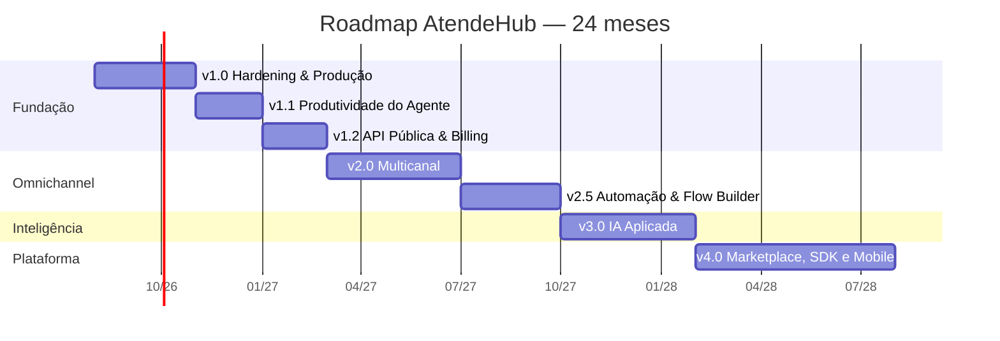

---

## 3.2 v1.0 — "Endurecimento e Produção Real"

| Campo | Valor |
|---|---|
| **Objetivo** | Levar o produto atual a produção com segurança, observabilidade e operabilidade de nível Enterprise. **Zero features novas de usuário final.** |
| **Complexidade** | 🟠 Alta |
| **Tempo estimado** | 3 meses (6 sprints) |
| **Dependências** | Nenhuma — é a base de tudo |
| **Impacto** | Habilita a venda do primeiro contrato pago com SLA; elimina risco jurídico (LGPD) |
| **Prioridade** | **P0** |
| **Criticidade** | **Máxima** — hoje o produto não pode ir a produção com dados reais de terceiros |

### Funcionalidades / entregas

| # | Entrega | GAPs fechados | Complexidade |
|---|---|---|---|
| 1 | Mídia privada: bucket fechado + URLs pré-assinadas com TTL + proxy autenticado por tenant | SEC-01, STO-1..5 | 🟡 |
| 2 | Correção do retry de webhook + DLQ + alerta operacional | WEBH-1, WEBH-5 | 🟢 |
| 3 | Correção de mídia sem legenda (preview/unread/lastMessageAt) | WEBH-2 | 🟢 |
| 4 | RBAC com escopo: `@Roles` + `ConversationScopeGuard` (própria / departamento / todas) | PRM-01, PRM-02, RBAC-1..3 | 🟠 |
| 5 | RLS no Postgres + `Prisma $extends` injetando `companyId` automaticamente | DB-01, SEC-13, DB-1 | 🟠 |
| 6 | Autenticação: reset de senha, verificação de e-mail, lockout, política de senha, MFA (TOTP) | SEC-05..11, AUTH-2..6 | 🟠 |
| 7 | Cookie `httpOnly` para refresh + access em memória | SEC-02, FES-1 | 🟡 |
| 8 | Nginx endurecido: CSP, HSTS, headers, redirect 80→443 na API, `limit_req`, timeouts de WS, ACME/Certbot | SEC-03, NGX-1..8, DVO-10 | 🟡 |
| 9 | Container non-root, healthcheck, `tini`, shutdown gracioso, migrate no entrypoint | SEC-04, DKR-1..5, DVO-13 | 🟢 |
| 10 | **Swagger/OpenAPI** completo com DTOs anotados e exemplos | API-01, DOC-01 | 🟡 |
| 11 | Observabilidade: OpenTelemetry (traces + métricas), `/metrics` Prometheus, Grafana com 6 dashboards, Loki para logs, propagação de `requestId` na fila | MON-01..05, MON-10, OBS-1..6 | 🟠 |
| 12 | Worker separado da API (mesmo código, processo dedicado) + Bull Board | ESC-01, FIL-10 | 🟡 |
| 13 | Backup automatizado (pg_dump + WAL-G para S3, MinIO mirror) + teste de restore mensal | DVO-05, DVO-06 | 🟡 |
| 14 | CI/CD: build de imagem, push para GHCR, deploy em staging, CodeQL, Trivy, gitleaks, Dependabot, gate de cobertura | CI-1..9, SEC-14, TST-06 | 🟠 |
| 15 | E2E real: Playwright (login → receber → responder → transferir → encerrar) + Testcontainers na API | TST-01..03 | 🟠 |
| 16 | Índices e performance: trigram, composto `(companyId,status,lastMessageAt)`, `getStats` com cache Redis 30s | DB-03, DB-04, PERF-01, PERF-02, CONV-1 | 🟢 |
| 17 | Estado em memória para Redis (`avatarFetchedAt`, presença) | ESC-03, WEBH-3, WS-1 | 🟢 |
| 18 | ESLint + Prettier + Husky + commitlint no front | COD-01..03 | 🟢 |
| 19 | Provedor de e-mail transacional (Resend/SES) | INT-08, EML-02 | 🟢 |
| 20 | Ambientes dev/staging/prod com IaC mínima (Terraform + Docker Swarm ou ECS) | DVO-01..03 | 🟠 |

### Critérios de saída (Definition of Done da versão)

- [ ] Nenhum objeto de mídia acessível sem autenticação (validado por teste automatizado)
- [ ] Falha simulada de Postgres durante processamento de webhook resulta em retry e, após 3 tentativas, DLQ + alerta
- [ ] Agente autenticado recebe 403 ao acessar conversa de outro departamento (teste E2E)
- [ ] `SELECT` direto no banco com `app.current_company_id` de outro tenant retorna 0 linhas
- [ ] Dashboards Grafana: latência p50/p95/p99, taxa de erro, profundidade de fila, conexões WS, conexões WhatsApp, mensagens/min
- [ ] Restore completo de backup executado com sucesso em ambiente limpo (documentado)
- [ ] Pipeline verde: lint + types + unit + E2E + CodeQL + Trivy + cobertura ≥ 70%
- [ ] SSL Labs grade A na API e no app
- [ ] Deploy sem downtime demonstrado em staging

---

## 3.3 v1.1 — "Produtividade do Agente"

| Campo | Valor |
|---|---|
| **Objetivo** | Tornar o dia a dia do atendente competitivo com Chatwoot/Tiflux; reduzir TMA em 30% |
| **Complexidade** | 🟡 Média |
| **Tempo estimado** | 2 meses (4 sprints) |
| **Dependências** | v1.0 (RBAC com escopo, observabilidade) |
| **Impacto** | Retenção de clientes; principal reclamação de quem usa hoje |
| **Prioridade** | P1 |
| **Criticidade** | Alta |

### Funcionalidades

| # | Entrega | GAPs | Complexidade |
|---|---|---|---|
| 1 | **Migração do front para a stack alvo**: React Router 7 + React Query 5 + Zustand + TailwindCSS + shadcn/ui (por rota, incremental) | FE-1..4, UI-01..03, UX-01 | 🔴 |
| 2 | Respostas rápidas com atalho `/` + variáveis (`{{contato.nome}}`) | UX-04 | 🟡 |
| 3 | Macros (ação composta) | UX-05 | 🟡 |
| 4 | Distribuição automática: `ROUND_ROBIN` e `LEAST_BUSY` implementados + status do agente + limite de simultâneas | FIL-01..03, AUX-3, AUX-4 | 🟠 |
| 5 | Transferência com motivo, histórico e notificação | CONV-6 | 🟢 |
| 6 | Presence real: quem está online, digitando, com a conversa aberta (anti-colisão) | UX-07, WS-2 | 🟡 |
| 7 | Busca global `Ctrl+K` (conversas, contatos, mensagens com FTS) | UX-02, API-08, DB-05 | 🟠 |
| 8 | Atalhos de teclado + snooze + follow-up | UX-03, UX-08 | 🟡 |
| 9 | Histórico unificado do cliente na lateral | UX-11 | 🟡 |
| 10 | Reabertura de conversa encerrada dentro de janela configurável | CONV-7 | 🟡 |
| 11 | Virtualização de listas + skeletons + responsividade mobile/tablet | UI-04..06, PERF-04..06 | 🟠 |
| 12 | Métricas de atendimento: TME, TMA, FRT, abandono, aderência a SLA + rollup diário | MET-01..02, MET-06, MET-09, DB-09, RPT-2 | 🟠 |
| 13 | **CSAT**: pesquisa de satisfação pós-atendimento (modelo + envio + relatório) | MET-04 | 🟡 |
| 14 | Notificação push (web push) e por e-mail | AUX-2, UX-12 | 🟡 |
| 15 | Storybook + tokens de design | UI-10 | 🟡 |

### Critérios de saída
- [ ] Rota por tela e link direto para conversa funcionando (`/inbox/:conversationId`)
- [ ] Conversa nova é distribuída automaticamente ao agente disponível conforme estratégia da fila
- [ ] TMA e TME aparecem no dashboard com dados reais e batem com cálculo manual em amostra
- [ ] CSAT enviado automaticamente ao encerrar e respondido pelo WhatsApp
- [ ] Lighthouse ≥ 90 em performance e acessibilidade na tela de inbox

---

## 3.4 v1.2 — "Plataforma Comercial: API Pública e Billing"

| Campo | Valor |
|---|---|
| **Objetivo** | Transformar o sistema em um SaaS que cobra, mede consumo e é integrável |
| **Complexidade** | 🟠 Alta |
| **Tempo estimado** | 2 meses (4 sprints) |
| **Dependências** | v1.0 (Swagger, RBAC), v1.1 (métricas) |
| **Impacto** | **Receita** — hoje não há como cobrar |
| **Prioridade** | P1 |
| **Criticidade** | Máxima para o negócio |

### Funcionalidades

| # | Entrega | GAPs | Complexidade |
|---|---|---|---|
| 1 | API pública v1: chaves por empresa, escopos, rate limit por chave, quota, logs de uso | API-02, SEC-18 | 🟠 |
| 2 | Webhooks de saída: entrega com HMAC, retry exponencial, DLQ, log e reenvio manual | API-03 | 🟡 |
| 3 | Billing: planos, assinatura, gateway (Stripe + Asaas/Pagar.me para BR), faturas, dunning | INT-07, AUX-5, PRM-06 | 🟠 |
| 4 | Enforcement de limites de plano (agentes, canais, mensagens/mês, retenção) | PRM-06 | 🟡 |
| 5 | Back-office SUPER_ADMIN: tenants, planos, uso, impersonation auditada, suspensão | PRM-05, RBAC-5 | 🟠 |
| 6 | Campos customizados de contato e conversa | CRM-04, DB-08 | 🟡 |
| 7 | Importação/exportação CSV de contatos com dedup e merge | CRM-08 | 🟡 |
| 8 | Bulk operations + paginação por cursor em todas as listas | API-04, API-07 | 🟡 |
| 9 | Portal do desenvolvedor (docs + playground + changelog de API) | API-01, DOC-01 | 🟡 |
| 10 | LGPD completo: exportação de dados do titular, política de retenção configurável, DPA | SEC-22, DB-11 | 🟡 |
| 11 | Audit log imutável com hash encadeado e retenção | DB-12, AUX-1, SEC-24 | 🟡 |

### Critérios de saída
- [ ] Cliente cria chave de API, consome `GET /public/v1/conversations` e recebe 429 ao exceder a quota
- [ ] Webhook de saída entregue com assinatura verificável e reentregue após falha
- [ ] Assinatura cobrada de ponta a ponta em ambiente de teste do gateway
- [ ] Empresa no plano FREE é bloqueada ao tentar criar o 6º agente

---

## 3.5 v2.0 — "Omnichannel de Verdade"

| Campo | Valor |
|---|---|
| **Objetivo** | Deixar de ser "sistema de WhatsApp" e virar plataforma omnichannel |
| **Complexidade** | 🔴 Muito alta |
| **Tempo estimado** | 4 meses (8 sprints) |
| **Dependências** | v1.0 (arquitetura), v1.2 (API) |
| **Impacto** | Muda a categoria do produto e o ticket médio |
| **Prioridade** | P1 |
| **Criticidade** | Alta — é o que o nome do projeto promete |

### Funcionalidades

| # | Entrega | GAPs | Complexidade |
|---|---|---|---|
| 1 | **Refactor arquitetural: Channel Port/Adapter** (hexagonal) — `IChannelAdapter` com `send`, `receive`, `normalize`, `capabilities` | ARQ-09, ARQ-02, ARQ-03, WA-1 | 🔴 |
| 2 | **Modelo de identidade unificada**: `ContactIdentity` (canal + identificador → contato), migração do `@@unique([companyId, phone])` | DB-06, DB-07, CRM-2, CRM-5 | 🟠 |
| 3 | Conceito de **Inbox** (caixa) como fronteira de canal + permissão | PRM-02 | 🟡 |
| 4 | Canal **WhatsApp Cloud API oficial** (Meta) + templates HSM + janela de 24h | WA-01..03, MSG-3 | 🔴 |
| 5 | Canal **Webchat** (widget embarcável, SDK JS, identificação e histórico) | EML/Chat | 🟠 |
| 6 | Canal **Telegram** | TG-01..03 | 🟡 |
| 7 | Canal **Instagram** (DM + comentários + menções em story) | IG-01..05 | 🟠 |
| 8 | Canal **Facebook Messenger** (+ comentários de página) | FB-01..04 | 🟠 |
| 9 | Canal **E-mail** (IMAP/SMTP, threading, alias por caixa, parser) | EML-01, EML-03..06 | 🟠 |
| 10 | Roteamento e SLA por canal; capacidades por canal na UI (o que cada canal suporta) | FIL-04 | 🟡 |
| 11 | Timeline unificada por contato através de canais | UX-11, CRM-05 | 🟡 |
| 12 | Event bus interno (Pub/Sub) + outbox pattern | ARQ-05..07 | 🟠 |
| 13 | Migração Bull → BullMQ com rate limit por canal | ESC-11, FIL-09 | 🟡 |

### Critérios de saída
- [ ] Adicionar um canal novo exige apenas implementar `IChannelAdapter` (comprovado com Telegram feito por dev que não escreveu o core)
- [ ] Mesmo cliente escrevendo por WhatsApp e Instagram cai no mesmo `Contact`, com timeline única
- [ ] Envio bloqueado fora da janela de 24h no WhatsApp Cloud, com sugestão de template
- [ ] Widget de webchat embarcado em site externo, com histórico persistido

---

## 3.6 v2.5 — "Automação e Flow Builder"

| Campo | Valor |
|---|---|
| **Objetivo** | Substituir o menu numérico por automação visual comparável a Typebot/ManyChat |
| **Complexidade** | 🔴 Muito alta |
| **Tempo estimado** | 3 meses (6 sprints) |
| **Dependências** | v2.0 (canais e event bus) |
| **Impacto** | Deflexão de atendimento humano (redução de custo do cliente) |
| **Prioridade** | P1 |
| **Criticidade** | Alta — nenhum concorrente vende sem isso |

### Funcionalidades

| # | Entrega | GAPs | Complexidade |
|---|---|---|---|
| 1 | Motor de fluxo: grafo de nós, execução com estado em Redis, timeout, retomada | BOT-01..03 | 🔴 |
| 2 | Editor visual drag-and-drop (React Flow) com preview e simulador | BOT-01, BOT-06 | 🔴 |
| 3 | Tipos de nó: mensagem, pergunta, condição, variável, delay, HTTP request, transferir, taguear, encerrar, IA | BOT-02, BOT-04 | 🟠 |
| 4 | Multi-fluxo por canal/inbox/departamento + gatilhos (palavra-chave, primeira mensagem, horário) | BOT-09 | 🟡 |
| 5 | Versionamento, publicação e rollback de fluxo | BOT-07 | 🟡 |
| 6 | NLU leve: sinônimos, fuzzy match, intenções simples | BOT-05 | 🟡 |
| 7 | Analytics de fluxo: contenção, abandono por nó, caminho mais comum | BOT-08, MET-08 | 🟡 |
| 8 | Regras de automação estilo Zendesk Triggers (evento → condição → ação) | — | 🟠 |
| 9 | Campanhas: disparo em massa com opt-out, agendamento, controle de taxa, relatório | WA-07 | 🟠 |
| 10 | Botões e listas interativas do WhatsApp nos nós | WA-05 | 🟡 |
| 11 | Integrações no-code: n8n / Make / Zapier | INT-03 | 🟡 |

### Critérios de saída
- [ ] Cliente monta fluxo de qualificação de lead com 3 perguntas, condição e transferência, sem ajuda técnica
- [ ] Simulador reproduz o fluxo sem enviar mensagem real
- [ ] Painel mostra taxa de contenção do bot por fluxo

---

## 3.7 v3.0 — "IA Aplicada ao Atendimento"

| Campo | Valor |
|---|---|
| **Objetivo** | Usar IA onde há ganho mensurável: velocidade do agente, deflexão e qualidade |
| **Complexidade** | 🔴 Muito alta |
| **Tempo estimado** | 4 meses (8 sprints) |
| **Dependências** | v2.0 (dados unificados), v2.5 (fluxos) |
| **Impacto** | Diferencial competitivo e justificativa de upgrade de plano |
| **Prioridade** | P1 |
| **Criticidade** | Média-alta (não bloqueia operação, define posicionamento) |

### Funcionalidades

| # | Entrega | GAPs | Complexidade |
|---|---|---|---|
| 1 | Camada de abstração de LLM (provider-agnostic, com fallback, cache e controle de custo por tenant) | IA-10 | 🟠 |
| 2 | **Transcrição de áudio** automática (whisper/provider) com busca no texto | IA-07 | 🟡 |
| 3 | Copilot do agente: sugerir resposta, reescrever tom, resumir, traduzir | IA-02, IA-08 | 🟠 |
| 4 | Resumo automático de conversa e de handoff (transferência) | IA-03 | 🟡 |
| 5 | Classificação automática: assunto, sentimento, urgência → roteamento e tag | IA-04 | 🟠 |
| 6 | Base de conhecimento + RAG (upload de docs, embeddings com pgvector, citação da fonte) | IA-05 | 🔴 |
| 7 | Agente de IA autônomo como nó do fluxo, com guardrails, escopo e escalonamento para humano | IA-06 | 🔴 |
| 8 | QA automatizado: avaliação de 100% das conversas por rubrica configurável | IA-09 | 🟠 |
| 9 | Painel de IA: custo por tenant, taxa de aceitação de sugestão, deflexão | IA-10 | 🟡 |

### Critérios de saída
- [ ] Áudio recebido vira texto pesquisável em < 30s
- [ ] Sugestão de resposta aceita pelo agente em ≥ 40% dos casos (métrica instrumentada)
- [ ] Agente de IA resolve ≥ 25% das conversas de FAQ sem humano, com escalonamento correto quando incerto
- [ ] Custo de IA por tenant visível e limitável

---

## 3.8 v4.0 — "Plataforma e Ecossistema"

| Campo | Valor |
|---|---|
| **Objetivo** | Deixar de ser produto e virar plataforma extensível por terceiros |
| **Complexidade** | 🔴 Muito alta |
| **Tempo estimado** | 6 meses (12 sprints) |
| **Dependências** | v1.2 (API), v3.0 |
| **Impacto** | Efeito de rede, retenção estrutural, receita de marketplace |
| **Prioridade** | P2 |
| **Criticidade** | Média (estratégica, não operacional) |

### Funcionalidades

| # | Entrega | Complexidade |
|---|---|---|
| 1 | Marketplace de apps: manifesto, sandbox, permissões, instalação por tenant, revisão | 🔴 |
| 2 | SDK oficial: JS/TS, PHP, Python + CLI | 🟠 |
| 3 | App mobile (React Native/Expo) para agente e supervisor, com push nativo | 🔴 |
| 4 | Papéis e permissões customizáveis pelo cliente (policy engine) | 🟠 |
| 5 | CRM completo: pipeline, deals, tarefas, organizações, segmentação, lead scoring | 🔴 |
| 6 | Dashboards customizáveis + wallboard + drill-down | 🟠 |
| 7 | SSO (SAML/OIDC) + SCIM | 🟠 |
| 8 | White-label completo (domínio, marca, e-mail, app) | 🟠 |
| 9 | Multi-região + residência de dados + DR ativo-ativo | 🔴 |
| 10 | Certificação SOC 2 Tipo II / ISO 27001 | 🔴 |

---

## 3.9 Matriz consolidada de versões

| Versão | Objetivo | Complexidade | Tempo | Dependências | Impacto | Prioridade | Criticidade |
|---|---|---|---|---|---|---|---|
| **v1.0** | Hardening e produção | 🟠 Alta | 3 meses | — | Habilita venda com SLA | P0 | **Máxima** |
| **v1.1** | Produtividade do agente | 🟡 Média | 2 meses | v1.0 | -30% TMA, retenção | P1 | Alta |
| **v1.2** | API pública e billing | 🟠 Alta | 2 meses | v1.0, v1.1 | **Receita** | P1 | Máxima |
| **v2.0** | Omnichannel | 🔴 M. alta | 4 meses | v1.0, v1.2 | Muda a categoria | P1 | Alta |
| **v2.5** | Automação e bots | 🔴 M. alta | 3 meses | v2.0 | Deflexão / custo | P1 | Alta |
| **v3.0** | IA aplicada | 🔴 M. alta | 4 meses | v2.0, v2.5 | Diferencial | P1 | Média-alta |
| **v4.0** | Plataforma e ecossistema | 🔴 M. alta | 6 meses | v1.2, v3.0 | Efeito de rede | P2 | Média |

---

# FASE 4 — Product Backlog

> Estrutura: **Epic → Feature → User Story → Task → Subtask**, com critérios de aceite em formato Gherkin
> resumido. Estimativas em *story points* (Fibonacci). Backlog completo dos épicos das versões v1.0–v2.0;
> v2.5–v4.0 permanecem em nível de Feature (refinamento *just-in-time*).

## EPIC-01 — Segurança e Conformidade da Plataforma

**Objetivo de negócio:** eliminar risco jurídico e habilitar contrato com cláusula de segurança.
**Métrica de sucesso:** 0 achados críticos/altos em pentest; SSL Labs A; 100% da mídia autenticada.

### FEAT-01.1 — Mídia privada e acesso controlado

**US-01.1.1** — *Como* responsável pela empresa, *quero* que os arquivos enviados pelos meus clientes só
sejam acessíveis por usuários autenticados da minha empresa, *para* não violar a LGPD.

| Task | Subtask | SP |
|---|---|---|
| T-01.1.1.1 Remover a policy pública do bucket | Substituir `setBucketPolicy` por policy privada; migrar buckets existentes | 2 |
| T-01.1.1.2 Serviço de URL pré-assinada | `StorageService.getSignedUrl(key, ttl)`; TTL configurável (default 15 min) | 3 |
| T-01.1.1.3 Endpoint proxy autenticado | `GET /attachments/:id` valida JWT + tenancy + ownership da conversa e redireciona para a URL assinada | 5 |
| T-01.1.1.4 Prefixo por tenant | Chave do objeto passa a ser `{companyId}/{yyyy}/{mm}/{uuid}.{ext}` | 2 |
| T-01.1.1.5 Validar tipo real do arquivo | Checar magic bytes no upload; rejeitar SVG/HTML | 3 |
| T-01.1.1.6 Front consome URL assinada | `useAttachmentUrl` com cache e renovação antes do vencimento | 3 |

**Critérios de aceite**
- **Dado** um anexo existente, **quando** eu acessar a URL do MinIO diretamente sem token, **então** recebo 403.
- **Dado** um agente da empresa A, **quando** solicitar `GET /attachments/:id` de um anexo da empresa B, **então** recebo 404 (não 403 — não vazar existência).
- **Dado** um upload de arquivo `.png` cujo conteúdo é HTML, **quando** enviado, **então** é rejeitado com 400.
- **Dado** um anexo de imagem no chat, **quando** a URL assinada expirar durante a sessão, **então** a UI renova de forma transparente, sem imagem quebrada.

### FEAT-01.2 — Isolamento multi-tenant em profundidade

**US-01.2.1** — *Como* CTO, *quero* que o banco de dados recuse fisicamente leitura entre tenants,
*para* que um bug de aplicação não vire vazamento de dados.

| Task | Subtask | SP |
|---|---|---|
| T-01.2.1.1 Habilitar RLS | `ALTER TABLE ... ENABLE ROW LEVEL SECURITY` + policy `company_id = current_company_id()` em 14 tabelas | 8 |
| T-01.2.1.2 Extensão do Prisma | `$extends` com `query.$allOperations` executando `SET LOCAL app.current_company_id` na transação | 8 |
| T-01.2.1.3 Contexto de tenant | Propagar `companyId` via `AsyncLocalStorage` (reaproveitar `request-context.ts`) | 3 |
| T-01.2.1.4 Rotas de sistema | Marcar operações sem tenant (webhook ingest, jobs) com bypass explícito e auditado | 5 |
| T-01.2.1.5 Corrigir `updateMany` sem tenant | `webhook.service.ts:340`, `messageService.updateStatus` | 2 |
| T-01.2.1.6 Teste de isolamento | Suite que, para cada tabela, tenta ler dado de outro tenant e espera 0 linhas | 5 |

**Critérios de aceite**
- **Dado** um usuário da empresa A autenticado, **quando** qualquer query da aplicação for executada, **então** o Postgres retorna apenas linhas de A, mesmo se o `where` da aplicação omitir `companyId`.
- **Dado** o processador de webhook, **quando** processar um evento, **então** o `companyId` é resolvido da conexão e aplicado ao contexto antes de qualquer escrita.

### FEAT-01.3 — Autenticação Enterprise

**US-01.3.1** — *Como* usuário, *quero* recuperar minha senha por e-mail, *para* não depender do suporte.
**US-01.3.2** — *Como* administrador, *quero* exigir 2FA para todos da minha empresa, *para* atender à política interna.
**US-01.3.3** — *Como* usuário, *quero* ver e revogar minhas sessões ativas, *para* controlar acessos.

| Task | SP |
|---|---|
| T-01.3.1 Fluxo `forgot`/`reset` com token de uso único (TTL 30min, hash no banco) | 5 |
| T-01.3.2 Verificação de e-mail no cadastro + reenvio | 3 |
| T-01.3.3 Lockout progressivo por conta e por IP (5 tentativas → backoff exponencial) | 5 |
| T-01.3.4 Política de senha + checagem HIBP (k-anonymity) | 3 |
| T-01.3.5 MFA TOTP: enrollment, QR, códigos de recuperação, enforcement por empresa | 8 |
| T-01.3.6 Refresh em cookie `httpOnly`+`Secure`+`SameSite=Strict`; access em memória | 5 |
| T-01.3.7 Detecção de reuso de refresh token → revogar toda a família | 5 |
| T-01.3.8 Tela de sessões ativas com device/IP/última atividade | 5 |

**Critérios de aceite**
- **Dado** um token de reset já usado, **quando** reutilizado, **então** retorna 400 e registra tentativa na auditoria.
- **Dado** 5 tentativas de senha errada, **quando** a 6ª ocorrer, **então** a conta é bloqueada por tempo crescente e o usuário é notificado por e-mail.
- **Dado** um refresh token já rotacionado, **quando** for reapresentado, **então** todas as sessões daquele usuário são revogadas.
- **Dado** 2FA obrigatório na empresa, **quando** um usuário sem 2FA fizer login, **então** é forçado ao enrollment antes de acessar qualquer rota.

## EPIC-02 — Confiabilidade do Pipeline de Mensagens

**Métrica de sucesso:** 0 mensagens perdidas em teste de caos; p99 de ingest < 2s.

### FEAT-02.1 — Retry, DLQ e idempotência

**US-02.1.1** — *Como* operação, *quero* que nenhuma mensagem se perca quando uma dependência cair.

| Task | SP |
|---|---|
| T-02.1.1 Remover o catch que engole erro em `WebhookService.handleEvent` e propagar | 2 |
| T-02.1.2 Classificar erro transitório vs permanente (só retry no transitório) | 3 |
| T-02.1.3 DLQ dedicada + endpoint de reprocessamento manual | 5 |
| T-02.1.4 Alerta (Sentry + Slack) ao entrar na DLQ | 2 |
| T-02.1.5 Idempotência do job por `event+instance+messageId` | 3 |
| T-02.1.6 Teste de caos: derrubar Postgres/MinIO durante rajada e conferir 0 perdas | 5 |

**Critérios de aceite**
- **Dado** o Postgres indisponível, **quando** chegar um webhook, **então** o job falha, tenta 3x com backoff e vai para a DLQ, **e** nenhuma mensagem é dada como processada.
- **Dado** um job na DLQ, **quando** o admin clicar em "reprocessar", **então** a mensagem é criada corretamente e sem duplicar.

### FEAT-02.2 — Correção de sinalização de mídia

**US-02.2.1** — *Como* atendente, *quero* que um áudio sem legenda faça a conversa subir na lista como não lida.

| Task | SP |
|---|---|
| T-02.2.1 `updateLastMessage` passa a receber um preview derivado do tipo (ex.: "🎤 Áudio" → rótulo textual sem emoji: "Áudio") | 2 |
| T-02.2.2 Remover a condição `&& content` do gatilho | 1 |
| T-02.2.3 Teste cobrindo os 5 tipos de mídia sem legenda | 3 |

**Critérios de aceite**
- **Dado** um áudio recebido sem legenda, **quando** processado, **então** `lastMessageAt` é atualizado, `unreadCount` incrementa e o preview mostra "Áudio".

## EPIC-03 — Permissões e Escopo de Atendimento

### FEAT-03.1 — Escopo de conversa por papel

**US-03.1.1** — *Como* administrador, *quero* que agentes vejam apenas as conversas do seu departamento.

| Task | SP |
|---|---|
| T-03.1.1 `ConversationScopeGuard` + decorator `@Scope('own'|'department'|'company')` | 8 |
| T-03.1.2 Filtro implícito no `findAll`/`findOne` conforme papel e departamentos do usuário | 5 |
| T-03.1.3 Aplicar em `message`, `note`, `dashboard`, `report` | 5 |
| T-03.1.4 Configuração por empresa: "agentes veem todas / só do departamento / só as próprias" | 5 |
| T-03.1.5 Testes E2E de negação (403/404) por papel | 5 |

**Critérios de aceite**
- **Dado** um AGENT do departamento Suporte, **quando** listar conversas, **então** só vê conversas de Suporte (ou não atribuídas ao departamento, conforme configuração).
- **Dado** um AGENT, **quando** tentar `GET /conversations/:id` de outro departamento, **então** recebe 404.
- **Dado** um SUPERVISOR, **quando** listar, **então** vê todas as conversas dos departamentos que supervisiona.
- **Dado** um AGENT, **quando** tentar exportar relatório, **então** recebe 403.

## EPIC-04 — Observabilidade e Operação

### FEAT-04.1 — Telemetria completa

| US | Task | SP |
|---|---|---|
| US-04.1.1 Como SRE, quero traces ponta a ponta | Instrumentar NestJS, Prisma, Bull, Socket.IO e axios com OTel; exportar para Tempo/Jaeger | 8 |
| US-04.1.2 Como SRE, quero métricas | `/metrics` com histogramas de latência, contadores de mensagem por canal, gauge de profundidade de fila e conexões WS | 5 |
| US-04.1.3 Como SRE, quero logs pesquisáveis | Loki + Promtail; log estruturado JSON com `traceId`/`companyId` | 5 |
| US-04.1.4 Como SRE, quero dashboards | 6 dashboards Grafana (API, Fila, WhatsApp, Banco, Negócio, SLO) | 5 |
| US-04.1.5 Como SRE, quero ser acordado | Alertmanager com 12 regras (erro 5xx, fila crescendo, WhatsApp caído, SLA violado em massa, disco, latência) | 5 |
| US-04.1.6 Como dev, quero correlação | Propagar `requestId`/`traceId` para o job da fila e para a chamada à Evolution | 3 |

**Critérios de aceite**
- **Dado** uma mensagem recebida, **quando** eu buscar pelo `traceId` no Grafana, **então** vejo o span do webhook, do job, das queries do Prisma e da emissão Socket.IO.
- **Dado** a fila de webhook acima de 1.000 jobs por 5 minutos, **então** um alerta é disparado.

## EPIC-05 — Frontend Enterprise (migração de stack)

### FEAT-05.1 — Roteamento e data layer

| US | Task | SP |
|---|---|---|
| US-05.1.1 Como agente, quero compartilhar o link de uma conversa | Instalar React Router 7; rotas `/dashboard`, `/inbox`, `/inbox/:id`, `/contacts`, `/reports`, `/settings/*`; lazy loading por rota | 8 |
| US-05.1.2 Como usuário, quero a UI sempre sincronizada | Migrar `useConversations` (845 ln) para React Query com `queryKey` por recurso, invalidação por evento de socket, optimistic update no envio | 13 |
| US-05.1.3 Como dev, quero estado global previsível | Zustand para sessão, UI e preferências | 5 |
| US-05.1.4 Como designer, quero consistência | Tailwind + tokens + shadcn/ui; migrar componentes por rota | 13 |
| US-05.1.5 Como dev, quero segurança de tipo | Gerar cliente tipado a partir do OpenAPI (orval/openapi-typescript) + zod na borda | 8 |
| US-05.1.6 Como dev, quero quebrar o monólito | `SettingsPanel` (1.571 ln) → uma rota e um componente por seção | 8 |

**Critérios de aceite**
- **Dado** o link `/inbox/abc123`, **quando** aberto em outra aba autenticada, **então** a conversa correta abre diretamente.
- **Dado** uma nova mensagem via socket, **quando** recebida, **então** a lista e o chat atualizam sem refetch completo.
- **Dado** o build de produção, **então** o bundle inicial é < 250 KB gzip e cada rota carrega sob demanda.

## EPIC-06 — Roteamento e Distribuição Automática

### FEAT-06.1 — Estratégias de fila

| US | Task | SP |
|---|---|---|
| US-06.1.1 Como supervisor, quero distribuição automática | Implementar `ROUND_ROBIN` e `LEAST_BUSY`; serviço `AssignmentService` com lock em Redis | 8 |
| US-06.1.2 Como agente, quero controlar minha disponibilidade | `AgentAvailability` (ONLINE/BUSY/PAUSE/OFFLINE) com motivo de pausa e histórico | 5 |
| US-06.1.3 Como supervisor, quero limitar carga | `maxConcurrent` por agente/fila, respeitado na distribuição | 3 |
| US-06.1.4 Como cliente, quero não ficar preso | Transbordo entre filas e reatribuição quando o agente sai | 5 |
| US-06.1.5 Como supervisor, quero horário por fila | Horário de funcionamento no nível da fila, sobrepondo o da empresa | 3 |

**Critérios de aceite**
- **Dado** 3 agentes online e estratégia ROUND_ROBIN, **quando** chegarem 6 conversas, **então** cada agente recebe exatamente 2.
- **Dado** um agente em PAUSE, **quando** chegar conversa, **então** ele não recebe.
- **Dado** um agente no limite de simultâneas, **quando** chegar conversa, **então** ela vai para o próximo elegível ou permanece na fila.

## EPIC-07 — Métricas, CSAT e Relatórios

### FEAT-07.1 — Indicadores de atendimento

| US | Task | SP |
|---|---|---|
| US-07.1.1 Como gestor, quero TME/TMA/FRT | Campos `firstResponseAt`, `firstAssignedAt`, `handleTimeSecs` + backfill + cálculo | 8 |
| US-07.1.2 Como gestor, quero relatórios rápidos | Tabela `ConversationDailyStats` alimentada por job noturno + consulta a partir dela | 8 |
| US-07.1.3 Como gestor, quero CSAT | Modelo `SatisfactionSurvey`, envio automático pós-encerramento, coleta pela resposta do cliente, relatório | 8 |
| US-07.1.4 Como gestor, quero relatório agendado | Agendamento + geração assíncrona + envio por e-mail com link temporário | 5 |
| US-07.1.5 Como gestor, quero exportação pesada sem travar | Geração de PDF/CSV em fila com notificação ao concluir | 5 |

**Critérios de aceite**
- **Dado** um período de 12 meses, **quando** eu abrir o relatório, **então** ele responde em < 2s consultando o rollup.
- **Dado** uma conversa encerrada como RESOLVED, **quando** o encerramento ocorrer, **então** a pesquisa CSAT é enviada em até 1 minuto e a nota respondida é gravada.

## EPIC-08 — Omnichannel (v2.0)

### FEAT-08.1 — Abstração de canal

| US | Task | SP |
|---|---|---|
| US-08.1.1 Como arquiteto, quero adicionar canais sem tocar no core | Definir `IChannelAdapter` (send/receive/normalize/capabilities/healthcheck) + registry + testes de conformidade do contrato | 13 |
| US-08.1.2 Como produto, quero identidade unificada | `ContactIdentity(channel, externalId, contactId)` + migração + merge de contatos | 13 |
| US-08.1.3 Como admin, quero organizar por caixa | Entidade `Inbox` com canal, credenciais, fila padrão, permissões | 8 |
| US-08.1.4 Como agente, quero ver o que cada canal suporta | `capabilities` por canal dirigindo a UI (botões, template, áudio, tamanho de arquivo) | 5 |

**Critérios de aceite**
- **Dado** o adapter de Telegram, **quando** submetido à suíte de conformidade, **então** passa sem modificação no core.
- **Dado** um contato que já escreveu por WhatsApp, **quando** escrever pelo Instagram com identidade vinculada, **então** cai no mesmo `Contact` e vê-se a timeline unificada.

## 4.9 Backlog resumido — features de v2.5 a v4.0

| Epic | Features |
|---|---|
| EPIC-09 Flow Builder | Motor de execução · Editor visual · Biblioteca de nós · Gatilhos · Versionamento · Simulador · Analytics |
| EPIC-10 Automação | Triggers · Automações agendadas · Campanhas · Opt-out · Integrações no-code |
| EPIC-11 IA | Abstração de LLM · Transcrição · Copilot · Resumo · Classificação · RAG · Agente autônomo · QA automatizado |
| EPIC-12 CRM | Organizações · Campos custom · Pipeline · Deals · Tarefas · Segmentos · Lead scoring |
| EPIC-13 Plataforma | API pública · Webhooks · Marketplace · SDK · Portal do dev |
| EPIC-14 Mobile | App agente · Push nativo · Offline-first |
| EPIC-15 Enterprise | SSO · SCIM · Papéis custom · White-label · Multi-região · SOC 2 |

---

# FASE 5 — Kanban

## 5.1 Política do quadro

| Coluna | Definição de entrada | WIP | Definição de saída |
|---|---|---|---|
| **Backlog** | Item criado com ID, épico e valor de negócio | ∞ | Refinado, estimado, com critérios de aceite |
| **To Do** | Priorizado para a sprint atual | 15 | Alguém assumiu |
| **Doing** | Em desenvolvimento | 6 (1/dev) | PR aberto, testes escritos, CI verde |
| **Review** | PR aguardando revisão de código | 5 | 1 aprovação + comentários resolvidos |
| **QA** | Mergeado em staging | 5 | Critérios de aceite validados manualmente + E2E verde |
| **Done** | Em produção | — | Métrica/monitor confirmando funcionamento |

**Regras:** puxar da direita para a esquerda; item bloqueado ganha etiqueta 🚧 e vira pauta do daily;
bug de produção em severidade 1 fura a fila e zera o WIP de Doing.

## 5.2 Quadro — Sprint 1 e 2 da v1.0 (estado inicial proposto)

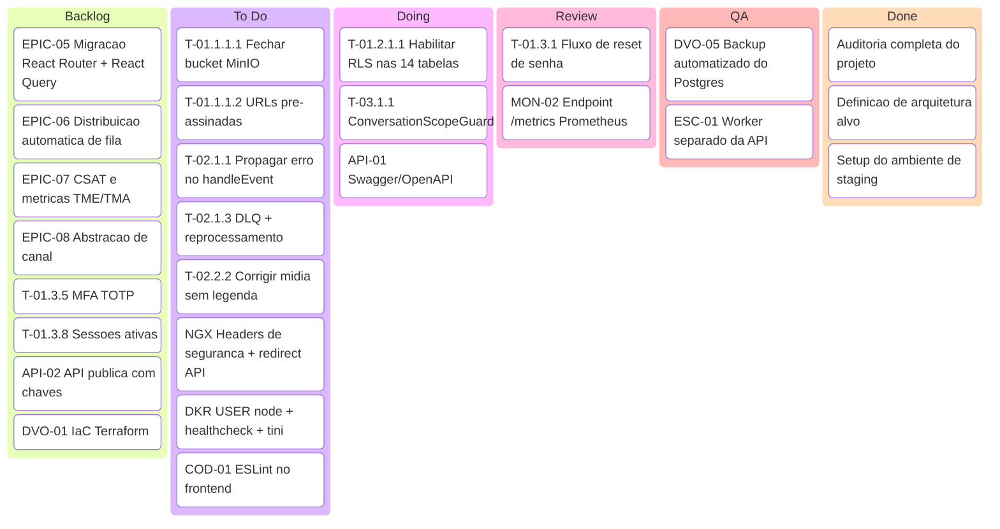

## 5.3 Sequenciamento recomendado das 6 sprints da v1.0

| Sprint | Foco | Itens principais | Risco |
|---|---|---|---|
| **S1** | Parar o sangramento | Bucket privado, retry do webhook, mídia sem legenda, headers nginx, container non-root, ESLint | Baixo |
| **S2** | Isolamento | RLS + extensão Prisma + correção de `updateMany` + testes de isolamento | **Alto** (toca todas as queries) |
| **S3** | Permissões e contrato | ScopeGuard, Swagger, formato de erro padronizado | Médio |
| **S4** | Observabilidade | OTel, Prometheus, Grafana, Loki, alertas, worker separado | Médio |
| **S5** | Autenticação | Reset, verificação, lockout, MFA, cookie httpOnly, sessões | Médio |
| **S6** | Operação e CD | Backup/restore, IaC, staging, deploy automatizado, E2E Playwright, gate de cobertura | Médio |

## 5.4 Definition of Ready / Definition of Done (padrão do time)

**Ready:** valor de negócio explícito · critérios de aceite em Gherkin · dependências mapeadas ·
estimado pelo time · impacto em segurança/LGPD avaliado · impacto em performance avaliado.

**Done:** código revisado e mergeado · testes unitários e de integração escritos · E2E quando toca fluxo
crítico · documentação/OpenAPI atualizados no mesmo PR · métrica/alerta criado quando aplicável ·
`ROADMAP_ESTABILIZACAO.md` atualizado com evidência · sem regressão de cobertura · validado em staging.

---

# FASE 6 — Fluxograma funcional completo do sistema

> Diagrama do **estado-alvo** (v2.5), já contemplando canais múltiplos, bot, IA e todos os caminhos
> alternativos. Os nós marcados com `[NOVO]` não existem hoje.

## 6.1 Visão macro — do cliente ao arquivamento

```mermaid
flowchart TD
    START([Cliente inicia contato]) --> CH{Canal de origem}

    CH -->|WhatsApp| WA[Evolution API ou WhatsApp Cloud API]
    CH -->|Instagram DM| IG["Meta Graph API - NOVO"]
    CH -->|Facebook Messenger| FB["Meta Graph API - NOVO"]
    CH -->|Telegram| TG["Bot API - NOVO"]
    CH -->|Webchat| WC["Widget SDK - NOVO"]
    CH -->|E-mail| EM["IMAP/SMTP - NOVO"]
    CH -->|SMS| SMS["Provedor SMS - NOVO"]
    CH -->|API pública| PUB["API de terceiros - NOVO"]

    WA --> HOOK
    IG --> HOOK
    FB --> HOOK
    TG --> HOOK
    WC --> HOOK
    EM --> HOOK
    SMS --> HOOK
    PUB --> HOOK

    HOOK[/"Webhook recebido em POST /webhooks/:channel"/] --> AUTHW{Assinatura ou apikey válida?}
    AUTHW -->|Não| REJ[["403 - registra tentativa suspeita"]]
    AUTHW -->|Sim| RATE{Dentro do rate limit?}
    RATE -->|Não| R429[["429 - provedor reenviará"]]
    RATE -->|Sim| VALID{Payload tem schema válido?}
    VALID -->|Não| LOGINV[["Loga payload inválido e descarta - 200"]]
    VALID -->|Sim| ENQ[[Enfileira job em Redis/BullMQ e responde 200]]

    ENQ --> WORKER[Worker consome o job]
    WORKER --> DEDUP{Já processado? dedup por externalId}
    DEDUP -->|Sim| SKIP([Ignora - idempotente])
    DEDUP -->|Não| RESOLVE[Resolve tenant pela conexão/inbox]

    RESOLVE --> NOCONN{Conexão existe e está ativa?}
    NOCONN -->|Não| ORPHAN[["Loga órfão + alerta operacional"]]
    NOCONN -->|Sim| IDENT[Resolve ou cria ContactIdentity e Contact]

    IDENT --> BLOCK{Contato bloqueado?}
    BLOCK -->|Sim| DROP([Descarta silenciosamente])
    BLOCK -->|Não| CONV{Existe conversa ativa?}

    CONV -->|Sim| APPEND[Anexa mensagem à conversa existente]
    CONV -->|Não| REOPEN{Existe conversa encerrada dentro da janela de reabertura?}
    REOPEN -->|Sim| REOP[["Reabre conversa e preserva histórico - NOVO"]]
    REOPEN -->|Não| NEW[Cria nova conversa em WAITING]

    REOP --> PERSIST
    NEW --> PERSIST
    APPEND --> PERSIST

    PERSIST[(Persiste Message + Attachment)] --> MEDIA{Tem mídia?}
    MEDIA -->|Sim| DL[Baixa mídia decriptada e envia ao S3/MinIO]
    DL --> DLFAIL{Download OK?}
    DLFAIL -->|Não| DLRETRY[["Retry 3x, depois marca anexo como indisponível"]]
    DLFAIL -->|Sim| ATT[(Cria Attachment e emite message.updated)]
    MEDIA -->|Não| EVT
    ATT --> EVT
    DLRETRY --> EVT

    EVT[[Publica evento de domínio: message.received]] --> RT[Emite em tempo real via Socket.IO]
    EVT --> AUTOM

    AUTOM{Automação aplicável?} --> BIZ
    BIZ{Dentro do horário comercial?}
    BIZ -->|Não| OOH["Envia mensagem de fora do expediente"]
    OOH --> OOHACT{Ação configurada fora do expediente}
    OOHACT -->|Deixar na fila| QUEUE
    OOHACT -->|Encerrar| CLOSEAUTO
    OOHACT -->|Bot 24h| BOT

    BIZ -->|Sim| HASBOT{Fluxo de bot ativo para este canal/inbox?}
    HASBOT -->|Não| QUEUE
    HASBOT -->|Sim| BOTUP{Motor de fluxo disponível?}
    BOTUP -->|Não| BOTDOWN[["Bot offline: pula automação, loga e alerta"]]
    BOTDOWN --> QUEUE
    BOTUP -->|Sim| BOT

    BOT[Executa fluxo do bot] --> BOTNODE{Tipo de nó}
    BOTNODE -->|Mensagem| BOTMSG[Envia mensagem]
    BOTNODE -->|Pergunta| BOTASK[Pergunta e aguarda resposta]
    BOTNODE -->|Condição| BOTIF[Avalia condição]
    BOTNODE -->|HTTP| BOTHTTP{Chamada externa OK?}
    BOTNODE -->|IA| AI
    BOTNODE -->|Encerrar| CLOSEAUTO
    BOTNODE -->|Transferir| QUEUE

    BOTHTTP -->|Timeout ou 5xx| BOTERR[["Caminho de erro do nó + alerta"]]
    BOTERR --> QUEUE
    BOTHTTP -->|OK| BOTIF

    BOTMSG --> BOTWAIT
    BOTASK --> BOTWAIT
    BOTIF --> BOTNODE

    BOTWAIT{Cliente respondeu no tempo?}
    BOTWAIT -->|Sim| BOTVALID{Resposta válida para o nó?}
    BOTWAIT -->|Não - inatividade| INACT["Mensagem de inatividade e encerra ou transfere"]
    INACT --> CLOSEAUTO
    BOTVALID -->|Não| BOTRETRY{Tentativas < 3?}
    BOTRETRY -->|Sim| BOTMSG
    BOTRETRY -->|Não| QUEUE
    BOTVALID -->|Sim| BOTNODE

    AI["Agente de IA responde com RAG - NOVO"] --> AICONF{Confiança acima do limiar?}
    AICONF -->|Sim| AIRESP[Responde e registra origem]
    AICONF -->|Não| AIESC[["Escala para humano com resumo da conversa"]]
    AIRESP --> BOTWAIT
    AIESC --> QUEUE

    QUEUE[Entra na fila de atendimento] --> QFULL{Fila cheia? limite do plano ou capacidade}
    QFULL -->|Sim| OVERFLOW[["Transbordo para fila secundária ou aviso de alto volume"]]
    OVERFLOW --> QUEUE2[Fila secundária]
    QFULL -->|Não| SLASTART[[Agenda job de SLA com o prazo da fila]]
    QUEUE2 --> SLASTART

    SLASTART --> DIST{Estratégia de distribuição}
    DIST -->|MANUAL| WAITAG[Aguarda um agente puxar da fila]
    DIST -->|ROUND_ROBIN| RR[Próximo agente do rodízio]
    DIST -->|LEAST_BUSY| LB[Agente com menos conversas abertas]
    DIST -->|SKILL_BASED| SK["Agente com a habilidade requerida - NOVO"]

    RR --> AGON{Existe agente online e com capacidade?}
    LB --> AGON
    SK --> AGON
    AGON -->|Não| WAITAG
    AGON -->|Sim| ASSIGN[Atribui a conversa ao agente]

    WAITAG --> SLAT{SLA venceu antes do atendimento?}
    SLAT -->|Sim| SLABREACH[["Marca slaBreachedAt, notifica supervisor, registra auditoria"]]
    SLABREACH --> ESCAL{Política de escalonamento}
    ESCAL -->|Notificar| WAITAG
    ESCAL -->|Reatribuir| ASSIGN
    ESCAL -->|Transbordar| QUEUE2
    SLAT -->|Não| ASSIGN

    ASSIGN --> ATTEND[Atendimento humano em andamento]
    ATTEND --> AGACT{Ação do agente}

    AGACT -->|Responder| SEND{Janela de 24h aberta? - WhatsApp}
    SEND -->|Não| TPL["Exige template HSM aprovado - NOVO"]
    SEND -->|Sim| SENDOUT[Envia pelo adapter do canal]
    TPL --> SENDOUT
    SENDOUT --> SENDOK{Provedor aceitou?}
    SENDOK -->|Não| SENDFAIL[["Marca FAILED, avisa o agente, oferece reenviar"]]
    SENDFAIL --> ATTEND
    SENDOK -->|Sim| SENTOK[Status SENT, depois DELIVERED e READ]
    SENTOK --> ATTEND

    AGACT -->|Nota interna| NOTE[Registra nota - não vai ao cliente]
    NOTE --> ATTEND
    AGACT -->|Taguear| TAGA[Aplica tag]
    TAGA --> ATTEND
    AGACT -->|Transferir| XFER{Destino}
    XFER -->|Outro agente| XAG[Transfere com motivo e resumo]
    XFER -->|Outro departamento| XDEP[Volta para a fila do departamento]
    XFER -->|Supervisor| SUP
    XAG --> ATTEND
    XDEP --> QUEUE
    AGACT -->|Snooze| SNOOZE["Adia com lembrete - NOVO"]
    SNOOZE --> WAKE{Prazo do snooze venceu ou cliente respondeu?}
    WAKE -->|Sim| ATTEND
    AGACT -->|Agente ficou offline| AGOFF[["Reatribui automaticamente ou devolve à fila"]]
    AGOFF --> QUEUE

    SUP[Supervisor monitora] --> SUPACT{Ação do supervisor}
    SUPACT -->|Assumir| ATTEND
    SUPACT -->|Sussurrar ao agente| ATTEND
    SUPACT -->|Reatribuir| ASSIGN
    SUPACT -->|Auditar| AUD[(Consulta trilha de auditoria)]

    AGACT -->|Encerrar| CLOSE{Motivo do encerramento}
    CLOSE -->|Resolvido| RES[resolution = RESOLVED]
    CLOSE -->|Não resolvido| UNRES[resolution = UNRESOLVED]
    CLOSE -->|Cancelado| CANC[resolution = CANCELLED com justificativa obrigatória]

    CLOSEAUTO[Encerramento automático pelo sistema] --> CSAT
    RES --> CSAT
    UNRES --> CSAT
    CANC --> ARCH

    CSAT{Pesquisa de satisfação habilitada?}
    CSAT -->|Não| ARCH
    CSAT -->|Sim| SURVEY["Envia CSAT/NPS - NOVO"]
    SURVEY --> SRESP{Cliente respondeu no prazo?}
    SRESP -->|Sim| SSAVE[(Grava nota e comentário)]
    SRESP -->|Não| SEXP[Expira a pesquisa]
    SSAVE --> ANALYT
    SEXP --> ANALYT

    ANALYT[(Alimenta rollup diário e analytics)] --> REPORTS[Relatórios e dashboards]
    REPORTS --> CRM[(Atualiza CRM - timeline, deal, lead score)]
    CRM --> FOLLOW{Follow-up programado?}
    FOLLOW -->|Sim| FUP["Tarefa/automação de follow-up - NOVO"]
    FUP --> OUTB[Contato ativo pelo canal permitido]
    OUTB --> START
    FOLLOW -->|Não| ARCH

    ARCH[Arquivamento] --> RETEN{Política de retenção atingida?}
    RETEN -->|Não| KEEP[(Mantém disponível para consulta)]
    RETEN -->|Sim| PURGE[["Anonimiza ou expurga conforme LGPD"]]

    KEEP --> RE{Cliente escreve de novo?}
    RE -->|Dentro da janela| REOP
    RE -->|Fora da janela| NEW
```

## 6.2 Caminhos alternativos — tabela de tratamento

| Cenário | Gatilho | Tratamento no estado-alvo | Existe hoje? |
|---|---|---|---|
| **Horário comercial** | `businessHours` do fluxo/fila | Segue para bot ou fila normalmente | ✅ |
| **Fora do expediente** | Fora de `businessHours` | Mensagem de fora do expediente + ação configurável (fila / encerrar / bot 24h) | Parcial (só mensagem) |
| **Feriado** | Calendário de feriados por empresa | Trata como fora do expediente | ❌ |
| **Bot offline** | Motor de fluxo indisponível / Redis fora | Pula automação, envia direto para fila, alerta operacional | ❌ (hoje a exceção é engolida) |
| **Bot em loop** | 3 respostas inválidas no mesmo nó | Encaminha para humano | Parcial |
| **Operador offline** | Nenhum agente `ONLINE` com capacidade | Permanece em `WAITING`; SLA continua correndo; transbordo se configurado | ❌ |
| **Agente cai durante atendimento** | Socket desconectado > N minutos | Devolve à fila ou reatribui, com nota de sistema | ❌ |
| **Erro de integração** | Provedor retorna 4xx/5xx no envio | Marca `FAILED`, avisa o agente na UI, oferece reenvio, registra métrica | Parcial |
| **Falha de API externa no bot** | Nó HTTP com timeout | Caminho de erro do nó; se ausente, encaminha para fila e alerta | ❌ |
| **Falha da Evolution / provedor caído** | Health-check falha | Circuit breaker abre, mensagens acumulam na fila, banner na UI, alerta | ❌ |
| **Fila cheia** | Limite de capacidade/plano | Transbordo para fila secundária ou aviso ao cliente de alto volume | ❌ |
| **Reabertura** | Cliente escreve após encerramento | Reabre a conversa dentro da janela; fora dela, cria nova mantendo histórico do contato | ❌ |
| **Transferência** | Agente transfere | Motivo obrigatório, resumo automático por IA, nota de sistema, notificação | Parcial |
| **Escalonamento** | SLA violado / palavra-chave crítica / sentimento negativo | Notifica supervisor → reatribui → transborda, conforme política | Parcial |
| **SLA vencido** | Job de SLA dispara com status ainda `WAITING` | `slaBreachedAt`, notificação, auditoria, evento `sla.breached` | ✅ |
| **Contato bloqueado** | `isBlocked = true` | Descarta a mensagem silenciosamente | ✅ |
| **Mensagem duplicada** | Mesmo `externalId` | Idempotente, ignora | ✅ |
| **Mídia criptografada não baixa** | `getBase64FromMediaMessage` falha | Retry, depois anexo marcado como indisponível com opção de nova tentativa manual | Parcial |
| **Payload malformado** | Schema inválido | Loga com amostra sanitizada, responde 200 para não travar o provedor | ❌ |
| **Janela de 24h fechada** | WhatsApp Cloud | Bloqueia texto livre e exige template aprovado | ❌ |
| **Tenant suspenso / inadimplente** | Billing | Recebe mensagens mas bloqueia envio; banner de cobrança | ❌ |
| **Limite de plano atingido** | `maxAgents` / `maxChannels` / mensagens | Bloqueia a ação com CTA de upgrade | ❌ |

## 6.3 Ciclo de vida da conversa (estado-alvo)

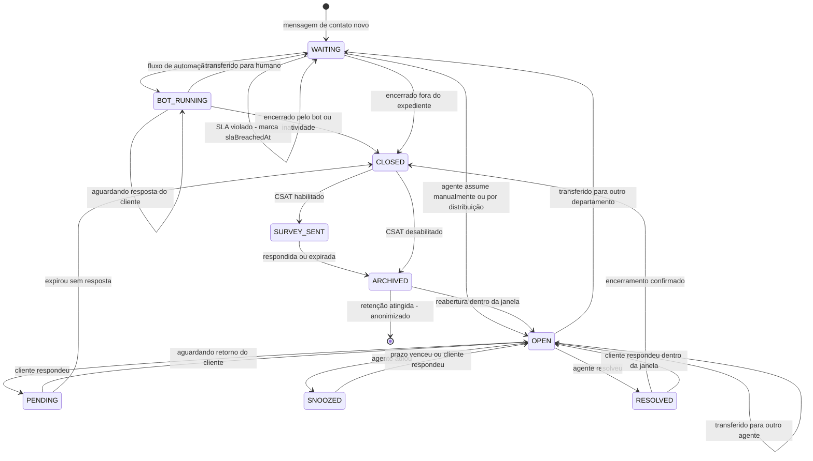

> **Estados novos propostos:** `BOT_RUNNING`, `PENDING`, `SNOOZED`, `SURVEY_SENT`, `ARCHIVED`.
> Hoje existem apenas `WAITING`, `OPEN`, `RESOLVED`, `CLOSED`.

---

# FASE 7 — Fluxograma técnico

## 7.1 Arquitetura de execução ponta a ponta (estado-alvo v2.0)

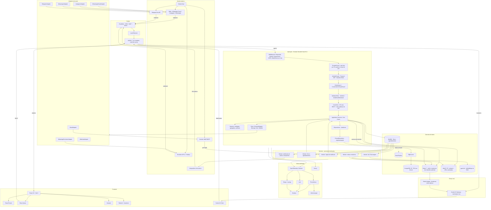

## 7.2 Caminho de uma requisição autenticada (detalhe da cadeia)

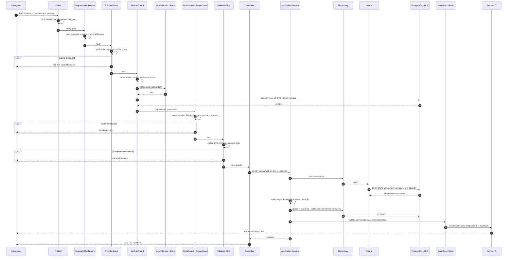

## 7.3 Caminho de ingestão de mensagem (assíncrono)

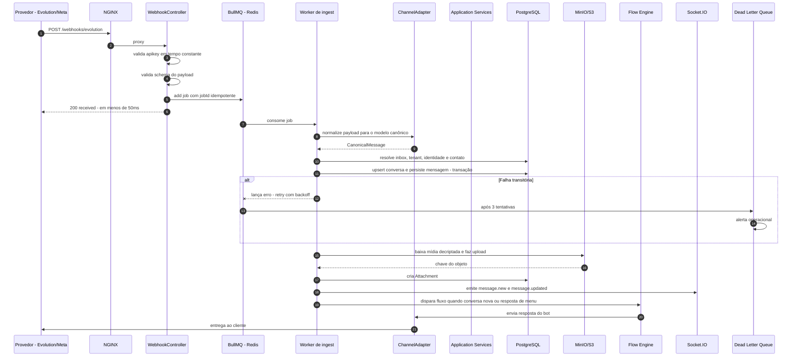

## 7.4 Topologia de implantação (produção alvo)

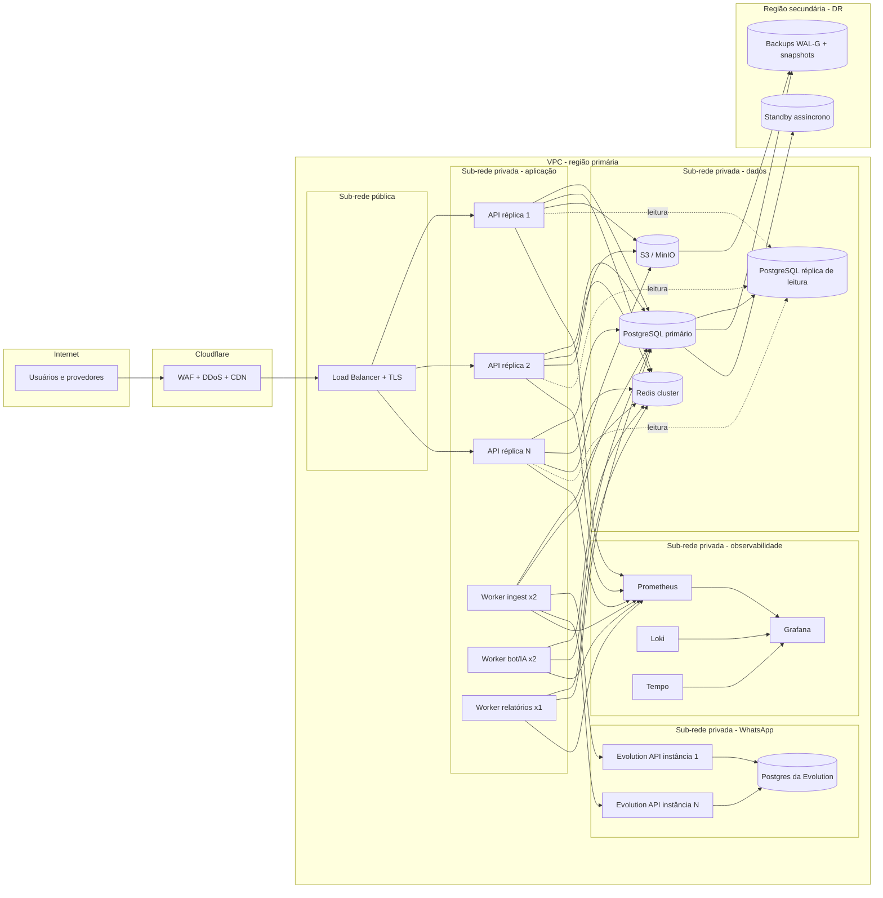

---

# FASE 8 — Diagramas UML

## 8.1 Use Case Diagram

```mermaid
flowchart TB
    subgraph ATORES[Atores]
        CLIENTE([Cliente final])
        AGENTE([Agente])
        SUPER([Supervisor])
        ADMIN([Admin da empresa])
        SADMIN([Super Admin - operação do SaaS])
        SYS([Sistema / Jobs])
        DEV([Desenvolvedor integrador])
    end

    subgraph UC_ATEND[Atendimento]
        UC1(Iniciar conversa por qualquer canal)
        UC2(Enviar e receber mensagens)
        UC3(Enviar mídia)
        UC4(Responder pesquisa de satisfação)
        UC5(Assumir conversa da fila)
        UC6(Responder cliente)
        UC7(Adicionar nota interna)
        UC8(Aplicar tags)
        UC9(Transferir conversa)
        UC10(Encerrar com motivo)
        UC11(Adiar / snooze)
        UC12(Definir disponibilidade)
    end

    subgraph UC_SUP[Supervisão]
        UC13(Monitorar fila em tempo real)
        UC14(Reatribuir conversa)
        UC15(Assumir conversa de agente)
        UC16(Consultar relatórios e SLA)
        UC17(Auditar ações)
    end

    subgraph UC_ADM[Administração]
        UC18(Gerenciar usuários e papéis)
        UC19(Configurar departamentos e filas)
        UC20(Conectar canais)
        UC21(Configurar fluxo de automação)
        UC22(Configurar SLA e horários)
        UC23(Gerenciar plano e faturamento)
        UC24(Gerenciar chaves de API e webhooks)
        UC25(Exportar dados / LGPD)
    end

    subgraph UC_SIS[Automático]
        UC26(Rotear conversa por estratégia)
        UC27(Executar fluxo de bot)
        UC28(Detectar violação de SLA)
        UC29(Enviar pesquisa de satisfação)
        UC30(Processar webhook de entrada)
        UC31(Entregar webhook de saída)
        UC32(Gerar rollup de métricas)
        UC33(Sugerir resposta com IA)
    end

    subgraph UC_PLAT[Plataforma]
        UC34(Gerenciar tenants e planos)
        UC35(Impersonar com auditoria)
        UC36(Consumir API pública)
        UC37(Instalar app do marketplace)
    end

    CLIENTE --> UC1 & UC2 & UC3 & UC4
    AGENTE --> UC2 & UC5 & UC6 & UC7 & UC8 & UC9 & UC10 & UC11 & UC12
    SUPER --> UC13 & UC14 & UC15 & UC16 & UC17
    SUPER --> UC5 & UC6
    ADMIN --> UC18 & UC19 & UC20 & UC21 & UC22 & UC23 & UC24 & UC25
    ADMIN --> UC13 & UC16
    SADMIN --> UC34 & UC35
    SYS --> UC26 & UC27 & UC28 & UC29 & UC30 & UC31 & UC32 & UC33
    DEV --> UC36 & UC37

    UC6 -.include.-> UC2
    UC5 -.include.-> UC26
    UC10 -.include.-> UC29
    UC27 -.extend.-> UC33
```

## 8.2 Activity Diagram — atendimento completo

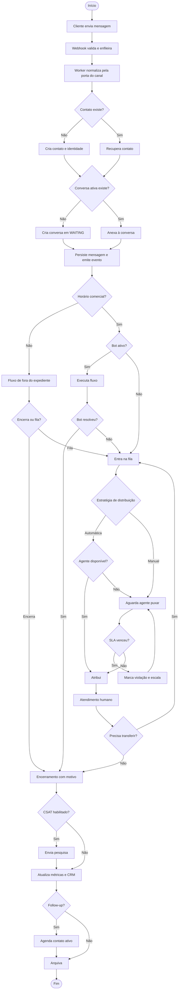

## 8.3 Class Diagram — domínio alvo (Clean Architecture)

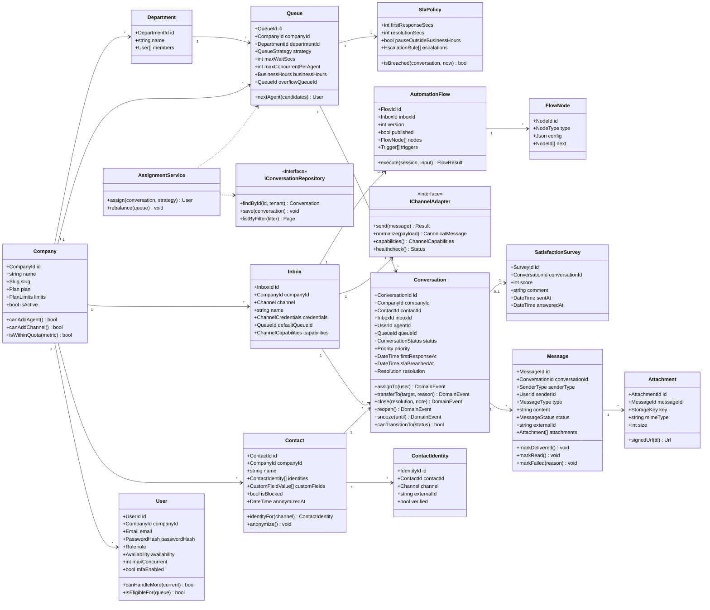

## 8.4 Sequence Diagram — envio de mensagem pelo agente

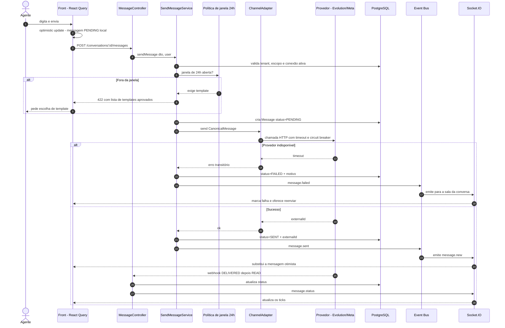

## 8.5 State Diagram — mensagem

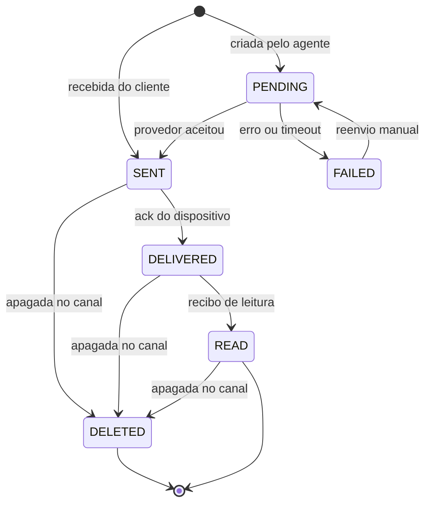

## 8.6 Deployment Diagram

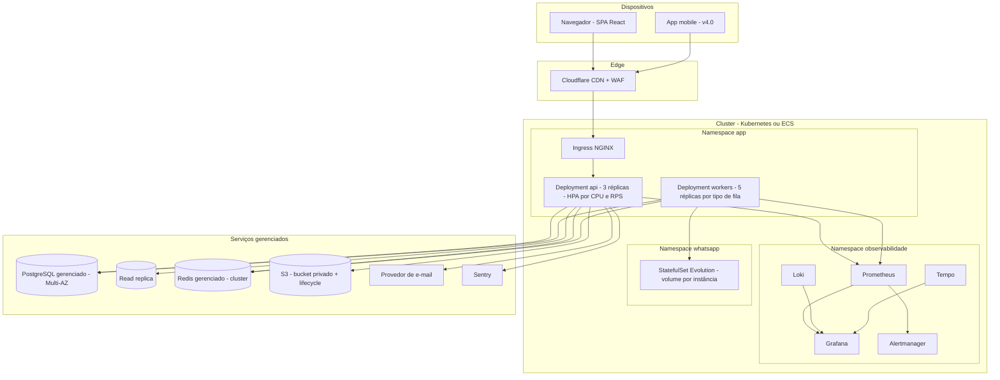

## 8.7 ER Diagram — modelo de dados alvo

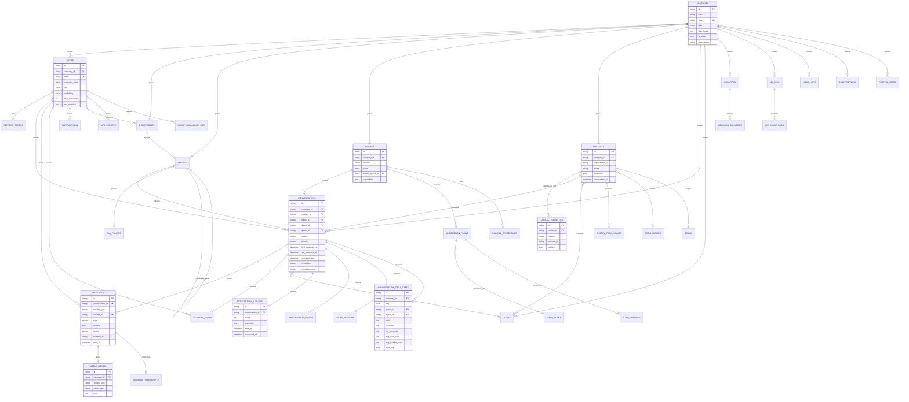

## 8.8 Component Diagram

```mermaid
flowchart TB
    subgraph PRES[Camada de apresentação]
        C1[REST Controllers]
        C2[WebSocket Gateway]
        C3[Public API Controllers]
        C4[Webhook Controllers]
    end

    subgraph APPL[Camada de aplicação]
        A1[Use Cases de Conversa]
        A2[Use Cases de Mensagem]
        A3[Use Cases de Contato e CRM]
        A4[Use Cases de Automação]
        A5[Use Cases de Relatório - CQRS leitura]
        A6[Use Cases de Identidade e Acesso]
        A7[Application Event Handlers]
    end

    subgraph DOMN[Camada de domínio]
        D1[Agregado Conversation]
        D2[Agregado Contact]
        D3[Agregado Company]
        D4[Agregado AutomationFlow]
        D5[Políticas: SLA, Roteamento, Janela 24h, Permissão]
        D6[Eventos de domínio]
    end

    subgraph INFRA[Camada de infraestrutura]
        I1[Prisma Repositories]
        I2[Channel Adapters]
        I3[Storage Adapter - S3]
        I4[LLM Adapter]
        I5[Cache e Sessão - Redis]
        I6[Queue Adapter - BullMQ]
        I7[Notifier - e-mail, push, Slack]
        I8[Outbox Publisher]
        I9[Telemetry - OTel]
    end

    C1 --> A1 & A2 & A3 & A6
    C2 --> A1
    C3 --> A1 & A2 & A3
    C4 --> A2 & A4
    A1 & A2 & A3 & A4 & A5 & A6 --> D1 & D2 & D3 & D4 & D5
    D1 & D2 & D3 & D4 --> D6
    D6 --> A7
    A1 & A2 & A3 & A4 & A5 & A6 --> I1
    A2 --> I2 & I3
    A4 --> I4 & I5
    A7 --> I6 & I7 & I8
    I8 --> C2
    PRES --> I9
    APPL --> I9
    INFRA --> I9
```

---

# FASE 9 — Benchmark competitivo

> **Nota de método:** as informações abaixo vêm de documentação pública, repositórios open-source e
> materiais comerciais dos fornecedores. Onde o stack não é divulgado publicamente, está marcado como
> *não divulgado* em vez de suposição. Nenhum código de terceiros foi analisado ou reproduzido — apenas
> conceitos, escopo funcional e padrões arquiteturais.

## 9.1 Posicionamento do mercado

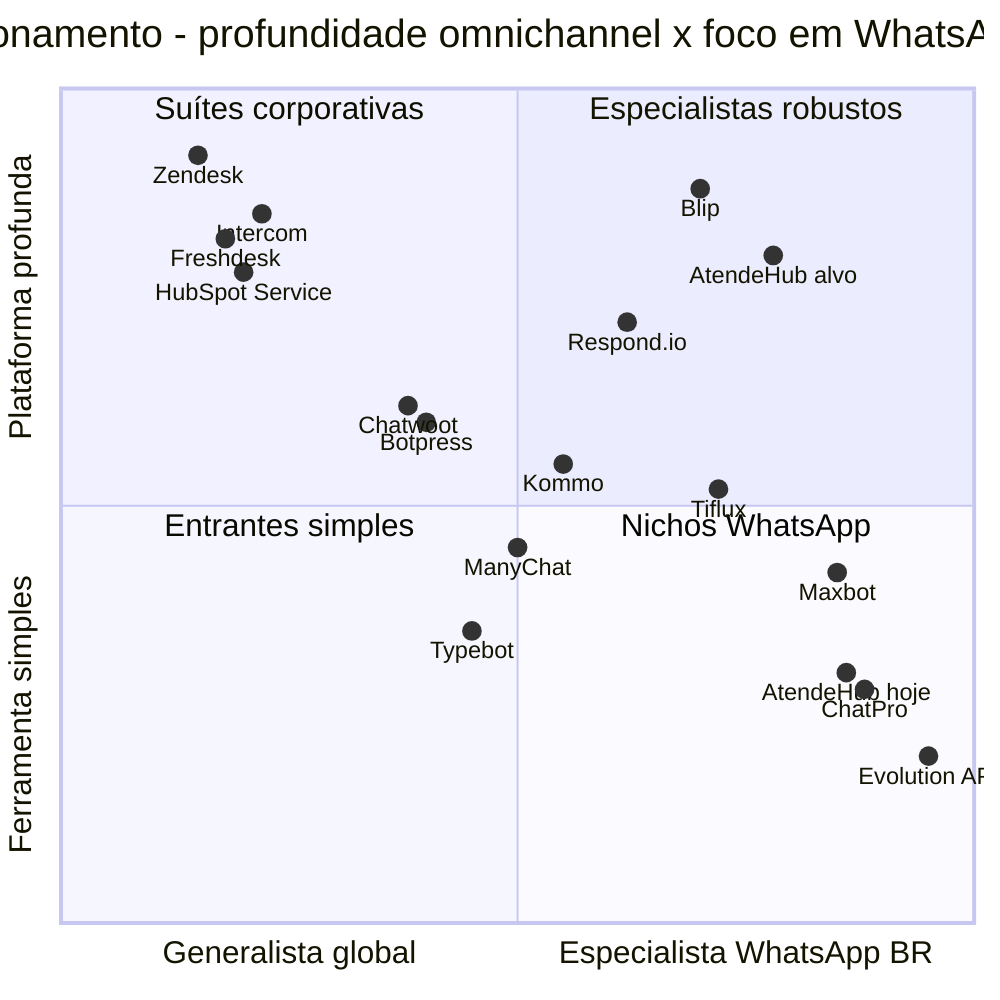

## 9.2 Análise individual

### Chatwoot — *o benchmark direto de arquitetura*

| Aspecto | Avaliação |
|---|---|
| **Pontos fortes** | Open-source maduro; modelo de **Inbox** como abstração de canal (a decisão arquitetural que o AtendeHub precisa copiar conceitualmente); canais amplos (WhatsApp, FB, IG, Telegram, Twitter, e-mail, webchat, API, SMS); API REST completa e documentada; webhooks; automation rules; macros; canned responses; times e atribuição automática; CSAT nativo; app mobile; self-hosted com Helm chart |
| **Pontos fracos** | UX genérica, não desenhada para WhatsApp brasileiro; relatórios rasos comparados a Zendesk; sem flow builder visual robusto; performance degrada em instâncias grandes self-hosted; suporte comunitário |
| **Funcionalidades-chave** | Inbox multicanal · Agent bots · Automações · Macros · Canned responses · CSAT · Campanhas · Help center · Custom attributes · Teams |
| **UX** | Funcional e limpa, sem personalidade; curva de aprendizado baixa |
| **Escalabilidade** | Boa até dezenas de milhares de conversas/dia; Sidekiq para background; Redis + Postgres |
| **Arquitetura** | Monolito Rails com engines; Action Cable para tempo real; Sidekiq para filas |
| **Tecnologias (públicas)** | Ruby on Rails, Vue.js, PostgreSQL, Redis, Sidekiq |
| **O que devemos implementar** | 🔴 **Modelo de Inbox** como fronteira de canal e permissão · 🔴 **Automation rules** (evento→condição→ação) · 🔴 **Macros e canned responses** · 🟠 Custom attributes · 🟠 CSAT nativo · 🟠 Teams com atribuição · 🟡 Help center |

### Zendesk — *o benchmark de profundidade*

| Aspecto | Avaliação |
|---|---|
| **Pontos fortes** | Profundidade absurda em relatórios (Explore), SLA com múltiplas políticas e escalonamento, triggers/automations/views, marketplace com centenas de apps, SDK, sandbox, SSO/SCIM, certificações (SOC2, ISO, HIPAA), routing por skill, side conversations |
| **Pontos fracos** | Caro (por agente, com escadas de plano); complexo de configurar; WhatsApp é cidadão de segunda classe; suporte ao mercado BR limitado; customização exige consultoria |
| **Funcionalidades-chave** | Ticketing · Views · Triggers · Automations · SLA policies · Macros · Explore analytics · Guide (KB) · Talk (voz) · Sunshine (plataforma de dados) · Marketplace |
| **UX** | Densa, orientada ao poder do usuário avançado; excelente teclado e views salvas |
| **Escalabilidade** | Multi-região, milhões de tickets/dia |
| **Arquitetura** | Multi-serviço; historicamente Rails no core com serviços especializados |
| **Tecnologias** | Ruby on Rails (core histórico), Java/Scala em serviços, Kafka, MySQL/Aurora — *parcialmente divulgado* |
| **O que devemos implementar** | 🔴 **Views salvas e filtros compostos** · 🔴 **SLA policies múltiplas com escalonamento** · 🔴 **Triggers e automations** · 🟠 Marketplace de apps · 🟠 Sandbox por tenant · 🟠 Relatórios com drill-down |

### Freshdesk Omnichannel

| Aspecto | Avaliação |
|---|---|
| **Pontos fortes** | Boa relação custo-benefício; omnichannel de verdade (e-mail, chat, voz, social, WhatsApp); automações; gamificação do time (interessante para operações de venda); IA (Freddy); onboarding simples |
| **Pontos fracos** | Relatórios menos profundos que Zendesk; limitações de customização; algumas features presas a planos altos |
| **Funcionalidades-chave** | Ticketing · Omniroute · Dispatch'r/Supervisor/Observer (automações) · Gamificação · Field service · Freddy AI |
| **UX** | Amigável, boa para times menos técnicos |
| **Escalabilidade** | Alta, SaaS multi-tenant global |
| **Arquitetura** | Multi-serviço; Rails + Java — *parcialmente divulgado* |
| **Tecnologias** | Ruby on Rails, Java, MySQL, Redis, Kafka — *parcialmente divulgado* |
| **O que devemos implementar** | 🟠 **Omniroute** (roteamento unificado por carga entre canais) · 🟠 Gamificação leve do time · 🟡 Field service (irrelevante para o nicho) |

### Intercom

| Aspecto | Avaliação |
|---|---|
| **Pontos fortes** | Melhor UX do mercado; messenger embarcável excelente; Fin (agente de IA) com resultados publicados de deflexão; product tours; séries de automação; dados de produto integrados ao atendimento |
| **Pontos fracos** | Preço por resolução/assento alto; foco em SaaS/produto, não em operação de WhatsApp; WhatsApp limitado |
| **Funcionalidades-chave** | Messenger · Fin AI · Séries · Product tours · Help center · Custom bots · Inbox com IA |
| **UX** | Referência de mercado — animações, densidade, atalhos, copy |
| **Escalabilidade** | Alta |
| **Arquitetura** | Rails no core com serviços; AWS — *parcialmente divulgado* |
| **Tecnologias** | Ruby on Rails, React, Elasticsearch, AWS — *parcialmente divulgado* |
| **O que devemos implementar** | 🔴 **Padrão de agente de IA com deflexão medida e escalonamento** · 🔴 **Qualidade de UX do inbox** (referência visual) · 🟠 Widget de webchat embarcável · 🟠 Help center integrado |

### Respond.io — *o concorrente mais próximo do alvo*

| Aspecto | Avaliação |
|---|---|
| **Pontos fortes** | Foco explícito em mensageria de negócio (WhatsApp, IG, FB, Telegram, LINE, Viber, WeChat); **workflow builder visual** forte; broadcast/campanhas; Click-to-chat ads; roteamento avançado; integração com CRMs; contatos unificados entre canais |
| **Pontos fracos** | Relatórios medianos; preço escala rápido por contato; menos profundo em ticketing/SLA que Zendesk |
| **Funcionalidades-chave** | Omnichannel inbox · Workflows visuais · Broadcasts · Contact merge · Growth widgets · Click-to-chat |
| **UX** | Boa, orientada a operação comercial |
| **Escalabilidade** | Alta para mensageria |
| **Arquitetura / Tecnologias** | *Não divulgado publicamente* |
| **O que devemos implementar** | 🔴 **Workflow builder visual** (modelo mais próximo do que queremos) · 🔴 **Contact merge / identidade unificada** · 🔴 **Broadcasts com opt-out** · 🟠 Click-to-WhatsApp ads com atribuição · 🟠 Growth widgets |

### Tiflux — *concorrente brasileiro*

| Aspecto | Avaliação |
|---|---|
| **Pontos fortes** | Forte em gestão de chamados/service desk para o mercado BR; SLA e contratos; catálogo de serviços; apontamento de horas; base de conhecimento; integração com WhatsApp; preço em BRL e suporte local |
| **Pontos fracos** | Origem em service desk, não em conversação — a UX de chat é secundária; automação conversacional limitada; menos omnichannel |
| **Funcionalidades-chave** | Chamados · SLA e contratos · Catálogo de serviços · Apontamento de horas · KB · Portal do cliente · Relatórios |
| **UX** | Orientada a ticket, não a conversa |
| **Escalabilidade / Arquitetura** | *Não divulgado publicamente* |
| **O que devemos implementar** | 🟠 **Contratos e SLA por cliente** (diferencial B2B no BR) · 🟠 **Portal do cliente** · 🟠 Apontamento de tempo por atendimento · 🟡 Catálogo de serviços |

### ChatPro — *concorrente brasileiro de API WhatsApp*

| Aspecto | Avaliação |
|---|---|
| **Pontos fortes** | Simplicidade extrema de integração; preço acessível; documentação direta; time-to-value de minutos |
| **Pontos fracos** | É essencialmente uma camada de API sobre WhatsApp, não uma plataforma de atendimento; sem inbox robusto, sem SLA, sem relatórios profundos |
| **O que devemos implementar** | 🟠 **Facilidade de onboarding** (conectar WhatsApp em < 3 minutos) · 🟡 API "sem fricção" para desenvolvedores como porta de entrada de plano |

### Maxbot — *concorrente brasileiro WhatsApp-first*

| Aspecto | Avaliação |
|---|---|
| **Pontos fortes** | Muito alinhado ao mercado brasileiro de PME; multiatendimento; chatbot; funil/CRM leve; disparo em massa; preço competitivo em BRL |
| **Pontos fracos** | Arquitetura e escalabilidade não comprovadas publicamente; dependência de WhatsApp não oficial em parte da oferta (risco de banimento); relatórios simples |
| **O que devemos implementar** | 🟠 **Funil de vendas leve integrado ao inbox** · 🟠 **Disparo em massa com controle de taxa** · 🟡 Etiquetas de funil no chat |

### Kommo CRM (ex-amoCRM)

| Aspecto | Avaliação |
|---|---|
| **Pontos fortes** | CRM conversacional real — pipeline no centro, mensageria ao redor; automações de funil; muito bom para vendas |
| **Pontos fracos** | Fraco como service desk/suporte; SLA e ticketing pouco desenvolvidos |
| **O que devemos implementar** | 🟠 **Pipeline vinculado à conversa** (arrastar card muda etapa e dispara automação) · 🟠 Automação por etapa de funil |

### ManyChat

| Aspecto | Avaliação |
|---|---|
| **Pontos fortes** | Flow builder acessível para não técnicos; forte em IG/FB; growth tools (comment-to-DM, ref links); templates prontos |
| **Pontos fracos** | Voltado a marketing, não a atendimento; inbox limitado; sem SLA/relatórios de operação |
| **O que devemos implementar** | 🔴 **UX do flow builder para não técnicos** · 🟠 **Comment-to-DM no Instagram** (alto valor no BR) · 🟠 Biblioteca de templates de fluxo |

### Blip (Take Blip)

| Aspecto | Avaliação |
|---|---|
| **Pontos fortes** | Plataforma brasileira de escala Enterprise; Blip Desk + Builder; forte em grandes contas; canais amplos; IA; governança |
| **Pontos fracos** | Complexidade e custo altos para PME; curva de aprendizado |
| **Tecnologias (públicas)** | Ecossistema .NET / protocolo aberto de mensageria — *parcialmente divulgado* |
| **O que devemos implementar** | 🟠 **Separação clara entre Builder (fluxo) e Desk (atendimento)** · 🟠 Governança e ambientes por cliente |

### Evolution API — *dependência atual, não concorrente*

| Aspecto | Avaliação |
|---|---|
| **Pontos fortes** | Open-source, muito adotada no BR, cobre WhatsApp não oficial com boa cobertura de eventos; barata |
| **Pontos fracos** | Baileys = risco de banimento e sem SLA da Meta; breaking changes entre versões; operação (instâncias, sessões, storage) é responsabilidade de quem hospeda |
| **Risco para o AtendeHub** | **Alto** — hoje é ponto único de falha e de risco regulatório |
| **O que devemos fazer** | 🔴 **Manter como adapter, mas adicionar WhatsApp Cloud API oficial como alternativa** por inbox; deixar o cliente escolher entre custo e conformidade |

### Typebot / Botpress — *referências de flow builder*

| Aspecto | Typebot | Botpress |
|---|---|---|
| **Pontos fortes** | Builder visual excelente e simples; open-source; embed fácil; blocos de integração | Builder poderoso; NLU; agentes de IA; SDK; hooks de código |
| **Pontos fracos** | Não é plataforma de atendimento; sem inbox humano | Complexidade alta; curva de aprendizado |
| **Tecnologias (públicas)** | TypeScript, Next.js, Prisma, PostgreSQL | TypeScript, Node.js |
| **O que devemos implementar** | 🔴 **Modelo de nós e UX do editor** (Typebot é a melhor referência de simplicidade) · 🟠 **NLU e agentes** (Botpress como referência de profundidade) · 🟠 Integração nativa: permitir usar Typebot como motor externo via webhook antes de construir o nosso |

### HubSpot Service Hub

| Aspecto | Avaliação |
|---|---|
| **Pontos fortes** | Integração total com CRM/marketing/vendas; base de conhecimento; pesquisas; playbooks; relatórios; ecossistema de apps |
| **Pontos fracos** | Caro; WhatsApp limitado; foco em inbound marketing |
| **O que devemos implementar** | 🟠 **Playbooks para o agente** (roteiro contextual durante o atendimento) · 🟠 Pesquisas além de CSAT (NPS, CES) · 🟡 Integração com o HubSpot como conector |

## 9.3 Matriz comparativa de funcionalidades

| Funcionalidade | AtendeHub hoje | AtendeHub v2.5 | Chatwoot | Zendesk | Freshdesk | Intercom | Respond.io | Tiflux | Maxbot |
|---|:--:|:--:|:--:|:--:|:--:|:--:|:--:|:--:|:--:|
| WhatsApp não oficial | ✅ | ✅ | ⚠️ | ❌ | ❌ | ❌ | ❌ | ✅ | ✅ |
| WhatsApp Cloud oficial | ❌ | ✅ | ✅ | ✅ | ✅ | ✅ | ✅ | ⚠️ | ⚠️ |
| Instagram | ❌ | ✅ | ✅ | ✅ | ✅ | ⚠️ | ✅ | ❌ | ⚠️ |
| Facebook | ❌ | ✅ | ✅ | ✅ | ✅ | ⚠️ | ✅ | ❌ | ⚠️ |
| Telegram | ❌ | ✅ | ✅ | ⚠️ | ⚠️ | ❌ | ✅ | ❌ | ❌ |
| Webchat | ❌ | ✅ | ✅ | ✅ | ✅ | ✅ | ✅ | ✅ | ⚠️ |
| E-mail | ❌ | ✅ | ✅ | ✅ | ✅ | ✅ | ⚠️ | ✅ | ❌ |
| SMS | ❌ | ⚠️ | ✅ | ✅ | ✅ | ⚠️ | ✅ | ❌ | ❌ |
| Fila e distribuição automática | ⚠️ | ✅ | ✅ | ✅ | ✅ | ✅ | ✅ | ✅ | ✅ |
| SLA com escalonamento | ⚠️ | ✅ | ⚠️ | ✅ | ✅ | ⚠️ | ⚠️ | ✅ | ❌ |
| Flow builder visual | ❌ | ✅ | ⚠️ | ✅ | ✅ | ✅ | ✅ | ⚠️ | ✅ |
| IA / copiloto | ❌ | ✅ (v3.0) | ⚠️ | ✅ | ✅ | ✅ | ✅ | ⚠️ | ⚠️ |
| CSAT / NPS | ❌ | ✅ | ✅ | ✅ | ✅ | ✅ | ✅ | ✅ | ⚠️ |
| Relatórios avançados | ⚠️ | ✅ | ⚠️ | ✅ | ✅ | ✅ | ⚠️ | ✅ | ⚠️ |
| API pública + webhooks | ❌ | ✅ | ✅ | ✅ | ✅ | ✅ | ✅ | ✅ | ⚠️ |
| Marketplace de apps | ❌ | v4.0 | ⚠️ | ✅ | ✅ | ✅ | ⚠️ | ❌ | ❌ |
| App mobile | ❌ | v4.0 | ✅ | ✅ | ✅ | ✅ | ✅ | ✅ | ⚠️ |
| CRM / funil | ❌ | v4.0 | ⚠️ | ⚠️ | ⚠️ | ⚠️ | ⚠️ | ⚠️ | ✅ |
| Self-hosted | ✅ | ✅ | ✅ | ❌ | ❌ | ❌ | ❌ | ❌ | ❌ |
| Preço em BRL / suporte local | ✅ | ✅ | ❌ | ⚠️ | ⚠️ | ❌ | ❌ | ✅ | ✅ |

✅ completo · ⚠️ parcial/limitado · ❌ ausente

## 9.4 Síntese — o que copiar de cada um

| Fonte | Conceito a adotar | Onde entra |
|---|---|---|
| Chatwoot | **Inbox** como abstração de canal; automation rules; macros | v2.0, v2.5 |
| Zendesk | Views salvas; SLA policies múltiplas; triggers; marketplace | v1.1, v2.5, v4.0 |
| Freshdesk | Omniroute (roteamento por carga entre canais) | v2.0 |
| Intercom | Padrão de agente de IA com deflexão medida; qualidade de UX | v3.0, v1.1 |
| Respond.io | Workflow builder; contact merge; broadcasts | v2.0, v2.5 |
| Tiflux | Contratos e SLA por cliente; portal do cliente | v1.2, v4.0 |
| ChatPro | Onboarding de canal em minutos | v1.1 |
| Maxbot | Funil leve dentro do inbox; disparo em massa | v2.5, v4.0 |
| Kommo | Pipeline vinculado à conversa | v4.0 |
| ManyChat | UX do builder para não técnicos; comment-to-DM | v2.0, v2.5 |
| Blip | Separação Builder vs Desk; governança por ambiente | v2.5 |
| Typebot | Modelo de nós e simplicidade do editor | v2.5 |
| Botpress | NLU e agentes com ferramentas | v3.0 |
| HubSpot | Playbooks do agente; pesquisas além de CSAT | v3.0 |
| Evolution API | Manter como adapter; nunca como única opção | v2.0 |

---

# FASE 10 — Plano de evolução de 24 meses

> Início: **Q3/2026** (agosto). Cada trimestre lista novas funcionalidades, melhorias, refatorações,
> tecnologias introduzidas, infraestrutura, automações, IA, bots, CRM, analytics, marketplace, API,
> SDK e mobile.

## Q3/2026 — Fundação e segurança (v1.0, parte 1)

| Dimensão | Entregas |
|---|---|
| **Novas funcionalidades** | Reset de senha · Verificação de e-mail · Sessões ativas · Swagger público interno |
| **Melhorias** | Mídia privada com URL assinada · Correção do retry de webhook · Correção de mídia sem legenda · Índices trigram e composto |
| **Refatorações** | Extração da lógica de tenancy para extensão do Prisma · Worker separado da API · Estado em memória migrado para Redis |
| **Tecnologias** | `@nestjs/swagger` · `helmet` com CSP explícito · ESLint/Prettier/Husky no front |
| **Infraestrutura** | RLS no Postgres · Container non-root com `tini` e healthcheck · NGINX endurecido com ACME · Backup automatizado com teste de restore |
| **Automações** | DLQ com alerta · Pipeline de CI com CodeQL, Trivy, gitleaks, Dependabot |
| **IA / Bots / CRM / Analytics** | — |
| **API / SDK / Mobile / Marketplace** | OpenAPI gerado e versionado |
| **Métrica-alvo** | 0 mídia pública · 0 mensagem perdida em teste de caos · SSL Labs A |

## Q4/2026 — Observabilidade, autenticação e produtividade (v1.0 parte 2 + v1.1 parte 1)

| Dimensão | Entregas |
|---|---|
| **Novas funcionalidades** | MFA TOTP · Escopo de conversa por papel/departamento · Respostas rápidas · Transferência com motivo |
| **Melhorias** | Cookie httpOnly para refresh · Lockout e política de senha · Cache do dashboard |
| **Refatorações** | Início da migração do front: React Router + React Query nas rotas de inbox e dashboard |
| **Tecnologias** | OpenTelemetry · Prometheus · Grafana · Loki · Tempo · Alertmanager · React Router 7 · React Query 5 |
| **Infraestrutura** | Ambientes dev/staging/prod com Terraform · Deploy automatizado em staging · Bull Board |
| **Automações** | 12 regras de alerta · Deploy contínuo em staging a cada merge |
| **Analytics** | Dashboards operacionais (API, fila, WhatsApp, banco, negócio, SLO) |
| **Métrica-alvo** | MTTD < 5 min · Cobertura de testes ≥ 70% · Deploy em staging < 10 min |

## Q1/2027 — Produtividade do agente (v1.1 parte 2)

| Dimensão | Entregas |
|---|---|
| **Novas funcionalidades** | Distribuição automática (round-robin, least-busy) · Status do agente · Presence e anti-colisão · Busca global · Snooze · Macros · Reabertura de conversa |
| **Melhorias** | Virtualização de listas · Skeletons · Responsividade mobile/tablet · Atalhos de teclado |
| **Refatorações** | Conclusão da migração para Tailwind + shadcn/ui · Quebra do `SettingsPanel` em rotas · Cliente tipado gerado do OpenAPI |
| **Tecnologias** | Zustand · TailwindCSS · shadcn/ui · Storybook · Playwright |
| **Infraestrutura** | Blue-green em staging · CDN para assets |
| **Automações** | E2E no pipeline · Regressão visual |
| **Analytics** | TME, TMA, FRT, abandono, aderência a SLA · Rollup diário |
| **Métrica-alvo** | -30% TMA · Lighthouse ≥ 90 · Bundle inicial < 250 KB gzip |

## Q2/2027 — Comercialização (v1.2)

| Dimensão | Entregas |
|---|---|
| **Novas funcionalidades** | CSAT · API pública com chaves e escopos · Webhooks de saída assinados · Billing com planos e faturas · Back-office de tenants · Campos customizados · Import/export de contatos |
| **Melhorias** | Enforcement de limites de plano · Bulk operations · Paginação por cursor em todas as listas |
| **Refatorações** | Audit log imutável com hash encadeado · Formato de erro RFC 7807 |
| **Tecnologias** | Gateway de pagamento (Stripe + Asaas) · Provedor de e-mail transacional |
| **Infraestrutura** | Read replica · PgBouncer · Rate limit por chave de API |
| **Automações** | Dunning de cobrança · Relatórios agendados por e-mail |
| **CRM** | Campos customizados + importação |
| **API / SDK** | Portal do desenvolvedor com playground |
| **Métrica-alvo** | Primeiro contrato pago cobrado automaticamente · p95 da API pública < 300 ms |

## Q3/2027 — Omnichannel parte 1 (v2.0)

| Dimensão | Entregas |
|---|---|
| **Novas funcionalidades** | Modelo de Inbox · Identidade unificada de contato · Canal WhatsApp Cloud API oficial com templates HSM e janela de 24h · Canal Webchat com widget embarcável |
| **Melhorias** | Roteamento por canal · Capacidades por canal na UI |
| **Refatorações** | **Channel Port/Adapter (hexagonal)** · Repository Pattern nos agregados centrais · Event bus com outbox · Migração Bull → BullMQ |
| **Tecnologias** | BullMQ · SDK JS do widget |
| **Infraestrutura** | Workers por tipo de fila · Rate limit por canal |
| **Bots** | Fluxo por inbox (não mais um por empresa) |
| **Métrica-alvo** | Novo canal implementável em < 1 sprint · 0 regressão no WhatsApp existente |

## Q4/2027 — Omnichannel parte 2 (v2.0 conclusão)

| Dimensão | Entregas |
|---|---|
| **Novas funcionalidades** | Canais Telegram, Instagram (DM + comentários + menções em story), Facebook Messenger, E-mail com threading |
| **Melhorias** | Timeline unificada do contato · Merge de contatos · Omniroute entre canais |
| **Refatorações** | Consolidação do domínio: agregados Conversation/Contact com invariantes explícitas |
| **Tecnologias** | Meta Graph API · IMAP/SMTP · Telegram Bot API |
| **Infraestrutura** | Fila dedicada por canal com rate limit próprio |
| **CRM** | Organizações (B2B) |
| **Métrica-alvo** | 5+ canais em produção · ≥ 30% dos clientes com 2+ canais ativos |

## Q1/2028 — Automação (v2.5 parte 1)

| Dimensão | Entregas |
|---|---|
| **Novas funcionalidades** | Motor de fluxo com estado · Editor visual drag-and-drop · Biblioteca de nós · Gatilhos · Simulador |
| **Melhorias** | Botões e listas interativas do WhatsApp |
| **Refatorações** | Migração do auto-atendimento atual para o novo motor (com compatibilidade) |
| **Tecnologias** | React Flow · Motor de execução com máquina de estados |
| **Bots** | Versionamento e rollback de fluxo · NLU leve |
| **Analytics** | Métricas de fluxo (contenção, abandono por nó) |
| **Métrica-alvo** | Cliente monta fluxo sozinho em < 30 min · ≥ 20% de contenção pelo bot |

## Q2/2028 — Automação parte 2 e campanhas (v2.5 conclusão)

| Dimensão | Entregas |
|---|---|
| **Novas funcionalidades** | Automation rules (evento→condição→ação) · Campanhas com opt-out e controle de taxa · Integrações no-code (n8n/Make/Zapier) |
| **Melhorias** | Views salvas e filtros compostos · SLA policies múltiplas com escalonamento |
| **Refatorações** | Consolidação do event bus para alimentar automações |
| **Infraestrutura** | Throttling de campanha por número e por tier de qualidade |
| **CRM** | Segmentação dinâmica de contatos |
| **Métrica-alvo** | ≥ 40% dos clientes com pelo menos uma automação ativa |

## Q3/2028 — IA parte 1 (v3.0)

| Dimensão | Entregas |
|---|---|
| **Novas funcionalidades** | Transcrição de áudio · Copilot do agente (sugerir, reescrever, resumir) · Resumo de handoff |
| **Melhorias** | Busca full-text incluindo transcrições |
| **Refatorações** | Camada de abstração de LLM provider-agnostic com cache e quota |
| **Tecnologias** | pgvector · provedor de LLM · provedor de transcrição |
| **IA** | Painel de custo e quota por tenant |
| **Métrica-alvo** | ≥ 40% de aceitação de sugestão · transcrição em < 30s |

## Q4/2028 — IA parte 2 (v3.0 conclusão)

| Dimensão | Entregas |
|---|---|
| **Novas funcionalidades** | Base de conhecimento + RAG com citação · Classificação automática (assunto/sentimento/urgência) · Agente de IA autônomo como nó de fluxo · QA automatizado de atendimento |
| **Melhorias** | Roteamento inteligente por classificação |
| **Refatorações** | Guardrails e observabilidade específica de IA (custo, latência, taxa de escalonamento) |
| **Analytics** | Painel de IA: deflexão, custo, qualidade |
| **Métrica-alvo** | ≥ 25% de resolução autônoma em FAQ · custo de IA < 8% da receita do plano |

## Q1/2029 — Plataforma (v4.0 parte 1)

| Dimensão | Entregas |
|---|---|
| **Novas funcionalidades** | Marketplace de apps (manifesto, sandbox, permissões) · SDK oficial JS/TS e PHP · Papéis customizáveis |
| **Melhorias** | Dashboards customizáveis com drill-down · Wallboard |
| **Refatorações** | Extração de bounded contexts com fronteiras explícitas (preparação para microservices) |
| **Infraestrutura** | Kubernetes com HPA · Multi-AZ |
| **API / SDK** | CLI + geração de SDK a partir do OpenAPI |
| **Métrica-alvo** | 5 apps publicados por terceiros |

## Q2/2029 — Plataforma parte 2 (v4.0 conclusão)

| Dimensão | Entregas |
|---|---|
| **Novas funcionalidades** | App mobile (agente e supervisor) com push nativo · CRM completo (pipeline, deals, tarefas, lead scoring) · SSO SAML/OIDC + SCIM · White-label completo |
| **Melhorias** | Multi-região com residência de dados |
| **Refatorações** | DR ativo-ativo |
| **Tecnologias** | React Native/Expo |
| **Infraestrutura** | Segunda região ativa |
| **Certificações** | Preparação SOC 2 Tipo II / ISO 27001 |
| **Métrica-alvo** | 99,9% de disponibilidade medida · primeiro contrato Enterprise com SSO |

## 10.1 Resumo do plano por trimestre

| Trimestre | Versão | Tema | Marco de negócio |
|---|---|---|---|
| Q3/2026 | v1.0 (1/2) | Segurança e correções críticas | Apto a operar com dados reais |
| Q4/2026 | v1.0 (2/2) + v1.1 (1/2) | Observabilidade e autenticação | Apto a assinar SLA |
| Q1/2027 | v1.1 (2/2) | Produtividade do agente | -30% TMA |
| Q2/2027 | v1.2 | API pública e billing | **Primeira receita recorrente automatizada** |
| Q3/2027 | v2.0 (1/2) | Abstração de canal + WA oficial + webchat | Deixa de ser mono-canal |
| Q4/2027 | v2.0 (2/2) | Telegram, Instagram, Facebook, e-mail | **Plataforma omnichannel** |
| Q1/2028 | v2.5 (1/2) | Flow builder | Automação self-service |
| Q2/2028 | v2.5 (2/2) | Automações e campanhas | Deflexão mensurável |
| Q3/2028 | v3.0 (1/2) | IA assistiva | Copilot em produção |
| Q4/2028 | v3.0 (2/2) | IA autônoma e RAG | **Resolução sem humano** |
| Q1/2029 | v4.0 (1/2) | Marketplace e SDK | Ecossistema |
| Q2/2029 | v4.0 (2/2) | Mobile, CRM, SSO, multi-região | **Enterprise-ready certificável** |

---

# FASE 11 — Documento técnico final

## 11.1 Arquitetura completa

### 11.1.1 Princípios arquiteturais adotados

| Princípio | Aplicação no AtendeHub |
|---|---|
| **Modular Monolith primeiro** | Um único deployable com fronteiras internas rígidas. Microservices só quando houver dor real de escala ou de time — nunca antes. |
| **Hexagonal (Ports & Adapters)** | O domínio não conhece Prisma, Evolution, MinIO nem Socket.IO. Tudo entra por porta. A porta mais importante é `IChannelAdapter`. |
| **Clean Architecture** | Dependências apontam para dentro: Infra → Aplicação → Domínio. Nenhum `import` do domínio para fora. |
| **DDD tático** | Agregados com invariantes: `Conversation` (raiz), `Contact`, `Company`, `AutomationFlow`. Value objects para `Email`, `Phone`, `Slug`, `StorageKey`. |
| **Repository Pattern** | Interface no domínio, implementação Prisma na infra. Habilita teste sem banco e troca de ORM. |
| **CQRS onde há assimetria** | Leitura de relatórios/dashboards vai a modelos de leitura (rollups e read replica); escrita passa pelo agregado. |
| **Event-Driven + Outbox** | Toda mutação relevante emite evento de domínio persistido na mesma transação (outbox) e publicado depois. Elimina "evento emitido, transação revertida". |
| **Pub/Sub** | Redis Streams/Pub-Sub como barramento; consumidores independentes (Socket.IO, webhooks de saída, automações, analytics). |
| **Multi-tenant defense-in-depth** | Camada 1: guard de escopo. Camada 2: extensão do Prisma injetando `companyId`. Camada 3: **RLS no Postgres**. Falha em uma não vira vazamento. |

### 11.1.2 Estrutura de pastas alvo (backend)

```
apps/api/src/
├── main.ts
├── app.module.ts
├── modules/                        # bounded contexts
│   ├── identity/                   # auth, users, roles, mfa, sessions
│   │   ├── domain/                 # entidades, VOs, políticas, eventos
│   │   ├── application/            # use cases, ports
│   │   ├── infrastructure/         # repositories Prisma, adapters
│   │   └── presentation/           # controllers, DTOs, guards
│   ├── inbox/                      # inboxes, canais, adapters
│   ├── conversation/               # conversa, mensagem, atribuição, SLA
│   ├── contact/                    # contatos, identidades, CRM
│   ├── automation/                 # fluxos, regras, campanhas
│   ├── analytics/                  # rollups, relatórios (lado leitura)
│   ├── billing/                    # planos, assinaturas, uso
│   └── platform/                   # api keys, webhooks de saída, marketplace
├── shared/
│   ├── kernel/                     # tipos base, Result, DomainEvent, AggregateRoot
│   ├── persistence/                # PrismaService + extensão de tenancy + outbox
│   ├── messaging/                  # event bus, BullMQ, outbox publisher
│   ├── storage/                    # S3 port + adapter
│   ├── observability/              # OTel, logger, métricas
│   └── security/                   # crypto, hashing, rate limit
└── workers/                        # entrypoints dedicados por fila
    ├── ingest.worker.ts
    ├── automation.worker.ts
    ├── sla.worker.ts
    ├── media.worker.ts
    └── outbound.worker.ts
```

### 11.1.3 Estrutura alvo (frontend)

```
src/
├── app/
│   ├── router.tsx                  # React Router com rotas lazy
│   ├── providers.tsx               # QueryClient, Theme, Auth, Toast
│   └── layout/
├── features/                       # organização por feature, não por tipo
│   ├── inbox/{api,components,hooks,store}
│   ├── conversation/
│   ├── contacts/
│   ├── analytics/
│   ├── settings/
│   └── automation/
├── shared/
│   ├── ui/                         # shadcn/ui + componentes próprios
│   ├── lib/                        # http client tipado, socket, utils
│   └── config/
└── styles/                         # tokens Tailwind
```

## 11.2 Fluxo completo

Consolidado nas Fases 6 e 7. Resumo textual do caminho crítico:

1. Cliente envia mensagem em qualquer canal.
2. Provedor chama o webhook do canal; a assinatura é validada em tempo constante.
3. Payload validado por schema; job idempotente enfileirado no BullMQ; resposta 200 em < 50 ms.
4. Worker de ingest normaliza pelo `IChannelAdapter` para um `CanonicalMessage`.
5. Tenant, inbox, identidade e contato resolvidos; contexto de tenancy aberto (RLS ativa).
6. Conversa criada, reaberta ou anexada; mensagem persistida com dedup por `externalId`.
7. Mídia baixada decriptada e enviada ao storage privado; `Attachment` criado; evento de atualização emitido.
8. Evento de domínio `message.received` gravado no outbox e publicado.
9. Consumidores reagem: Socket.IO transmite, automação executa o fluxo, analytics contabiliza, webhooks de saída entregam.
10. Automação decide: horário comercial → bot → IA → fila.
11. Fila distribui conforme estratégia; SLA agendado com `jobId` determinístico.
12. Agente atende; envio passa pela política de janela de 24h e pelo adapter do canal.
13. Encerramento com motivo; CSAT enviado; rollup atualizado; CRM atualizado; follow-up agendado.
14. Arquivamento conforme política de retenção; anonimização quando aplicável.

## 11.3 Modelagem — mudanças estruturais propostas

| Mudança | Motivo | Versão | Estratégia de migração |
|---|---|---|---|
| `ContactIdentity` (canal + externalId → contato) | Um cliente é a mesma pessoa em vários canais | v2.0 | Expand: criar tabela, popular a partir de `Contact.phone`, manter coluna antiga por 2 releases, depois contrair |
| `Inbox` como entidade | Canal deixa de ser enum solto e vira configuração com credenciais e permissão | v2.0 | Criar `Inbox` por `WhatsAppConnection` existente |
| `Conversation.priority`, `snoozedUntil`, `firstResponseAt`, `firstAssignedAt` | Métricas e UX ausentes | v1.1 | Adicionar nullable + backfill por job |
| Novos status `PENDING`, `SNOOZED`, `ARCHIVED` | Ciclo de vida real | v1.1 | Adicionar ao enum (Postgres permite `ADD VALUE`) |
| `SatisfactionSurvey` | CSAT inexistente | v1.1 | Nova tabela |
| `ConversationDailyStats` | Relatórios O(1) | v1.1 | Nova tabela + job noturno + backfill |
| `AgentAvailability` + `maxConcurrent` em `User` | Distribuição automática | v1.1 | Colunas novas com default |
| `CustomField` / `CustomFieldValue` | Segmentação | v1.2 | Novas tabelas |
| `ApiKey`, `ApiUsageLog`, `WebhookDelivery` | API pública e webhooks | v1.2 | Novas tabelas |
| `Organization` | CRM B2B | v2.0 | Nova tabela, `Contact.organizationId` nullable |
| `AutomationFlow` v2 com `FlowNode`/`FlowVersion` | Flow builder | v2.5 | Nova modelagem; migrar `AutoAttendanceFlow` para um fluxo equivalente |
| Particionamento de `messages` por mês | Tabela que cresce sem limite | v2.0 | Criar tabela particionada, migrar em janela, trocar por rename |
| `messages.search_vector` (tsvector + GIN) | Busca de conteúdo | v1.1 | Coluna gerada + índice concorrente |
| Índice trigram em `contacts(name, phone)` | Busca de contato | v1.0 | `CREATE INDEX CONCURRENTLY` |
| `apiToken` criptografado (pgcrypto ou KMS) | Segredo de tenant em claro | v1.0 | Migrar valores e trocar leitura |

## 11.4 Recomendações executivas

| # | Recomendação | Justificativa |
|---|---|---|
| R-1 | **Congelar features por 3 meses e executar a v1.0 integralmente** | O produto tem 2 defeitos críticos e 25 GAPs P0. Adicionar feature sobre essa base multiplica o custo de correção. |
| R-2 | **Não migrar o front inteiro de uma vez** | Migrar por rota, com as duas stacks convivendo. Uma reescrita big-bang com 302 testes acoplados à implementação atual é o maior risco de cronograma do plano. |
| R-3 | **Tratar a abstração de canal como pré-requisito, não como parte do canal** | Implementar Instagram sem `IChannelAdapter` cria o segundo acoplamento e dobra o custo do terceiro canal. |
| R-4 | **Adicionar WhatsApp Cloud API oficial antes de escalar vendas** | Baileys via Evolution é risco de banimento sem SLA. Oferecer as duas opções por inbox transforma risco em escolha do cliente. |
| R-5 | **Instrumentar antes de otimizar** | Não há métrica de latência ou throughput hoje. Otimizar sem baseline é adivinhação. |
| R-6 | **Comprar em vez de construir: e-mail transacional, pagamento, transcrição, LLM** | Nenhum desses é diferencial competitivo. |
| R-7 | **Construir o flow builder, não terceirizar** | É o diferencial defensável e o principal motivo de churn para concorrentes. |
| R-8 | **Manter `ROADMAP_ESTABILIZACAO.md` como changelog, mas mover o planejamento para este documento** | 219 KB não é consultável; separar histórico de plano. |
| R-9 | **Definir SLOs antes do primeiro contrato pago** | Sem SLO não há como prometer SLA nem medir regressão. |
| R-10 | **Contratar pentest externo ao final da v1.0** | Auditoria interna não substitui adversário independente. |

## 11.5 Checklist geral

### Checklist de segurança (pré-produção)

- [ ] Bucket de mídia privado; acesso apenas por URL assinada ou proxy autenticado
- [ ] RLS habilitada em todas as tabelas com `companyId`
- [ ] Extensão do Prisma injetando tenant em 100% das operações
- [ ] `ConversationScopeGuard` aplicado em conversation, message, note, dashboard, report
- [ ] Refresh token em cookie `httpOnly`, `Secure`, `SameSite=Strict`
- [ ] Detecção de reuso de refresh token com revogação de família
- [ ] MFA TOTP disponível e forçável por empresa
- [ ] Lockout progressivo e política de senha com verificação HIBP
- [ ] Fluxo de reset e verificação de e-mail
- [ ] CSP, HSTS, X-Frame-Options, X-Content-Type-Options, Referrer-Policy, Permissions-Policy
- [ ] Redirect 80→443 em todos os hosts
- [ ] Container non-root com `tini` e healthcheck
- [ ] Segredos em cofre; nenhum `.env` em host de produção
- [ ] `apiToken` de conexão criptografado em repouso
- [ ] Validação de magic bytes no upload
- [ ] Rate limit por IP, usuário, tenant e chave de API
- [ ] WAF/CDN na borda
- [ ] CodeQL, Trivy, gitleaks e Dependabot no CI, bloqueando merge em severidade alta
- [ ] Auditoria de acesso a dados sensíveis
- [ ] Exportação e exclusão de dados do titular (LGPD Art. 18)
- [ ] Pentest externo realizado e achados críticos/altos corrigidos

### Checklist de produção (go-live)

- [ ] Backup automatizado com restore testado nos últimos 30 dias
- [ ] Monitoramento com alertas roteados para on-call
- [ ] SLO definido e error budget acordado
- [ ] Runbook por cenário de incidente
- [ ] Deploy sem downtime demonstrado
- [ ] Rollback testado
- [ ] Certificado TLS com renovação automática
- [ ] Limites de recurso e log driver configurados
- [ ] Healthcheck e readiness em todos os serviços
- [ ] Shutdown gracioso drenando jobs em andamento
- [ ] Teste de carga executado com resultado documentado
- [ ] Plano de comunicação de incidente e status page

### Checklist de qualidade (por PR)

- [ ] Testes unitários cobrindo o comportamento novo
- [ ] Teste de integração quando toca banco ou fila
- [ ] E2E quando toca fluxo crítico
- [ ] OpenAPI atualizado no mesmo PR
- [ ] Migration com estratégia expand/contract quando destrutiva
- [ ] Métrica ou alerta criado quando o comportamento é operacionalmente relevante
- [ ] Sem regressão de cobertura
- [ ] Sem `console.log` / `any` novo sem justificativa
- [ ] Revisão de impacto em tenancy e permissão

## 11.6 Plano de implantação

### Estratégia por ambiente

| Ambiente | Propósito | Dados | Deploy | Acesso |
|---|---|---|---|---|
| **Local** | Desenvolvimento | Seed sintético | `docker compose up` + scripts PowerShell | Dev |
| **Staging** | Validação e QA | Cópia anonimizada de produção, semanal | Automático a cada merge em `master` | Time |
| **Produção** | Clientes | Reais | Manual aprovado, a partir de tag | On-call |

### Pipeline de promoção

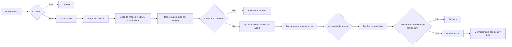

### Procedimento de migração de banco

1. Migration **expand** (adiciona coluna/tabela nullable, sem remover nada) → deploy.
2. Backfill em job idempotente, com progresso monitorado e limite de taxa.
3. Código passa a ler/escrever no novo formato (dual-write se necessário) → deploy.
4. Validação: contagem, amostragem, comparação.
5. Migration **contract** (remove o antigo) — no mínimo dois releases depois.

> Nenhuma migration destrutiva no mesmo deploy da mudança de código. Nunca.

## 11.7 Plano de testes

| Nível | Ferramenta | Escopo | Meta de cobertura | Onde roda |
|---|---|---|---|---|
| Unitário | Jest | Domínio, use cases, utilitários, componentes | ≥ 80% em domínio, ≥ 70% global | Todo PR |
| Integração | Jest + Testcontainers | Repositories, migrations, filas, RLS | Fluxos de dados críticos | Todo PR |
| Contrato | Pact ou schema do OpenAPI | Front ↔ API, API ↔ adapters de canal | 100% das rotas públicas | Todo PR |
| E2E API | Supertest | Autenticação, tenancy, permissões, SLA | Fluxos críticos | Todo PR |
| E2E UI | Playwright | Login → receber → responder → transferir → encerrar → relatório | 12 jornadas | Merge em master |
| Carga | k6 | 500 msg/min por tenant, 200 agentes simultâneos | p95 < 500 ms | Semanal e antes de release |
| Caos | Toxiproxy / scripts | Queda de Postgres, Redis, MinIO, Evolution | 0 perda de mensagem | Antes de release |
| Segurança | ZAP, nuclei, CodeQL, Trivy | OWASP Top 10, dependências, imagem | 0 alto/crítico | Todo PR (SAST) / semanal (DAST) |
| Acessibilidade | axe-core | WCAG 2.1 AA nas telas principais | 0 violação crítica | Merge em master |
| Regressão visual | Chromatic ou Percy | Componentes do design system | Aprovação manual de diff | Merge em master |

### Cenários obrigatórios de teste de tenancy

| # | Cenário | Resultado esperado |
|---|---|---|
| 1 | Usuário da empresa A pede conversa da empresa B | 404 |
| 2 | Query direta no banco com contexto da empresa A sobre linha da B | 0 linhas |
| 3 | Webhook com `externalId` colidente entre tenants | Apenas o tenant correto é afetado |
| 4 | Socket da empresa A tenta entrar na sala de conversa da B | `WsException` e log de tentativa |
| 5 | Chave de API da empresa A consulta recurso da B | 403 |
| 6 | Agente do departamento X pede conversa do departamento Y | 404 |
| 7 | Anexo da empresa B acessado com token da A | 404 |

## 11.8 Plano de segurança

### Modelo de ameaças (STRIDE resumido)

| Ameaça | Vetor principal | Mitigação |
|---|---|---|
| **Spoofing** | Webhook forjado; token roubado | Assinatura HMAC; comparação em tempo constante; MFA; cookie httpOnly; detecção de replay |
| **Tampering** | Alteração de payload; SQL injection | Validação de schema; Prisma parametrizado; RLS; audit log com hash encadeado |
| **Repudiation** | Ação sem rastro | Audit log imutável com ator, IP, user-agent, antes/depois |
| **Information disclosure** | **Bucket público (atual)**; vazamento entre tenants; log com PII | Storage privado; RLS; nível de log travado; mascaramento de PII |
| **Denial of service** | Rajada de webhook; upload gigante; consulta pesada | Rate limit em 4 níveis; limite de body por rota; timeout de query; backpressure na fila; WAF |
| **Elevation of privilege** | Agente acessando dados de admin; container root | RBAC com escopo; policies granulares; container non-root; princípio do menor privilégio no banco |

### Camadas de defesa

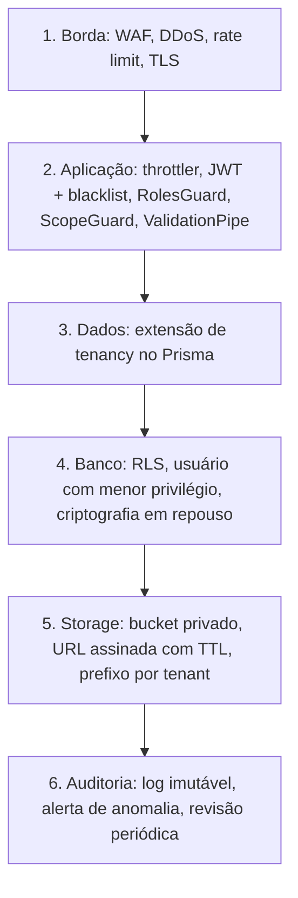

### Conformidade LGPD — matriz

| Direito do titular (Art. 18) | Implementação | Status |
|---|---|---|
| Confirmação e acesso | Endpoint de exportação de dados do titular | ❌ v1.2 |
| Correção | Edição de contato | ✅ |
| Anonimização/eliminação | `Contact.anonymizedAt` com substituição de campos | ✅ |
| Portabilidade | Exportação em formato estruturado | ❌ v1.2 |
| Informação sobre compartilhamento | Registro de operações + DPA | ❌ v1.2 |
| Revogação de consentimento | Opt-out por contato e por canal | ❌ v2.5 |
| Segurança (Art. 46) | Criptografia em trânsito e repouso, controle de acesso, log | ⚠️ parcial (bucket público é violação atual) |

## 11.9 Plano de observabilidade

### Os três sinais

| Sinal | Ferramenta | O que instrumentar |
|---|---|---|
| **Traces** | OpenTelemetry → Tempo | HTTP, Prisma, BullMQ, Socket.IO, axios (Evolution/Meta), LLM |
| **Métricas** | OTel/Prometheus | RED por rota, USE por recurso, métricas de negócio |
| **Logs** | Winston JSON → Loki | Estruturado com `traceId`, `requestId`, `companyId`, `userId`; sem PII |

### Métricas obrigatórias

| Categoria | Métrica | Tipo | Alerta |
|---|---|---|---|
| API | `http_request_duration_seconds` por rota e status | histograma | p95 > 800 ms por 5 min |
| API | `http_requests_total` com status | contador | taxa de 5xx > 1% por 5 min |
| Fila | `queue_depth` por fila | gauge | > 1.000 por 5 min |
| Fila | `job_duration_seconds`, `job_failures_total` | histograma/contador | falhas > 5% por 10 min |
| Fila | `dlq_size` | gauge | > 0 |
| WebSocket | `ws_connections_active` por tenant | gauge | queda > 50% em 1 min |
| WhatsApp | `channel_connection_status` por inbox | gauge | desconectado > 2 min |
| Mensagens | `messages_received_total`, `messages_sent_total`, `messages_failed_total` por canal | contador | falha > 3% |
| Negócio | `conversations_waiting`, `sla_breaches_total`, `first_response_seconds` | gauge/histograma | fila > 50 esperando |
| Banco | conexões, queries lentas, replicação | gauge | lag > 10 s |
| IA | `llm_tokens_total`, `llm_cost_usd`, `llm_latency_seconds` por tenant | contador/histograma | custo > orçamento diário |

### SLOs propostos

| SLI | SLO | Janela | Error budget |
|---|---|---|---|
| Disponibilidade da API | 99,9% | 30 dias | 43 min |
| Latência p95 de rotas de leitura | < 500 ms | 30 dias | 1% das requisições |
| Latência de ingest (webhook → visível na UI) | p95 < 3 s | 7 dias | 1% |
| Entrega de mensagem enviada | 99,5% aceitas pelo provedor | 30 dias | 0,5% |
| Perda de mensagem recebida | 0 | sempre | 0 |

### Dashboards Grafana

1. **API** — RED por rota, top erros, latência por percentil, tráfego por tenant.
2. **Filas** — profundidade, taxa de processamento, falhas, DLQ, idade do job mais antigo.
3. **Canais** — status por inbox, mensagens/min por canal, falhas de envio, latência do provedor.
4. **Banco** — conexões, queries lentas, cache hit, tamanho das tabelas, lag da réplica.
5. **Negócio** — conversas ativas/esperando, TME, TMA, violações de SLA, CSAT do dia.
6. **SLO** — burn rate do error budget, disponibilidade acumulada.

## 11.10 Plano de escalabilidade

### Capacidade alvo por fase

| Fase | Tenants | Agentes simultâneos | Mensagens/dia | Arquitetura |
|---|---|---|---|---|
| v1.0 | 20 | 100 | 50 mil | 1 API + 1 worker, Postgres único |
| v1.2 | 100 | 500 | 300 mil | 3 API + 3 workers, read replica, PgBouncer |
| v2.0 | 500 | 2.000 | 2 milhões | HPA, filas por canal, cache Redis, CDN |
| v3.0 | 2.000 | 10.000 | 10 milhões | Particionamento de mensagens, workers dedicados de IA |
| v4.0 | 10.000 | 50.000 | 50 milhões | Multi-região, sharding por tenant, extração de contextos |

### Estratégias por gargalo

| Gargalo previsto | Sintoma | Estratégia |
|---|---|---|
| Ingest de webhook | Fila crescendo, latência de UI | Escalar workers horizontalmente; fila por canal; backpressure com 429 ao provedor |
| Escrita no Postgres | Lock, latência de commit | Particionamento de `messages`; batch de writes de status; PgBouncer |
| Leitura de relatórios | Query lenta competindo com atendimento | Rollups + read replica + cache |
| Socket.IO | Memória e broadcast | Redis adapter (já existe); salas enxutas; batching de eventos |
| Storage | Custo e latência | Lifecycle para classe fria; CDN; deduplicação por hash |
| LLM | Custo e latência | Cache semântico; modelo menor para tarefas simples; quota por tenant |
| Tenant gigante | Noisy neighbor | Limites por tenant; fila dedicada; possibilidade de instância isolada |

## 11.11 Plano DevOps

| Área | Estado atual | Alvo | Quando |
|---|---|---|---|
| IaC | Nenhum | Terraform para rede, banco, Redis, storage, cluster | v1.0 |
| Orquestração | docker-compose | Kubernetes (ou ECS) com HPA | v1.2 → v4.0 |
| Ambientes | Só local | dev / staging / prod isolados | v1.0 |
| Segredos | `.env` no host | Vault ou SOPS com rotação | v1.0 |
| Imagens | Build local | Registry privado, SBOM, assinatura, scan | v1.0 |
| Deploy | Manual | GitOps com aprovação e canário | v1.0 → v1.2 |
| Rollback | Inexistente | Automático por métrica, em 1 comando | v1.0 |
| On-call | Inexistente | Escala, runbooks, postmortem sem culpa | v1.2 |
| Custo | Não medido | Tag por ambiente, alerta de orçamento | v1.2 |

## 11.12 Plano CI/CD

```yaml
# Estrutura alvo dos workflows (resumo conceitual)
# .github/workflows/
#   ci-api.yml        → lint · typecheck · unit · integração (Testcontainers) · cobertura ≥70% · CodeQL
#   ci-web.yml        → lint · typecheck · unit · build · Lighthouse CI · axe
#   ci-security.yml   → Trivy (imagem) · gitleaks · npm audit · OWASP dependency check
#   e2e.yml           → Playwright contra staging efêmero
#   build-push.yml    → build multi-stage · SBOM (syft) · assinatura (cosign) · push GHCR
#   deploy-staging.yml→ deploy automático a cada merge · smoke tests · rollback automático
#   deploy-prod.yml   → manual, a partir de tag · canário 10% · watch de métricas · promoção
#   db-check.yml      → prisma migrate diff · detecção de migration destrutiva
#   release.yml       → semantic-release · CHANGELOG · release notes · notificação
```

### Gates de qualidade (bloqueiam merge)

| Gate | Critério |
|---|---|
| Lint | 0 erros |
| Tipos | `tsc --noEmit` limpo |
| Testes | 100% verdes |
| Cobertura | ≥ 70% global, ≥ 80% em `domain/` |
| SAST | 0 alertas de severidade alta/crítica |
| Dependências | 0 vulnerabilidade alta/crítica sem exceção documentada |
| Migrations | Nenhuma destrutiva sem flag explícita e aprovação |
| OpenAPI | Atualizado quando há mudança em controller |
| Bundle | Front dentro do budget de tamanho |

## 11.13 Plano de backup

| Ativo | Método | Frequência | Retenção | Destino | Verificação |
|---|---|---|---|---|---|
| PostgreSQL (app) | `pg_dump` lógico + WAL-G contínuo | Dump diário; WAL contínuo | 7 diários, 4 semanais, 12 mensais | S3 em região distinta, criptografado | Restore automatizado semanal em ambiente efêmero |
| PostgreSQL (Evolution) | `pg_dump` | Diário | 7 dias | S3 | Mensal |
| MinIO/S3 (mídia) | Replicação de bucket + versionamento | Contínua | 90 dias + lifecycle | Bucket em outra região | Checagem de integridade mensal |
| Redis | RDB + AOF | AOF contínuo, snapshot 6h | 48h | Volume + S3 | Mensal (dados são efêmeros por design) |
| Sessões da Evolution | Snapshot de volume | Diário | 7 dias | S3 | Mensal — perda implica reescanear QR |
| Configuração/IaC | Git | Por commit | Ilimitada | GitHub + espelho | — |
| Segredos | Backup do cofre | Diário | 30 dias | Cofre secundário | Trimestral |

**RPO alvo:** 5 minutos (WAL contínuo). **RTO alvo:** 1 hora.

### Procedimento de restore (resumo executável)

1. Provisionar instância limpa via Terraform.
2. Restaurar base do último snapshot + replay de WAL até o ponto desejado (PITR).
3. Restaurar bucket de mídia (ou apontar para a réplica).
4. Aplicar `prisma migrate deploy` e validar `_prisma_migrations`.
5. Subir API em modo somente leitura; validar 10 consultas canário.
6. Religar workers; validar fila e ingest.
7. Repontar DNS; monitorar por 1 hora.

## 11.14 Plano de Disaster Recovery

| Cenário | Probabilidade | Impacto | RTO | RPO | Procedimento |
|---|---|---|---|---|---|
| Perda de instância da API | Alta | Baixo | < 2 min | 0 | Auto-healing do orquestrador; réplicas absorvem |
| Corrupção de dados por bug | Média | Alto | 1 h | 5 min | PITR para o instante anterior ao deploy; rollback de código |
| Perda do banco primário | Baixa | Crítico | 30 min | 5 min | Promover réplica; repontar aplicação |
| Perda de região | Muito baixa | Crítico | 4 h | 15 min | Provisionar em região secundária a partir de IaC + backups |
| Ransomware / comprometimento | Baixa | Crítico | 8 h | 24 h | Isolar; restaurar de backup imutável (object lock); rotacionar todos os segredos; notificar ANPD em 2 dias úteis |
| Banimento do número WhatsApp | **Média** | Alto | 1 h | 0 | Migrar inbox para número reserva; ativar WhatsApp Cloud como alternativa; comunicar cliente |
| Evolution API indisponível | Média | Alto | 30 min | 0 | Circuit breaker; fila retém; failover para instância reserva |
| Vazamento de dados | Baixa | Crítico | — | — | Plano de resposta a incidente; notificação ANPD e titulares; postmortem público |

### Testes de DR obrigatórios

- [ ] Restore completo trimestral em ambiente limpo, cronometrado
- [ ] Failover de banco semestral
- [ ] Simulação de perda de região anual (tabletop + execução parcial)
- [ ] Rotação completa de segredos semestral

## 11.15 Plano de monitoramento

| Camada | O que | Ferramenta | Ação em alerta |
|---|---|---|---|
| Externa | Disponibilidade e latência do endpoint público | Uptime robot / synthetic | Página on-call se 2 falhas seguidas |
| Aplicação | RED, exceções, traces | Prometheus + Sentry + Tempo | Alerta por severidade; Sentry agrupa |
| Fila | Profundidade, falhas, DLQ | Prometheus | DLQ > 0 gera ticket automático |
| Banco | Conexões, locks, queries lentas, lag | Prometheus + pg_exporter | Alerta e runbook de query lenta |
| Canais | Status por inbox | Métrica de negócio | Notificação ao cliente + alerta interno |
| Negócio | Fila de espera, SLA, CSAT | Grafana | Aviso ao supervisor do tenant |
| Custo | Gasto de infra e de IA | Cloud billing + métrica própria | Alerta de orçamento em 80% e 100% |
| Segurança | Tentativas de login, 403, acessos anômalos | Loki + regras | Investigação de segurança |

### Política de severidade e resposta

| Sev | Definição | Tempo de resposta | Comunicação |
|---|---|---|---|
| **S1** | Plataforma indisponível ou perda de dados | 15 min, 24×7 | Status page + e-mail a todos os clientes |
| **S2** | Funcionalidade crítica degradada (envio falhando, fila parada) | 30 min, horário estendido | Status page |
| **S3** | Degradação parcial ou tenant único afetado | 4 h úteis | Contato direto |
| **S4** | Bug sem impacto operacional | Próxima sprint | Changelog |

Todo incidente S1/S2 exige **postmortem sem culpa em até 5 dias úteis**, com linha do tempo, causa raiz,
itens de ação com responsável e prazo, e publicação interna.

## 11.16 Plano de versionamento

| Item | Política |
|---|---|
| **Código** | SemVer `MAJOR.MINOR.PATCH`. MAJOR = quebra de contrato de API; MINOR = feature retrocompatível; PATCH = correção |
| **Branches** | `master` sempre deployável; `feat/*`, `fix/*`, `chore/*` a partir de master; sem branch de longa duração |
| **Commits** | Conventional Commits em PT-BR (já é a convenção do projeto), com ID do roadmap no título |
| **Tags** | `v1.2.3` assinada, gerada por `semantic-release` a partir dos commits |
| **API** | `/api/v1` estável. Mudança incompatível cria `/api/v2` com os dois convivendo por ≥ 6 meses; header `Sunset` anunciando a data |
| **Banco** | Migrations versionadas e imutáveis após merge; nunca editar migration já aplicada |
| **Contrato** | `docs/09-APIs/API_CONTRACT.md` e OpenAPI atualizados no mesmo commit que altera endpoint (regra já existente no projeto — manter) |
| **Fluxos de automação** | Versionados por publicação, com rollback |
| **Imagens** | Tag por versão + `sha` do commit; nunca `latest` em produção |

## 11.17 Plano de releases

| Tipo | Cadência | Conteúdo | Aprovação |
|---|---|---|---|
| **Patch** | Sob demanda | Correções sem mudança de contrato | Tech lead |
| **Minor** | Quinzenal (fim de sprint) | Features da sprint | Tech lead + PM |
| **Major** | Por versão do roadmap | Mudanças de contrato | CTO + comunicação prévia de 30 dias |
| **Hotfix** | Imediato | Correção de S1/S2 | On-call + tech lead, postmortem obrigatório |

### Ritual de release

1. Congelamento de código na quinta-feira da segunda semana da sprint.
2. Regressão automatizada completa em staging.
3. QA manual dos critérios de aceite dos itens da sprint.
4. Geração de tag, CHANGELOG e release notes (automático).
5. Deploy canário na terça-feira pela manhã (nunca sexta-feira).
6. Observação de 30 minutos em 10% do tráfego; promoção ou rollback.
7. Monitoramento reforçado por 24 h.
8. Comunicação no changelog público e in-app.

## 11.18 Plano de documentação

| Documento | Público | Responsável | Cadência | Local |
|---|---|---|---|---|
| `README.md` | Novo dev | Tech lead | A cada mudança de setup | Raiz |
| `CLAUDE.md` | Agentes/IA e devs | Tech lead | Contínua | Raiz |
| **Este documento** | Liderança e time | CTO | Trimestral | `docs/` |
| `ROADMAP_ESTABILIZACAO.md` | Time | Quem executa | Por item concluído | Raiz — passa a ser **changelog**, não plano |
| `docs/09-APIs/API_CONTRACT.md` + OpenAPI | Front, integradores | Quem altera o endpoint | Mesmo commit | `docs/` + `/docs` na API |
| ADRs (`docs/adr/NNNN-*.md`) | Time | Quem decide | Por decisão relevante | `docs/adr/` |
| `docs/26-DevOps/RUNBOOK.md` | On-call | SRE | Por incidente | `docs/` |
| Diagramas C4 | Time e novos devs | Arquiteto | Por mudança estrutural | `docs/arquitetura/` |
| Central de ajuda | Cliente final | Suporte/produto | Por feature | Produto |
| Portal do desenvolvedor | Integradores | Produto | Por versão da API | Público |
| `CHANGELOG.md` | Todos | Automático | Por release | Raiz |
| Postmortems | Time | On-call | Por incidente S1/S2 | `docs/postmortems/` |

### Regra de ouro da documentação

> **Documentação que não é atualizada no mesmo PR que muda o comportamento não existe.**
> O CI deve falhar quando um controller muda e o OpenAPI não muda junto.

---

## 11.19 Roadmap de decisões arquiteturais a registrar (ADRs pendentes)

| ADR | Decisão a formalizar | Prazo |
|---|---|---|
| ADR-001 | Manter Modular Monolith; critérios objetivos para extrair um serviço | v1.0 |
| ADR-002 | RLS como camada obrigatória de tenancy | v1.0 |
| ADR-003 | Storage privado com URL assinada vs proxy autenticado | v1.0 |
| ADR-004 | Migração incremental do front por rota (não big-bang) | v1.1 |
| ADR-005 | `IChannelAdapter` como contrato de canal | v2.0 |
| ADR-006 | Identidade de contato desacoplada de telefone | v2.0 |
| ADR-007 | Bull → BullMQ | v2.0 |
| ADR-008 | Motor de fluxo próprio vs Typebot embarcado | v2.5 |
| ADR-009 | Abstração de LLM provider-agnostic | v3.0 |
| ADR-010 | Estratégia de multi-região e residência de dados | v4.0 |

---

## 11.20 Conclusão

O AtendeHub não é um projeto imaturo — é um **produto mono-canal bem executado** com fundações melhores
do que a média (567 testes verdes, CI real, SLA com job determinístico, tratamento cuidadoso de refresh
token, logging com contexto de requisição). O que separa o estado atual do alvo Enterprise não é
qualidade de código, e sim **escopo arquitetural**: ausência de abstração de canal, de camada de domínio,
de observabilidade e de operação.

A sequência crítica é inegociável:

1. **Fechar os 2 achados críticos e os 25 GAPs P0** (v1.0) — sem isso, qualquer feature nova é construída
   sobre risco jurídico e perda silenciosa de mensagens.
2. **Construir a abstração de canal antes do segundo canal** (v2.0) — a alternativa é pagar o custo de
   acoplamento N vezes.
3. **Construir o flow builder internamente** (v2.5) — é o diferencial defensável do produto.
4. **Aplicar IA onde há métrica**, não onde há hype (v3.0).

Executado nessa ordem, o AtendeHub chega ao final de 24 meses como uma plataforma omnichannel
brasileira, com automação visual, IA aplicada, API pública e certificações em andamento — competindo de
igual para igual no seu nicho, e não tentando ser um Zendesk pior.

---

*Documento gerado em 2026-07-28 a partir de auditoria direta do código-fonte em `master @ de1da24`.*
*Próxima revisão recomendada: ao final da v1.0 (Q4/2026).*
